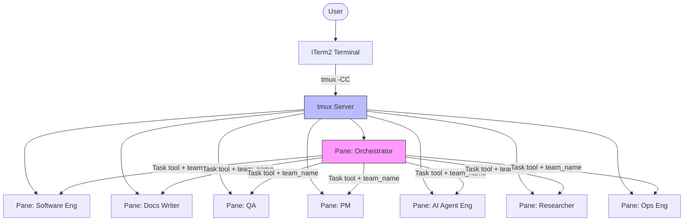
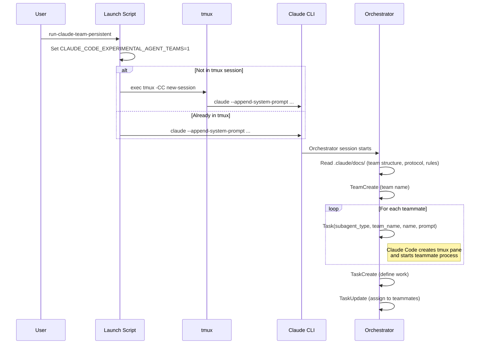
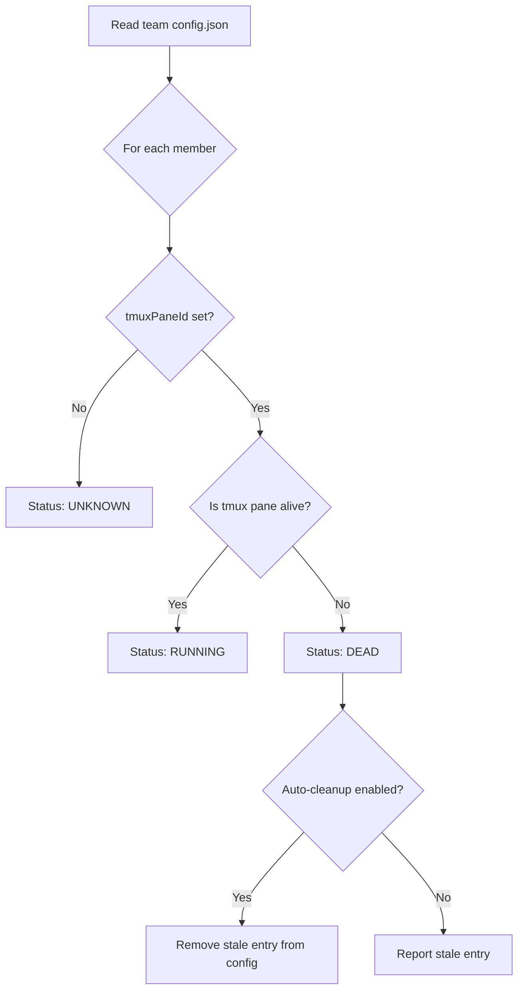
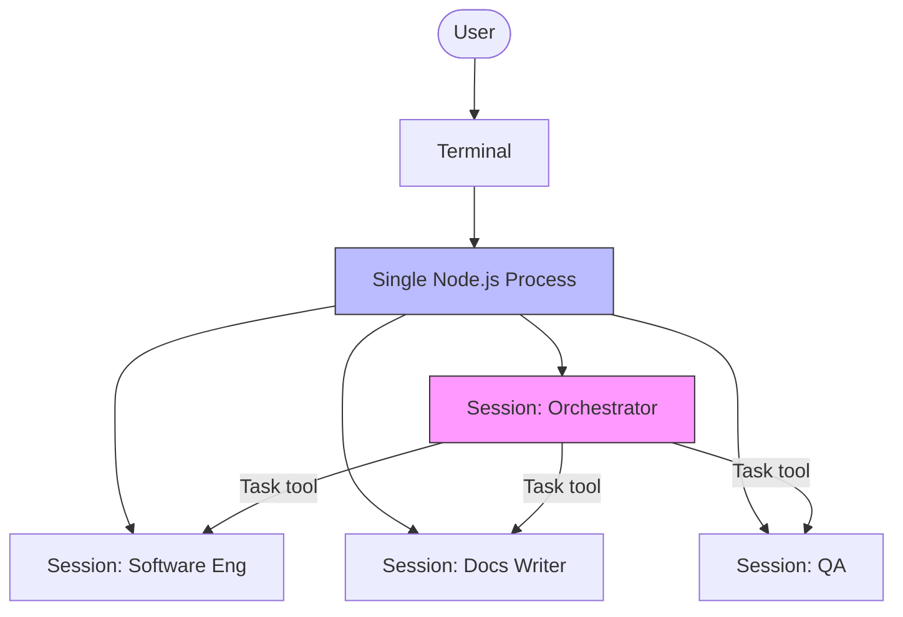
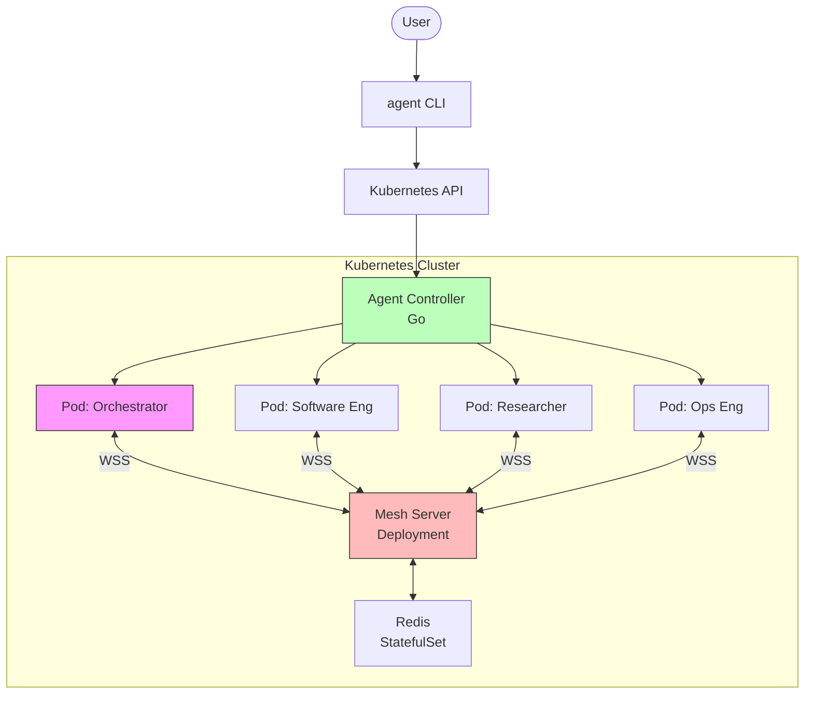
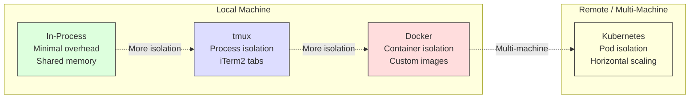

# Orchestration Mechanisms

How agent teams are spawned and managed across different backends.

## Overview

Agent teams can run on different orchestration backends depending on the environment and requirements. Each backend has different characteristics for isolation, visibility, resource management, and scalability.

| Backend                           | Status              | Isolation     | Visibility    | Best For                      |
| :-------------------------------- | :------------------ | :------------ | :------------ | :---------------------------- |
| [tmux](#tmux-backend)             | Current             | Per-pane      | iTerm2 tabs   | Local development, full team  |
| [In-process](#in-process-backend) | Current             | Per-session   | Shift+Up/Down | Quick tasks, minimal overhead |
| [Docker](#docker-backend)         | Planned (Phase 9)   | Per-container | docker logs   | Reproducible environments     |
| [Kubernetes](#kubernetes-backend) | Planned (Phase 11+) | Per-pod       | kubectl logs  | Production, multi-machine     |

## tmux Backend

The default backend for local development. Each agent runs in its own tmux pane. iTerm2 users get native tab integration via `tmux -CC`.



### Launch Flow



### Health Check



### Characteristics

- **Isolation**: Each agent runs as a separate `claude` process in its own tmux pane
- **Communication**: Via Claude Code's `SendMessage` tool (routed through team config)
- **Persistence**: tmux sessions survive terminal disconnects; `--continue` resumes Claude sessions
- **Visibility**: iTerm2 renders each pane as a native tab via `tmux -CC`
- **Resource limit**: Bounded by local machine memory and API rate limits
- **Known issues**:
  - Simultaneous spawning can garble `send-keys` ([#23615](https://github.com/anthropics/claude-code/issues/23615))
  - Delegate mode may not propagate correctly ([#25037](https://github.com/anthropics/claude-code/issues/25037))

## In-Process Backend

Teammates run as hidden sessions within the orchestrator's Node.js process. Minimal overhead, but limited visibility.



### Characteristics

- **Isolation**: Shared process, separate sessions
- **Communication**: In-process message passing (faster than tmux)
- **Persistence**: Sessions live only as long as the process
- **Visibility**: Navigate with Shift+Up/Down between sessions
- **Resource limit**: All sessions share one process's memory
- **Best for**: Quick tasks, simple coordination, environments without tmux

<!-- TODO: Document when in-process mode is selected (auto detection) -->

## Docker Backend

> **Status**: Planned — Phase 9. See [agent-team architecture §3](../specs/draft/agent-team-architecture.md).

Each agent runs in its own Docker container with a framework-specific image.

```mermaid
graph TB
    User([User]) --> Launcher[agent-launcher]
    Launcher --> DockerAPI[Docker API]

    DockerAPI --> ContOrch[Container: Orchestrator<br/>claude-code:latest]
    DockerAPI --> ContSE[Container: Software Eng<br/>engineer:latest]
    DockerAPI --> ContRes[Container: Researcher<br/>researcher:latest]
    DockerAPI --> ContOps[Container: Ops Eng<br/>ops:latest]

    ContOrch <--> |Mesh MCP| MeshServer[Mesh Server<br/>Socket.io]
    ContSE <--> |Mesh MCP| MeshServer
    ContRes <--> |Mesh MCP| MeshServer
    ContOps <--> |Mesh MCP| MeshServer

    subgraph SharedVolumes[Shared Volumes]
        Workspace[/workspace]
        ClaudeConfig[~/.claude :ro]
    end

    ContSE --> SharedVolumes
    ContRes --> SharedVolumes
    ContOps --> SharedVolumes

    style MeshServer fill:#fbb,stroke:#333
    style ContOrch fill:#f9f,stroke:#333
```

### Planned Characteristics

- **Isolation**: Full container isolation per agent
- **Communication**: Mesh MCP server over Socket.io (replaces `SendMessage`)
- **Persistence**: Container lifecycle managed by launcher; sessions can be saved/restored
- **Visibility**: `docker logs`, mesh server dashboard (future)
- **Resource limit**: Per-container CPU/memory limits via Docker
- **Per-agent images**: Engineer gets full dev tools, researcher gets lightweight image

<!-- TODO: Document container image strategy -->
<!-- TODO: Document volume mount patterns -->
<!-- TODO: Document credential passing (Docker secrets vs env) -->
<!-- TODO: Document mesh MCP integration with containers -->

## Kubernetes Backend

> **Status**: Planned — Phase 11+. See [multi-repo phase plan](../specs/draft/multi-repo-phase-plan.md).

Agents run as Kubernetes pods, managed by a custom controller. Supports horizontal scaling and multi-machine teams.



### Planned Characteristics

- **Isolation**: Full pod isolation, network policies
- **Communication**: Mesh MCP over WebSocket, Redis-backed for cross-node routing
- **Persistence**: PersistentVolumeClaims for session data; S3 backend for cross-cluster
- **Visibility**: `kubectl logs`, Grafana dashboards, OTEL tracing
- **Resource limit**: K8s resource requests/limits, pod autoscaling
- **Scaling**: Multiple instances of the same agent type for parallel work

<!-- TODO: Document Agent CRD schema -->
<!-- TODO: Document Helm chart structure -->
<!-- TODO: Document network policy for agent-to-mesh communication -->
<!-- TODO: Document OTEL integration (Phase 9 of architecture) -->

## Backend Comparison



| Aspect               | In-Process     | tmux                         | Docker                 | Kubernetes            |
| :------------------- | :------------- | :--------------------------- | :--------------------- | :-------------------- |
| **Setup**            | None           | `brew install tmux`          | Docker Desktop         | k8s cluster           |
| **Isolation**        | Shared process | Separate processes           | Containers             | Pods                  |
| **Communication**    | In-process     | SendMessage (team config)    | Mesh MCP               | Mesh MCP + Redis      |
| **Persistence**      | Session only   | tmux sessions + `--continue` | Volumes + session save | PVC + S3              |
| **Scaling**          | Single machine | Single machine               | Single machine         | Multi-machine         |
| **Debugging**        | Shift+Up/Down  | iTerm2 tabs                  | `docker logs`          | `kubectl logs` + OTEL |
| **Resource control** | None           | None                         | Per-container limits   | K8s requests/limits   |
| **Phase**            | Current        | Current                      | Phase 9                | Phase 11+             |

## References

- [Agent Launcher Spec](../specs/draft/agent-launcher.md) — lifecycle management
- [Agent Team Architecture](../specs/draft/agent-team-architecture.md) — design topics (Docker §3, K8s §9)
- [Multi-Repo Phase Plan](../specs/draft/multi-repo-phase-plan.md) — phase dependencies
- [Mesh MCP Server Spec](../specs/draft/mesh-mcp-server.md) — agent communication layer
- [Launch Guide](../LAUNCH-GUIDE.md) — current tmux launch instructions
- [Claude Code Agent Teams](https://code.claude.com/docs/en/agent-teams)
