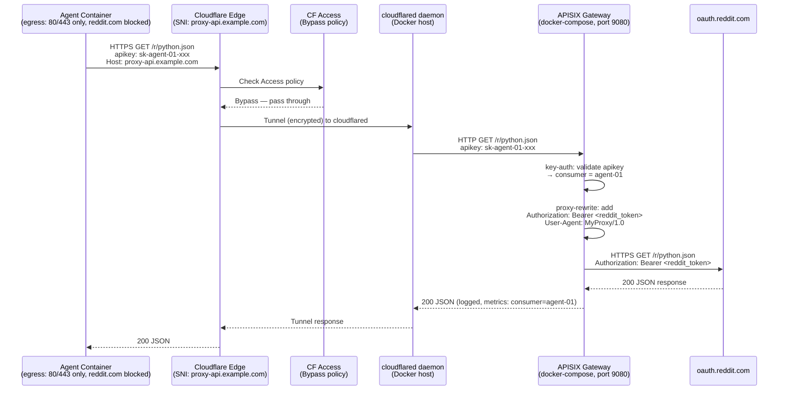

# Reddit Proxy Deployment Options

**Approach:** Deploy Apache APISIX as a reverse-proxy API gateway in docker-compose on a Cloudflare Tunnel-connected Docker host. APISIX handles per-agent API-key authentication (key-auth + Consumer model), proxies requests to Reddit via OAuth2 client-credentials, and exposes per-consumer usage metrics through its Prometheus plugin + Grafana. Cloudflare Zero Trust splits traffic by hostname: the gateway dashboard/UI uses an email-gated Allow policy; the proxy API hostname uses a Bypass policy so CF does not intercept, deferring entirely to APISIX's built-in key-auth to validate per-agent tokens.

---

## Section 1: Off-the-Shelf Gateway Selection

### Requirements Recap

- Per-client API-key auth with a "consumer" concept
- Own web UI showing per-key usage graphs and request logs
- Reverse-proxy to https://www.reddit.com (path-preserving)
- Docker-compose deployable, OSS/self-hostable

### Candidate Evaluation

#### Apache APISIX (+ etcd + Prometheus + Grafana)

**Verdict: WINNER**

APISIX satisfies all three requirements natively:

1. **Per-client key auth:** The `key-auth` plugin combined with the `Consumer` primitive assigns each agent its own API key. A consumer named `agent-01` holds a key; all requests using that key are tagged with `consumer="agent-01"` in every metric and log. ([APISIX key-auth docs](https://apisix.apache.org/docs/apisix/plugins/key-auth/))

2. **Usage observability:** The `prometheus` plugin emits `apisix_http_status`, `apisix_http_latency`, and `apisix_bandwidth` counters/histograms, each carrying a `consumer` label populated from the authenticated consumer name. PromQL for per-agent traffic: `sum(rate(apisix_http_status[5m])) by (consumer)`. Grafana dashboard ID 11719 provides a baseline; custom panels grouping by `consumer` label give per-key graphs. ([APISIX Prometheus plugin](https://apisix.apache.org/docs/apisix/plugins/prometheus/)) Request logs go to stdout or via `http-logger`/`kafka-logger` plugins.

3. **Reverse-proxy:** Standard upstream + route configuration pointing to `https://www.reddit.com` or `https://oauth.reddit.com`. The `proxy-rewrite` plugin can inject the Reddit OAuth Bearer token as an upstream header.

4. **Dashboard:** As of APISIX 3.x, the dashboard is embedded — accessible at `http://<apisix>:9180/ui/`. The legacy standalone `apache/apisix-dashboard` image (v3.0.1) is deprecated; the embedded dashboard is now the standard. ([APISIX Dashboard docs](https://apisix.apache.org/docs/apisix/dashboard/))

**Resource footprint:** APISIX gateway ~50 MB RAM at idle; etcd ~30 MB; Prometheus ~50 MB; Grafana ~100 MB. Total ~230 MB for full observability stack. ([APISIX vs Kong comparison](https://apisix.apache.org/learning-center/apisix-vs-kong/))

**Docker-compose containers needed:** `apisix`, `etcd`, `prometheus`, `grafana`, `cloudflared`. Optionally a `token-refresher` sidecar (see Section 2).

**Caveat:** The old standalone APISIX Dashboard (v2.x) had reported high CPU usage on GitHub ([apisix-dashboard issue #2935](https://github.com/apache/apisix-dashboard/issues/2935)), but that image is deprecated. The embedded dashboard is a lightweight UI calling the Admin API directly.

#### Kong Community (+ Kong Manager OSS + Prometheus + Grafana)

**Verdict: SECOND CHOICE**

- `key-auth` plugin + Consumer model is identical in concept to APISIX.
- Prometheus plugin (global plugin config) exposes `kong_http_requests_total` with `consumer` label. Import Grafana dashboard ID 11377 ([Kong APIs Monitoring](https://grafana.com/grafana/dashboards/11377-kong-apis-monitoring/)) for per-consumer graphs.
- Kong Manager OSS (available in Kong 3.x free tier) replaces the largely-unmaintained Konga. ([Kong Manager OSS announcement](https://konghq.com/blog/product-releases/kong-manager-oss))
- **Disadvantages:** PostgreSQL dependency adds another container and ~200 MB base RAM overhead. Or use DB-less mode (declarative config via decK) but then runtime config changes require file edits + reload. ([Kong docker benchmark](https://api7.ai/blog/apisix-kong-3-0-performance-comparison))

#### Tyk

**Eliminated.** The analytics dashboard requires a commercial license. The open-source Gateway + Pump gives raw analytics to a data sink (MongoDB) but the visual Dashboard GUI is not open source. ([Tyk Open Source docs](https://tyk.io/docs/tyk-open-source))

#### Traefik

**Eliminated for this use case.** Traefik has no native per-client API key auth with consumer semantics. `forwardAuth` middleware requires a separate auth service. No built-in consumer-level usage UI. Would need Prometheus + Grafana but consumer labels must come from a custom auth service. Too much custom code.

#### Caddy

**Eliminated.** No native per-client API key auth or consumer management. Metrics via `metrics` module require external Grafana; no consumer-level labeling without custom middleware.

#### nginx + njs/lua and mitmproxy

**Eliminated.** nginx requires significant custom Lua/njs coding for per-consumer auth and metrics. mitmproxy is a debug/dev tool, not a production gateway.

---

### APISIX docker-compose Skeleton

```yaml
version: "3.8"
services:
  etcd:
    image: bitnami/etcd:3.5
    environment:
      ALLOW_NONE_AUTHENTICATION: "yes"
      ETCD_ADVERTISE_CLIENT_URLS: http://etcd:2379
    volumes: [etcd_data:/bitnami/etcd]

  apisix:
    image: apache/apisix:3.9.0-debian
    ports:
      - "9080:9080" # proxy
      - "9180:9180" # Admin API / UI
      - "9091:9091" # Prometheus metrics
    volumes:
      - ./apisix/config.yaml:/usr/local/apisix/conf/config.yaml:ro
    depends_on: [etcd]

  prometheus:
    image: prom/prometheus:latest
    volumes:
      - ./prometheus/prometheus.yml:/etc/prometheus/prometheus.yml:ro

  grafana:
    image: grafana/grafana:latest
    ports: ["3000:3000"]
    volumes:
      - grafana_data:/var/lib/grafana
      - ./grafana/provisioning:/etc/grafana/provisioning

  cloudflared:
    image: cloudflare/cloudflared:latest
    command: tunnel --config /etc/cloudflared/config.yml run
    volumes:
      - ./cloudflared:/etc/cloudflared:ro

volumes:
  etcd_data:
  grafana_data:
```

Key APISIX `config.yaml` snippet for prometheus and upstream:

```yaml
apisix:
  node_listen: 9080
deployment:
  admin:
    admin_listen:
      port: 9180
plugin_attr:
  prometheus:
    export_uri: /apisix/prometheus/metrics
    export_addr:
      ip: "0.0.0.0"
      port: 9091
```

---

## Section 2: Reddit Blocking and Proxy Authentication

### (a) Will the proxy's egress to reddit.com be blocked?

**Almost certainly yes for unauthenticated requests.** As of May 30, 2026, Reddit's unauthenticated `.json` endpoints return 403 Forbidden for requests without OAuth credentials ([Medium: Reddit's API Is Officially Dead in 2026](https://medium.com/@alex_79882/reddits-api-is-officially-dead-in-2026-here-s-what-i-use-instead-f88ee5b809c8)). Additionally, datacenter/cloud IP ranges are a well-known block target for scraping traffic. **Unauthenticated requests from any IP will fail; authenticated OAuth requests from datacenter IPs have a much better chance of succeeding**, especially for "script" app types which signal legitimate developer use.

### (b) Recommended approach: Proxy holds Reddit OAuth credentials

Register ONE Reddit app of type **"script"** (or "web app") at https://www.reddit.com/prefs/apps. Both types are confidential clients that can use the `client_credentials` grant.

**Token acquisition** (POST from proxy at startup and every ~55 minutes):

```
POST https://www.reddit.com/api/v1/access_token
Authorization: Basic base64(client_id:client_secret)
Content-Type: application/x-www-form-urlencoded
Body: grant_type=client_credentials
```

This returns `{"access_token": "...", "token_type": "bearer", "expires_in": 3600}`.
There is no refresh token with `client_credentials` — re-request a new token when it expires. ([Reddit OAuth2 wiki](https://github.com/reddit-archive/reddit/wiki/oauth2))

**API calls** use the token against `https://oauth.reddit.com` (not `www.reddit.com`):

```
GET https://oauth.reddit.com/r/python.json
Authorization: Bearer <access_token>
User-Agent: <your-app-name>/1.0 by <reddit-username>
```

Rate limit: **100 QPM per OAuth client_id**, averaged over a 10-minute window. ([Reddit API Rate Limits Guide](https://painonsocial.com/blog/reddit-api-rate-limits-guide))

**NOTE (June 2026):** Reddit closed self-service app registration in November 2025. New OAuth apps require manual approval via Reddit's Developer Support form under the "Responsible Builder Policy." ([Wappkit: How to Get Reddit API Credentials in 2025](https://www.wappkit.com/blog/reddit-api-credentials-guide-2025)) Ensure your existing credentials or approved application are in place before deployment.

### Token injection in APISIX

Use a `token-refresher` sidecar container (a small shell script or Python container) that:

1. On startup and every 55 minutes, POSTs to Reddit's token endpoint
2. Updates the APISIX route's upstream `headers` via the Admin API:
   ```
   PATCH http://apisix:9180/apisix/admin/routes/<route-id>
   Body: {"plugins": {"proxy-rewrite": {"headers": {"set": {"Authorization": "Bearer <new_token>"}}}}}
   ```

This keeps ONE Reddit credential on the proxy while each agent uses its OWN APISIX consumer key.

---

## Section 3: Cloudflare Zero Trust — Precise Mechanism

### User's Intent

> "All app API endpoints bypass the Zero Trust check if an API token is present, deferring to the backend to validate the key."

This means: CF should NOT perform its own token validation on API traffic; when a request carries a token, just pass it through and let APISIX handle auth.

### Comparison of CF ZT Primitives

| Approach                               | CF validates token?                                | Per-agent granularity at CF level    | Logging    | Matches "defer to backend"?           |
| -------------------------------------- | -------------------------------------------------- | ------------------------------------ | ---------- | ------------------------------------- |
| **Bypass policy** for API hostname     | No — passes through unconditionally                | No                                   | No CF logs | ✅ Yes — literally passes all traffic |
| **Service Auth** for API hostname      | Yes — validates CF-Access-Client-Id/Secret at edge | Yes — one CF service token per agent | Yes        | ❌ CF validates, not backend          |
| **Bypass** (path-scoped under API app) | No                                                 | No                                   | No         | ✅ Yes                                |

### Recommendation: Split-Hostname with Bypass for API

**Two separate CF Access Applications:**

**Application 1 — Dashboard/UI**

- Hostname: `proxy-ui.example.com`
- cloudflared routes to APISIX admin UI (port 9180/ui/) + Grafana (port 3000)
  - (Or use path-based routing if you prefer one hostname)
- CF Access policy: **Allow**, rule: `Emails is owner@example.com`
- Requires interactive IdP login; only the owner can access

**Application 2 — Proxy API**

- Hostname: `proxy-api.example.com`
- cloudflared routes to APISIX proxy port 9080
- CF Access policy: **Bypass**, rule: `Everyone`
- CF passes all traffic through without any auth check
- APISIX `key-auth` plugin validates the per-agent `apikey` header and identifies the consumer
- Each agent gets its own APISIX consumer key (no CF service tokens needed at all)

**Tradeoff vs. Service Auth:**

- Bypass gives zero CF-level auth or per-request CF logging. If APISIX is misconfigured or the key-auth plugin is disabled, the endpoint is publicly exposed to the internet.
- Service Auth adds a CF-level defense in depth layer (CF validates CF-Access-Client-Id/Secret before traffic reaches APISIX), plus CF access logs per agent. However, it means CF — not APISIX — validates the token, which contradicts "deferring to backend."
- **For the stated intent ("defer to backend"), Bypass is the correct primitive.** If defense-in-depth is preferred, use Service Auth and accept that CF validates a CF token (agents send both CF-Access-Client-Id + CF-Access-Client-Secret AND the APISIX `apikey` header).

### cloudflared `config.yml`

```yaml
tunnel: <your-tunnel-id>
credentials-file: /etc/cloudflared/credentials.json

ingress:
  - hostname: proxy-ui.example.com
    service: http://apisix:9180
    originRequest:
      httpHostHeader: proxy-ui.example.com

  - hostname: proxy-api.example.com
    service: http://apisix:9080
    originRequest:
      httpHostHeader: proxy-api.example.com

  # Required catch-all
  - service: http_status:404
```

([cloudflared configuration file docs](https://developers.cloudflare.com/cloudflare-one/networks/connectors/cloudflare-tunnel/do-more-with-tunnels/local-management/configuration-file/))

### CF Access Application Setup (Dashboard)

**For proxy-ui.example.com:**

1. Zero Trust Dashboard → Access → Applications → Add application → Self-hosted
2. Application name: `Reddit Proxy UI`; Application domain: `proxy-ui.example.com`
3. Add policy: Action = **Allow**; Include rule: Emails = `owner@example.com`

**For proxy-api.example.com:**

1. Add application → Self-hosted
2. Application name: `Reddit Proxy API`; Application domain: `proxy-api.example.com`
3. Add policy: Action = **Bypass**; Include rule: **Everyone**

([CF Access policies docs](https://developers.cloudflare.com/cloudflare-one/access-controls/policies/))

### Per-Agent Token (APISIX Consumer Key)

Each agent gets its own APISIX consumer key. Create via Admin API:

```bash
curl -X PUT http://apisix:9180/apisix/admin/consumers \
  -H "X-API-KEY: <apisix-admin-key>" \
  -d '{"username": "agent-01", "plugins": {"key-auth": {"key": "sk-agent-01-xxx"}}}'
```

The agent sends: `GET https://proxy-api.example.com/r/python.json` with header `apikey: sk-agent-01-xxx`.

No CF service tokens are minted or distributed. CF sees all proxy-api traffic as bypass. APISIX authenticates, logs with `consumer=agent-01`, and emits Prometheus metrics tagged by consumer.

### Note on Bypass + cloudflared JWT Validation

A known issue ([Cloudflare Community](https://community.cloudflare.com/t/access-policy-to-bypass-auth-requirements-for-specific-subpath/455603)): if cloudflared is configured with `access` block for JWT validation and the application has a Bypass policy, cloudflared's middleware (`AccessJWTValidator`) may still reject requests. Mitigation: do NOT configure a cloudflared-level `access` block for the API tunnel ingress rule, and ensure the CF Access Bypass application is applied to the **same tunnel** as the API hostname. If this remains an issue, the Service Auth approach avoids it since the JWT is always valid.

---

## Section 4: End-to-End Request Flow



**What the agent-side plugin must send:**

- Base URL: `https://proxy-api.example.com`
- Auth header: `apikey: <per-agent APISIX consumer key>` (or `X-API-Key` if APISIX route is configured to read that header)
- No CF service tokens required (Bypass policy)
- No Reddit credentials in the agent (proxy holds them)

**Token refresh loop (sidecar):**

- `token-refresher` container POSTs to `https://www.reddit.com/api/v1/access_token` every 55 min
- On success, PATCHes APISIX route via Admin API to update Bearer token in `proxy-rewrite` headers

---

## Recommended Stack Summary

| Component       | Image                           | Role                                                      |
| --------------- | ------------------------------- | --------------------------------------------------------- |
| APISIX 3.9      | `apache/apisix:3.9.0-debian`    | Gateway: key-auth, proxy-rewrite, prometheus, embedded UI |
| etcd            | `bitnami/etcd:3.5`              | APISIX config store                                       |
| Prometheus      | `prom/prometheus:latest`        | Scrape APISIX metrics on port 9091                        |
| Grafana         | `grafana/grafana:latest`        | Per-consumer dashboards (import ID 11719 + custom panels) |
| cloudflared     | `cloudflare/cloudflared:latest` | Tunnel to CF edge                                         |
| token-refresher | `alpine` + curl/jq script       | Hourly Reddit OAuth token refresh → APISIX Admin API      |

**Second choice:** Kong Community 3.x (Kong Manager OSS + Prometheus plugin + Grafana ID 11377). Heavier (PostgreSQL) but widely documented. Konga is deprecated for Kong 3.x; use Kong Manager OSS or DB-less mode with decK.

---

## Open Risks

1. **Reddit OAuth approval gating (HIGH):** As of Nov 2025, Reddit requires manual approval for new OAuth apps via the "Responsible Builder Policy." If approval is denied or delayed, the entire proxy is inoperable. Mitigation: apply early; ensure the use case description meets Reddit's stated acceptable use terms.

2. **Reddit 100 QPM rate limit is shared across ALL agents (MEDIUM):** The single proxy Reddit credential means all agent traffic shares one 100-QPM bucket. Heavy multi-agent load will hit this limit. Mitigation: implement per-consumer rate-limiting in APISIX (`limit-count` plugin) to prevent any single agent from monopolizing the budget; consider registering multiple Reddit OAuth apps if volume grows.

3. **Bypass policy leaves API endpoint unguarded at CF layer (MEDIUM):** With CF Bypass, if APISIX's key-auth is misconfigured or the plugin is accidentally removed from a route, the endpoint is publicly accessible over the internet. Mitigation: either accept this risk (APISIX config is controlled), or switch to CF Service Auth for defense-in-depth (each agent gets a CF service token AND an APISIX consumer key).

4. **Reddit token refresh race condition (LOW-MEDIUM):** The token-refresher sidecar is a single point of failure. If it crashes, the proxy's Reddit token expires in 1 hour and all agents get 401s from Reddit. Mitigation: add a health check that alerts on token refresh failure; implement retry logic in the refresher; consider a simple two-token rotation (keep previous + current token).

5. **cloudflared Bypass + AccessJWTValidator conflict (LOW):** Some cloudflared versions enforce JWT validation at the tunnel middleware level even for Bypass-policy applications, resulting in rejected requests. Mitigation: validate behavior in staging; if encountered, switch the API application to Service Auth (CF validates CF tokens) or configure cloudflared to skip JWT validation for the API ingress rule (`noTLSVerify` is not the fix — the Access JWT validator must be disabled in the tunnel Access block configuration).

---

## References

- [Apache APISIX Prometheus plugin](https://apisix.apache.org/docs/apisix/plugins/prometheus/) — consumer label, metric names, export URI
- [Apache APISIX Dashboard docs](https://apisix.apache.org/docs/apisix/dashboard/) — embedded UI in 3.x
- [APISIX Docker deploy docs](https://apisix.apache.org/docs/docker/manual/) — docker-compose instructions
- [APISIX vs Kong comparison (API7.ai)](https://apisix.apache.org/learning-center/apisix-vs-kong/) — resource footprint
- [APISIX 3.0 vs Kong 3.0 benchmark](https://api7.ai/blog/apisix-kong-3-0-performance-comparison) — QPS numbers
- [APISIX Dashboard CPU issue #2935](https://github.com/apache/apisix-dashboard/issues/2935) — legacy dashboard issue
- [Kong APIs Monitoring Grafana dashboard ID 11377](https://grafana.com/grafana/dashboards/11377-kong-apis-monitoring/) — Kong Grafana dashboard
- [Tyk Open Source docs](https://tyk.io/docs/tyk-open-source) — confirms dashboard is commercial
- [Reddit OAuth2 wiki (reddit-archive)](https://github.com/reddit-archive/reddit/wiki/oauth2) — client_credentials grant, token endpoint, app types
- [Reddit API Rate Limits 2026 (PainOnSocial)](https://painonsocial.com/blog/reddit-api-rate-limits-guide) — 100 QPM, 10-min window
- [Reddit API Credentials 2025 (Wappkit)](https://www.wappkit.com/blog/reddit-api-credentials-guide-2025) — approval process changes Nov 2025
- [Medium: Reddit's API Is Officially Dead in 2026](https://medium.com/@alex_79882/reddits-api-is-officially-dead-in-2026-here-s-what-i-use-instead-f88ee5b809c8) — 403 on unauthenticated endpoints from May 2026
- [Reddit OAuth application-only flow (ranjithnair.dev)](https://blog.ranjithnair.dev/posts/reddit-oauth) — application-only OAuth walkthrough
- [CF Access policies docs](https://developers.cloudflare.com/cloudflare-one/access-controls/policies/) — Bypass, Service Auth, Allow
- [CF Access service tokens docs](https://developers.cloudflare.com/cloudflare-one/access-controls/service-credentials/service-tokens/) — CF-Access-Client-Id/Secret, Service Auth policy
- [CF Access application paths docs](https://developers.cloudflare.com/cloudflare-one/access-controls/policies/app-paths/) — path-based applications, specificity matching
- [CF Access Bypass path workaround (reliablepenguin.com, Oct 2025)](https://blogs.reliablepenguin.com/2025/10/09/make-a-single-path-public-with-cloudflare-zero-trust-while-the-rest-stays-protected) — Bypass scoped to path
- [cloudflared configuration file docs](https://developers.cloudflare.com/cloudflare-one/networks/connectors/cloudflare-tunnel/do-more-with-tunnels/local-management/configuration-file/) — ingress rules syntax
- [cloudflared in docker-compose (sambobb.com)](https://www.sambobb.com/posts/cloudflared-in-docker-compose/) — docker-compose integration
- [CF community: Bypass policy for subpath with cloudflared JWT issue](https://community.cloudflare.com/t/access-policy-to-bypass-auth-requirements-for-specific-subpath/455603) — AccessJWTValidator conflict
- [Grafana dashboard APISIX ID 11719](https://grafana.com/grafana/dashboards/11719) — official APISIX Grafana dashboard
