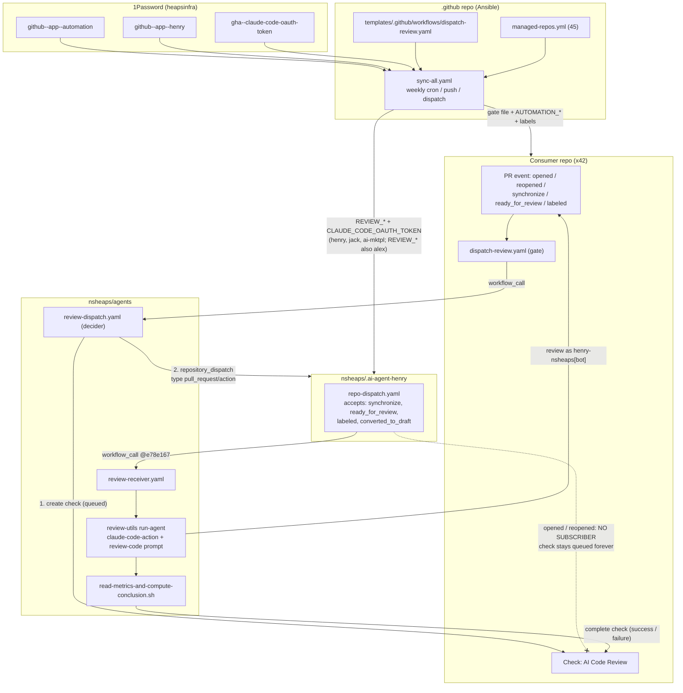

# AI review pipeline: as-is state (2026-10-07)

This is the canonical as-is record of the nsheaps AI code review system. It is built from read-only audits run on 2026-10-07. No repo was edited and no workflow was triggered during the audits. It is the baseline for rebuilding the system from the ground up.

**Evidence markers**

- **VERIFIED**: seen directly in a file, an API result or a run log.
- **INFERRED**: follows from the evidence but was not observed directly.

**Audit limits**

- `gh` was unauthenticated in the audit session: `GH_TOKEN` was invalid. All GitHub data came from the GitHub MCP tools.
- The MCP session could only read its configured repos. aitkit, agent-jordan, tilt, govee-ble-plugs and about 30 other managed repos were partly or wholly out of reach.
- Scratch evidence (logs and run lists) is in `/tmp/claude-0/-home-user/3d261a4d-264d-59d8-8fe2-a16bd408e85d/scratchpad/audit/`. That location is ephemeral.

**Account type: `nsheaps` is a GitHub _User_ account, not an Organization.** VERIFIED (owner `type: User`, id 1282393). As a result, these do not exist:

- org-level Actions secrets or variables
- org rulesets
- an org audit log (only the user security log at github.com/settings/security-log)
- org repo-deletion policies

Every secret and ruleset in this system is per repo. In this document "org" means "repos owned by `nsheaps`".

The three goals for the rebuild:

1. A system to set up reviews.
2. An agent that performs reviews across the account's repos.
3. A way to request a review on a PR from anywhere, without an external deployment.

---

## 1. Component summary

| #   | Component                                                         | Repo / path                                                                                                                                                                                                     | Role                                                                                                                                                                       | Trigger                                                                                                                                                | Identity / secrets                                                                                   | Current health                                                                                                  | Notes                                                                                                                                                                                                                       |
| --- | ----------------------------------------------------------------- | --------------------------------------------------------------------------------------------------------------------------------------------------------------------------------------------------------------- | -------------------------------------------------------------------------------------------------------------------------------------------------------------------------- | ------------------------------------------------------------------------------------------------------------------------------------------------------ | ---------------------------------------------------------------------------------------------------- | --------------------------------------------------------------------------------------------------------------- | --------------------------------------------------------------------------------------------------------------------------------------------------------------------------------------------------------------------------- |
| C1  | **Consumer gate** `dispatch-review.yaml`                          | every managed repo, `.github/workflows/dispatch-review.yaml`; canonical template `nsheaps/.github` → `ansible/templates/.github/workflows/dispatch-review.yaml`                                                 | Thin per-repo gate. Calls the decider (C3).                                                                                                                                | `pull_request` [opened, reopened, synchronize, ready_for_review, labeled]. The job runs if the PR is open AND (non-draft OR labeled `request-review`). | `AUTOMATION_GITHUB_APP_ID` / `_PRIVATE_KEY` passed explicitly                                        | **Partly working.** In 42 repos; runs succeed.                                                                  | Any label passes on a non-draft PR. Pin flip-flops between `f54467d` and `e78e167` (Renovate vs sync). Missing in github-actions (unmerged sync PR #153), qontacts, example-ai-workspace, rise-to-power and agent. VERIFIED |
| C2  | **Ansible Sync All**                                              | `nsheaps/.github`: `.github/workflows/sync-all.yaml`, `ansible/config/{managed-repos,sync-files,secret-sync}.yml`, `.github/org-labels.yaml`                                                                    | Distributes the gate file, Actions secrets (from 1Password) and labels to `managed_repos` (45 repos)                                                                       | Push to `ansible/**`; weekly cron `0 6 * * 1`; `workflow_dispatch`. PR runs are always dry-run.                                                        | `OP_SERVICE_ACCOUNT_TOKEN`; automation App for checkout and PRs                                      | **Working.** Last 10 runs succeeded; run 37273693472 (2026-10-05) `failed=0`                                    | Weekly cadence left Henry without secrets for about 4.5 days. One missing repo turns the whole run red. VERIFIED                                                                                                            |
| C3  | **Decider** `review-dispatch.yaml`                                | `nsheaps/agents/.github/workflows/review-dispatch.yaml`                                                                                                                                                         | Reusable workflow. Posts a queued "AI Code Review" check, then sends `repository_dispatch` to the reviewer repo.                                                           | `workflow_call` only                                                                                                                                   | AUTOMATION App (token minted for owner `nsheaps`)                                                    | **Working** (e.g. https://github.com/nsheaps/agents/actions/runs/37449168772)                                   | Event type is `pull_request/<action>`; `target-repo` defaults to `nsheaps/.ai-agent-henry` (L25). No `event-type` input. VERIFIED                                                                                           |
| C4  | **Receiver entry** `repo-dispatch.yaml`                           | `nsheaps/.ai-agent-henry/.github/workflows/repo-dispatch.yaml`                                                                                                                                                  | Accepts the dispatch and calls the reusable receiver (C5)                                                                                                                  | `repository_dispatch` types `pull_request/{synchronize, ready_for_review, labeled, converted_to_draft}`                                                | Passes AUTOMATION*\*, REVIEW*\*, `ANTHROPIC_API_KEY`, `CLAUDE_CODE_OAUTH_TOKEN`                      | **Partly broken**                                                                                               | **Drops `opened` and `reopened`**, so checks stay queued forever. Reads the wrong payload key (`consumer-workflow-run-url`). Hand-maintained, not synced. VERIFIED                                                          |
| C5  | **Reusable receiver** `review-receiver.yaml`                      | `nsheaps/agents/.github/workflows/review-receiver.yaml` (336 lines), pinned `@e78e167`                                                                                                                          | Marks the check in_progress, removes the label, dismisses prior approvals, runs the agent, computes the conclusion, finishes the check                                     | `workflow_call` only                                                                                                                                   | AUTOMATION token (checks, labels); REVIEW token (reviews, dismissals); Claude credential             | **Working with defects.** About 98/100 recent runs succeeded.                                                   | `plugin-ref` defaults to `main` (unpinned). Hard-codes `event-name: pull_request/synchronize`. Dead `skip` job. Concurrency group can leave old checks queued. VERIFIED                                                     |
| C6  | **run-agent / agent-setup** composite actions                     | `nsheaps/agents/plugins/claude-code/review-utils/actions/{run-agent,agent-setup}`                                                                                                                               | Checks out the consumer PR into `trigger-repo/` and runs `anthropics/claude-code-action@537ffff` (model opus) with plugins `github@ai-mktpl` and `review-changes@ai-mktpl` | called by C5                                                                                                                                           | REVIEW App token → `henry-nsheaps[bot]`; `CLAUDE_CODE_OAUTH_TOKEN`                                   | **Degraded**                                                                                                    | The metrics file is never written (Write rule never matches). 12–25 permission denials per run, not logged. Workspace root is not a git repo. Uses the deprecated `review-changes` plugin. VERIFIED / root cause INFERRED   |
| C7  | **Review prompt** `review-code/SKILL.md` and `interpolate-prompt` | `agents/plugins/claude-code/review-utils/skills/review-code/SKILL.md`; action `nsheaps/ai-mktpl/.github/actions/interpolate-prompt@e7607fb`                                                                     | Raw prompt (frontmatter stripped, envsubst)                                                                                                                                | called by C6                                                                                                                                           | —                                                                                                    | Working                                                                                                         | Asks for a notes doc it cannot write. Wrong text about the Write rule. `${REVIEW_URL}` renders empty. COMMENT verdict documented as `action_required` but mapped to `failure`. VERIFIED                                     |
| C8  | **Conclusion + Stop hook**                                        | `review-utils/.../read-metrics-and-compute-conclusion.sh`, `hooks/require-metrics-file.sh`                                                                                                                      | Maps APPROVE → success, REQUEST_CHANGES / COMMENT / unknown → failure. Falls back to the review API when the metrics file is missing.                                      | in C5                                                                                                                                                  | —                                                                                                    | **Fragile**                                                                                                     | The fallback rescues most runs. It fails when no review exists on the head SHA (run 37557540105). VERIFIED                                                                                                                  |
| C9  | **Receiver template**                                             | `nsheaps/agents/templates/dispatch-receiver-review.yaml`                                                                                                                                                        | Intended template for receiver repos                                                                                                                                       | —                                                                                                                                                      | references `REVIEW_ANTHROPIC_API_KEY`, no AUTOMATION\_\*                                             | **Stale / would not work**                                                                                      | Listens on `pr-review` (never sent). Uses `@main`. Not synced. Henry's real file has a different name. VERIFIED                                                                                                             |
| C10 | **Spec** `review-dispatch.md` and plan `review-utils.md`          | `agents/plugins/claude-code/review-utils/specs/review-dispatch.md`, `docs/plans/review-utils.md`                                                                                                                | Design docs                                                                                                                                                                | —                                                                                                                                                      | —                                                                                                    | **Stale**                                                                                                       | Describes `dispatch-receiver-review.yaml`, `pr-review`, `request-label`, `templates/dispatch-review.yaml`. Phases 7–10 pending. VERIFIED                                                                                    |
| C11 | **`sync-dispatch-workflows` skill**                               | `nsheaps/.github/.claude/skills/sync-dispatch-workflows/SKILL.md`                                                                                                                                               | Operator how-to for the gate                                                                                                                                               | —                                                                                                                                                      | —                                                                                                    | **Stale**                                                                                                       | Points to the non-existent `agents/templates/dispatch-review.yaml` (L107) and `dispatch-receiver-review.yaml` (L95, 163). VERIFIED                                                                                          |
| C12 | **GitHub App `automation-nsheaps[bot]`** (user id 251779498)      | 1Password `heapsinfra/github--app--automation`                                                                                                                                                                  | Gate, decider, checks, labels, dispatch, sync, ruleset bypass                                                                                                              | —                                                                                                                                                      | `AUTOMATION_GITHUB_APP_*`                                                                            | Working on current targets                                                                                      | Installation scope and permissions not verified (needs owner UI). VERIFIED in use                                                                                                                                           |
| C13 | **GitHub App `henry-nsheaps[bot]`**                               | 1Password `heapsinfra/github--app--henry` (CI) and `Agent-Henry/github--app--henry` (agent runtime)                                                                                                             | Posts and dismisses reviews. Also Henry's persona identity.                                                                                                                | —                                                                                                                                                      | `REVIEW_GITHUB_APP_*`                                                                                | Working                                                                                                         | Shared with the Henry persona (TODO in `secret-sync.yml:39`). VERIFIED                                                                                                                                                      |
| C14 | **Labels** `request-review`, `review/agent-henry`                 | `nsheaps/.github/.github/org-labels.yaml:6-8, 95-98`; also `ai-mktpl/.github/labels.yaml:4-6`; `scm-utils/.../references/labels.yaml`                                                                           | Manual trigger on drafts                                                                                                                                                   | label event                                                                                                                                            | —                                                                                                    | `request-review` present in all 15 checked managed repos (`ededed`)                                             | Missing in qontacts and example-ai-workspace. Defined twice with different colours and descriptions. `review/agent-henry` is read by nothing. VERIFIED                                                                      |
| C15 | **ai-mktpl local reviewer** `claude-code-review.yaml`             | `nsheaps/ai-mktpl/.github/workflows/claude-code-review.yaml`                                                                                                                                                    | Second, older, self-contained reviewer (claude-code-action@v1)                                                                                                             | PR events (same as the gate)                                                                                                                           | REVIEW\_\* plus `REVIEW_ANTHROPIC_API_KEY`, then `ANTHROPIC_API_KEY`, then `CLAUDE_CODE_OAUTH_TOKEN` | Working (run 37249515037)                                                                                       | ai-mktpl PRs get two reviewers. It removes the label; the shared gate does not. VERIFIED                                                                                                                                    |
| C16 | **`@claude` agents**                                              | `ai-mktpl/.github/workflows/{claude-agent-trigger,claude-agent}.yaml`; `iac/.github/workflows/claude.yml`                                                                                                       | General-purpose assistant, not a reviewer                                                                                                                                  | `issue_comment` with `@claude`                                                                                                                         | iac uses `ANTHROPIC_API_KEY` (never synced)                                                          | ai-mktpl: working; iac: active but every run skipped                                                            | Not part of the review pipeline. VERIFIED                                                                                                                                                                                   |
| C17 | **iac `claude-code-review.yml`**                                  | `nsheaps/iac/.github/workflows/claude-code-review.yml`                                                                                                                                                          | Legacy stock reviewer                                                                                                                                                      | `pull_request`                                                                                                                                         | `ANTHROPIC_API_KEY` (not synced)                                                                     | **Dead.** `disabled_manually`; 23/23 runs failed (last https://github.com/nsheaps/iac/actions/runs/22840033946) | Delete. VERIFIED                                                                                                                                                                                                            |
| C18 | **Henry legacy files**                                            | `.ai-agent-henry/.github/actions/{run-agent,agent-setup,with-post-step}`, `.claude/prompts/pr-review.md` + `partials/`, `.github/workflows/dispatch-review.yaml.example`, `.claude/rules/ci-review-workflow.md` | Pre-refactor pipeline and n8n-era docs                                                                                                                                     | none                                                                                                                                                   | stale `@nsheaps-ai-mktpl` plugin names                                                               | **Dead code / misleading**                                                                                      | The plan says delete (`review-utils.md:97-99`). The rule still describes n8n as live. VERIFIED                                                                                                                              |
| C19 | **n8n**                                                           | `nsheaps/n8n`                                                                                                                                                                                                   | The original webhook → dispatch router                                                                                                                                     | —                                                                                                                                                      | —                                                                                                    | **Not in use**                                                                                                  | All receiver runs are triggered by `automation-nsheaps[bot]` through the decider. VERIFIED                                                                                                                                  |
| C20 | **github-actions claude actions**                                 | `nsheaps/github-actions/.github/actions/{claude-auth,claude-debug,claude-stream-shim,interpolate-prompt,1password-secret-sync}`                                                                                 | Shared actions                                                                                                                                                             | —                                                                                                                                                      | —                                                                                                    | **Unused**                                                                                                      | The pipeline uses ai-mktpl's diverged copies instead. VERIFIED                                                                                                                                                              |
| C21 | **ai-mktpl review plugins**                                       | `ai-mktpl/plugins/{review-changes (0.2.27, DEPRECATED), scm-utils (0.2.3), review-beta (0.1.0)}`                                                                                                                | Review skills                                                                                                                                                              | —                                                                                                                                                      | —                                                                                                    | review-changes is installed by CI but inert; review-beta is unused                                              | `scm-utils/request-a-review` hard-codes ai-mktpl. VERIFIED                                                                                                                                                                  |
| C22 | **`pr-status-dispatch.yaml`**                                     | `agents/.github/workflows/pr-status-dispatch.yaml` (synced to managed repos except `.github` and `.org`)                                                                                                        | Sends `pr-status-refresh` to `.org` for the REPOS.md digest                                                                                                                | PR opened / closed / reopened / ready / converted_to_draft                                                                                             | AUTOMATION\_\*                                                                                       | Working                                                                                                         | **Not part of the review lifecycle.** Its Henry failures on 09-19 are outage evidence. VERIFIED                                                                                                                             |
| C23 | **Jack `pseudo-review` skill**                                    | `.ai-agent-jack/.claude/skills/pseudo-review/SKILL.md`                                                                                                                                                          | Manual fallback review posted as a PR comment                                                                                                                              | live Jack session                                                                                                                                      | Jack App                                                                                             | Manual only                                                                                                     | Writes to `/tmp`. VERIFIED                                                                                                                                                                                                  |
| C24 | **iac Pulumi `github-org`**                                       | `iac/github-org/Pulumi.yaml`                                                                                                                                                                                    | Protects iac's main; bots team                                                                                                                                             | —                                                                                                                                                      | —                                                                                                    | Manages **no** App installations or secrets                                                                     | `AppInstallationRepository` block commented out with placeholder ID. VERIFIED                                                                                                                                               |

---

## 2. End-to-end flow (as-is)

Step by step (VERIFIED from code and run logs):

1. A PR event fires the consumer gate (C1).
2. The gate calls `agents/.github/workflows/review-dispatch.yaml` (C3). The decider:
   - mints an AUTOMATION token,
   - creates a queued "AI Code Review" check on the PR head,
   - sends `repository_dispatch` to `nsheaps/.ai-agent-henry` with `event-type: pull_request/<action>`. The payload is `source{repo,pr_number,head_sha,head_ref,base_ref}`, `check_run_id`, `consumer_workflow_run_url` and `trigger{event,action}` (L86-100),
   - updates the check to "dispatched", still queued.
3. Henry's `repo-dispatch.yaml` (C4) accepts only four types and calls `review-receiver.yaml` (C5).
4. The receiver:
   - checks out `nsheaps/agents@plugin-ref` (default `main`) into `agent-repo/`,
   - marks the check in_progress,
   - removes the `request-review` label,
   - dismisses Henry's prior approvals,
   - runs `run-agent` (C6),
   - reads `$RUNNER_TEMP/review-metrics.yaml`, falling back to the review API,
   - completes the check.
5. Draft PRs without the label get no check at all, by design (e.g. agents #335, run 33195607925, `review` job skipped).

---

## 3. Per-component detail

### 3.1 Consumer gate (C1) and its distribution (C2)

- **Canonical template:** `/home/user/.github/ansible/templates/.github/workflows/dispatch-review.yaml`. VERIFIED.
  - The gate condition is at L52-57.
  - The pin is at L68 (`@f54467dda128…`, agents v0.3.157, 2026-10-01).
  - Only `AUTOMATION_GITHUB_APP_*` is passed (L70-72).
  - L73-76 suggest `event-type: pr-review`. That input does not exist, so uncommenting it breaks the gate.
  - L75 mentions `target-repo: nsheaps/.ai-agent-henry`. That input is real.
- **Distribution:**
  - `sync-files.yml:148-150` sends the template to `{{ managed_repos }}`, the 45 repos in `managed-repos.yml:12-70`. `vscode-claude-log-plugin` is deliberately excluded.
  - When a direct push is blocked, the sync opens a PR in the target repo. VERIFIED.
  - `sync-files.yml:140` names the template as the canonical source. There is **no** `agents/templates/dispatch-review.yaml`.
- **Copies.** `agents/.github/workflows/dispatch-review.yaml` is a synced _copy_, but its header says "template". VERIFIED (md5 of canonical is `afec272e`).
  - Byte-identical copies (11): ai-mktpl, cept, claude-utils, dotfiles, github2, homebrew-devsetup, iac, nsheaps, op-exec, .github, .org.
  - agents, .ai-agent-henry and .ai-agent-jack differ only by the Renovate pin `e78e167`.
  - `review-dispatch.yaml` and `review-receiver.yaml` are byte-identical between `f54467d` and `e78e167`, so the pin drift changes no behaviour.
- **Pin flip-flop** (VERIFIED): Renovate bumps the per-repo pin, then the next sync reverts it. Example: Henry's sync commit `23deb8f` (10-02), then Renovate `73473a6` (#107, 10-06).
- **Labels pass-through** (VERIFIED): any `labeled` event on a non-draft PR passes the gate. Renovate adding `dependencies` caused two spurious reviews:
  - aitkit#40, run 35719164764, $1.71
  - aitkit#41, run 37470764853, $0.81
- **Not required anywhere** (VERIFIED from config):
  - The only `required_status_checks` ruleset in `.github/.github/org-settings.yaml:286-325` is commented out and would require only `lint`.
  - `require-codeowner-review` is `enforcement: disabled`.
  - iac Pulumi requires only `check`.
  - Many PRs merged while the check was still queued, so stuck checks go unnoticed.

### 3.2 Decider (C3)

`/home/user/agents/.github/workflows/review-dispatch.yaml`. VERIFIED unless noted.

- Inputs: `target-repo` (default `nsheaps/.ai-agent-henry`, L21-26). No `event-type` or `request-label` inputs.
- Secrets: `AUTOMATION_GITHUB_APP_ID` and `AUTOMATION_GITHUB_APP_PRIVATE_KEY`.
- Steps:
  1. Build `details_url` (L50).
  2. Mint a token (L54-60).
  3. Create the check, queued (L64-75).
  4. Dispatch (L79-101).
  5. Update the check (L103-113).
  6. On failure, mark the check failed, only if a check id exists (L116-127).
- It never removes the trigger label (L15-16).
- Comments at L5 and L78 say the target runs `dispatch-receiver-review.yaml`. **No repo has that file.**
- One transient failure: 2026-08-17, run 32042735556, HTTP 429 downloading `LouisBrunner/checks-action`.

### 3.3 Receiver entry (C4)

`/home/user/.ai-agent-henry/.github/workflows/repo-dispatch.yaml` (blob ff698b2). VERIFIED.

- Types (L5-9): `pull_request/synchronize`, `pull_request/ready_for_review`, `pull_request/labeled`, `pull_request/converted_to_draft`.
- `uses: nsheaps/agents/.github/workflows/review-receiver.yaml@e78e167f60cb0bff5108a0d3f222e74fc6a2edd2` (L18, agents v0.3.160).
  - PRs #93 and #94 (2026-08-11) moved it to `@main`; Renovate #97 (2026-08-20) re-pinned it.
- L34 reads `client_payload.consumer-workflow-run-url` (hyphens). The decider sends `consumer_workflow_run_url` (underscores), so the value is always empty. Confirmed empty in run 37558142851.
- Workflow id 211074126, present since 2025-11-28.

### 3.4 Reusable receiver (C5)

`/home/user/agents/.github/workflows/review-receiver.yaml`. VERIFIED.

- Required secrets: AUTOMATION*\* and REVIEW*\*. Optional: `ANTHROPIC_API_KEY`, `CLAUDE_CODE_OAUTH_TOKEN` (L94-103).
- Requires a `check-run-id` input (L60-62), so a hand-made dispatch is not usable.
- Passes the fixed string `event-name: pull_request/synchronize` to run-agent and ignores the trigger inputs.
- The `trigger-event-name` description duplicates the action's.
- `plugin-ref` defaults to `main`, while the workflow itself is SHA-pinned.
- Concurrency group `review-receiver-<repo>-<pr>`.
- The `skip` job (L114-152) for `converted_to_draft` is dead: the gate never sends that action.
- The failure path needs the AUTOMATION token itself. When it is missing, checks stay queued (L305-311 admit this).
- Run 37371068884 (2026-10-05): the job was cancelled after 15m with no runner and no steps. The concurrency-replacement theory was **refuted**; it was probably platform runner starvation (INFERRED). .org#44 was hit in the same window.

### 3.5 run-agent, prompt and conclusion (C6–C8)

**Metrics path** (VERIFIED): `REVIEW_METRICS_PATH=$RUNNER_TEMP/review-metrics.yaml` (`run-agent/action.yaml:198-202`). It matches the receiver's read path (`review-receiver.yaml:278`) and the path in `SKILL.md:50-73`.

**Allowed tools** (VERIFIED from logs): `--allowedTools "mcp__github__*,Bash(gh:*),Bash(git:*),Write(/home/runner/work/_temp/**)"`. Claude Code v2.1.150. Settings `defaultMode: "auto"` (L301).

**Metrics file never written: root cause** (INFERRED, strongly supported). Per https://code.claude.com/docs/en/permissions:

- A single leading `/` anchors at the settings source, not the filesystem root.
- `Write(...)` path rules are accepted but never consulted; only `Edit(...)` and `Read(...)` are checked.
- So `Write(/home/runner/work/_temp/**)` cannot match the metrics file.
- Other ways to write it, such as a Bash heredoc, fall outside the `Bash(gh:*)`/`Bash(git:*)` allowlist.
- `defaultMode: "auto"` is probably not in effect, which would leave the session in Manual mode (INFERRED).

**Stop hook `require-metrics-file.sh`** (VERIFIED): it is registered, with `settingSources` including `user`. It exits 0 once `stop_hook_active=true` (L35-37), so it re-prompts only once, and the retried write is denied again.

**Denials are invisible** (VERIFIED):

- `show_full_output: false` (L246).
- Nothing reads `execution_file`.
- No artifacts are uploaded.

**Runs examined** (all VERIFIED):

| Run                                                                                | Consumer PR         | Turns | Denials | Metrics file      | Outcome                                                                                    |
| ---------------------------------------------------------------------------------- | ------------------- | ----- | ------- | ----------------- | ------------------------------------------------------------------------------------------ |
| [37558142851](https://github.com/nsheaps/.ai-agent-henry/actions/runs/37558142851) | aitkit#38           | 37    | 12      | missing           | rescued: APPROVED via the review API, $1.49                                                |
| [37557540105](https://github.com/nsheaps/.ai-agent-henry/actions/runs/37557540105) | agent-jordan#2      | 73    | 24      | missing           | **failed**: "no matching review found on 1732ff15… — review agent did not complete", $2.33 |
| [37449190104](https://github.com/nsheaps/.ai-agent-henry/actions/runs/37449190104) | agents#329          | 58    | 25      | missing           | rescued (review 5426982056 APPROVED)                                                       |
| [37560539774](https://github.com/nsheaps/.ai-agent-henry/actions/runs/37560539774) | renovate-config#484 | 34    | —       | missing (warning) | APPROVED, $1.00                                                                            |

**Other run-agent defects** (VERIFIED):

- The consumer is checked out into `trigger-repo/` (L109-116), so the workspace root is not a git repo. The log shows `fatal: not in a git directory … Failed to configure git authentication`. Two effects:
  - bare `git` calls at the root fail;
  - the consumer's CLAUDE.md and `.claude/rules` are not loaded.
- `plugins: github@ai-mktpl, review-changes@ai-mktpl` (L274-276). `review-changes` is DEPRECATED. It ships only a slash command the prompt never uses, so it is inert. `scm-utils` is not a drop-in replacement: its `review-code` skill has the same name as this prompt's methodology.
- The `agent-setup` path is hard-coded as `./agent-repo/...`, which contradicts its own comment.
- `actions/create-github-app-token` warns that `app-id` is deprecated in favour of `client-id`.

**Prompt defects** (VERIFIED):

- `SKILL.md:26` asks for "a local doc" with no writable path.
- `SKILL.md:60-61` describes the Write rule incorrectly.
- `${REVIEW_URL}` (L68) is not exported, so it renders empty.
- `SKILL.md` step 12 says COMMENT → `action_required`, but the script maps COMMENT → `failure`.

**Label 404 is benign** (VERIFIED): `remove-request-review-label.sh:28-29` uses `|| true`. GitHub returns 404 when the label is not _applied_ to the PR, whether or not it exists in the repo.

### 3.6 Templates, spec and skill (C9–C11)

VERIFIED.

- **`agents/templates/dispatch-receiver-review.yaml`:**
  - listens on `types: [pr-review]`, which is never sent;
  - does not pass AUTOMATION\_\*;
  - passes `REVIEW_ANTHROPIC_API_KEY`, which the receiver does not declare;
  - uses `review-receiver.yaml@main`;
  - its header claims "Synced via nsheaps/.github", but `sync-files.yml` has no receiver entry;
  - its comment cites `nsheaps/.github/secret-sync.yaml`; the real path is `ansible/config/secret-sync.yml`.
- **Spec `review-dispatch.md`:**
  - L23 and L240 name `dispatch-receiver-review.yaml` and claim both files are synced.
  - L338 mentions `templates/dispatch-review.yaml`.
  - L340: the "companion PR on nsheaps/.ai-agent-henry" is pending; that is .org PR #20 (GSD-126), open since 2026-06-09.
  - Phases 7–10 are pending.
- **Skill `sync-dispatch-workflows`:** L107 tells you to maintain `agents/templates/dispatch-review.yaml`, which does not exist. L95 and L163 name `dispatch-receiver-review.yaml`.
- **`.ai-agent-jack/.github/workflows/dispatch-review.yaml:3-4,22`:** comment names `dispatch-receiver-review.yaml`.

### 3.7 Parallel and legacy reviewers (C15–C18)

- **ai-mktpl `claude-code-review.yaml`:** second reviewer on every ai-mktpl PR. It removes the label (L64-69). `ai-mktpl/.claude/rules/auto-pr-management.md` only knows this pipeline. VERIFIED.
- **iac:**
  - `claude-code-review.yml` is disabled after 23/23 failures. The cause was INFERRED: an empty `ANTHROPIC_API_KEY`; logs return 410.
  - `claude.yml` is `@claude`-only; every run so far skipped.
  - Recommendation from the audit: delete both. VERIFIED state.
- **Henry repo:**
  - `.github/actions/{run-agent,agent-setup,with-post-step}` and `.claude/prompts/pr-review.md` + `partials/` are unused, use stale `@nsheaps-ai-mktpl` names, and are scheduled for deletion (`review-utils.md:97-99`).
  - `.github/workflows/dispatch-review.yaml.example` is an obsolete pre-reusable gate (`REVIEW_GITHUB_APP_*`, `pull_request/review`, TODO agents#117).
  - `.claude/rules/ci-review-workflow.md:5-15` still says the flow is App webhook → n8n → dispatch. This rule loads into every Henry session.
  - VERIFIED.

### 3.8 Supporting pieces in other repos

- **github-actions:**
  - `claude-auth`, `claude-debug`, `claude-stream-shim` and `interpolate-prompt` have no external users.
  - ai-mktpl holds diverged copies plus `claude-stream-tail`.
  - `1password-secret-sync` has been superseded by Ansible.
  - VERIFIED.
- **ai-mktpl plugins:**
  - `scm-utils/code-review` is described as "legacy skill used by Henry's CI review workflow".
  - `automated-code-review` is its recommended replacement, but it is not wired into CI.
  - `request-a-review` hard-codes `repos/nsheaps/ai-mktpl/...`.
  - `review-beta` (the D14 multi-aspect reviewer) is not used by any workflow.
  - VERIFIED.
- **`.org`:** documents gaps G4 (review not gated on green CI) and G16 (default CODEOWNER vs AI review as the merge gate) in `skills/org-repo-patterns/references/known-gaps.md`. VERIFIED.
- **Jack journal:** the full chain worked end to end on 2026-08-13 (PR #209 APPROVED by `henry-nsheaps[bot]`, `docs/projects/2026-08-13-org-repo-patterns/timeline.md:128`). VERIFIED.

---

## 4. Henry repo rename/delete: timeline and blast radius

### 4.1 What happened

**Conclusion:** `nsheaps/.ai-agent-henry` became unreachable (HTTP 404) on 2026-08-31. It came back on about 2026-09-16 as the **same repository object** (same repo id and workflow ids, run counters continuing). It came back **without its Actions secrets and without its pre-gap run history**.

- That pattern fits _deleted, then restored_ (INFERRED, strongly supported).
- No intermediate name was found anywhere. The only rename ever planned (`.ai-agent-henry` → `nsheaps/agent-henry`, task #170 / `nsheaps/.ai-agent-jack#39`) was put on hold indefinitely ("it-aint-broke so i-aint-fixing-it", `docs/research/discord-history/questions/Q10-repo-rename-timing.md`). VERIFIED.
- If a rename to `agent-henry` happened before the delete, the delete also removed its redirect. That would be consistent with the 404s, but it is unconfirmed.
- **Run retention is refuted as the cause of the history loss.**
  - agents still has dispatch-review run #1 (2026-05-30).
  - iac still has run 22840033946 (2026-03-09).
  - Henry is the only repo whose 404 window lines up with where its retained runs begin.
  - VERIFIED.

One earlier audit concluded that the repo was "never renamed or deleted" and that the missing history came from retention. Later evidence supersedes that conclusion: the Sync All 404s and the retention controls. The repo id and `created_at` are indeed unchanged, which is consistent with a restore.

### 4.2 Timeline (UTC)

| When                            | Event                                                                                                                                                                                                                                                                                                                                       | Evidence                                                                                                                                                   | Status                                |
| ------------------------------- | ------------------------------------------------------------------------------------------------------------------------------------------------------------------------------------------------------------------------------------------------------------------------------------------------------------------------------------------- | ---------------------------------------------------------------------------------------------------------------------------------------------------------- | ------------------------------------- |
| 2025-11-27/28                   | Repo created (id 1105709870) with `repo-dispatch.yaml` (workflow 211074126)                                                                                                                                                                                                                                                                 | first commit `ba1d784`                                                                                                                                     | VERIFIED                              |
| 2026-04-06                      | Earlier, separate outage: AUTOMATION\_\* missing in henry and jack, so every dispatch failed                                                                                                                                                                                                                                                | `.ai-agent-jack/docs/research/dream-2026-04-06/09-cicd-automation.md:186-220`                                                                              | VERIFIED (documented)                 |
| 2026-04-09 to 04-24             | Rename `.ai-agent-henry` → `agent-henry` proposed (task #170), then put on hold                                                                                                                                                                                                                                                             | `.ai-agent-henry/docs/research/discord-history/threads/chore-rename-repos.json`                                                                            | VERIFIED                              |
| 2026-08-13                      | Full chain works end to end                                                                                                                                                                                                                                                                                                                 | Jack journal                                                                                                                                               | VERIFIED                              |
| 2026-08-30 05:40                | Last Henry commit before the gap (`618a9fc`, #100)                                                                                                                                                                                                                                                                                          | git log                                                                                                                                                    | VERIFIED                              |
| 2026-08-30 10:47                | Last good agents decider run (33307318756)                                                                                                                                                                                                                                                                                                  | runs                                                                                                                                                       | VERIFIED                              |
| 2026-08-31 06:34                | Sync All #107 (33364721391) succeeds; repo exists                                                                                                                                                                                                                                                                                           | run                                                                                                                                                        | VERIFIED                              |
| 2026-08-31 ~07:00–14:04         | **Repo disappears**                                                                                                                                                                                                                                                                                                                         | Sync All #108 (33400407067, PR dry run) at 14:04:44: `GET /repos/nsheaps/.ai-agent-henry/labels 404: Not Found`; Henry is the only one of 45 repos failing | VERIFIED; exact time INFERRED         |
| 2026-08-31 17:40 to 09-15 12:29 | **Phase 1:** every decider dispatch fails with `Repository not found, OR token has insufficient permissions.` (21 failures in agents, 33420836676 → 34969153525; also op-exec 33404853822, 34263541846, 34432258754; dotfiles 34263770924)                                                                                                  | e.g. https://github.com/nsheaps/agents/actions/runs/34969146426                                                                                            | VERIFIED                              |
| 2026-09-07, 09-14               | Scheduled Sync All #111 (34091469037) and #115 (34814086983), real writes: Henry 404; the other 44 repos still get their secrets                                                                                                                                                                                                            | logs                                                                                                                                                       | VERIFIED                              |
| 2026-09-15 05:49                | Sync All #117 (34934228571): still 404                                                                                                                                                                                                                                                                                                      | log                                                                                                                                                        | VERIFIED                              |
| 2026-09-16 15:10:24–25          | All three Henry workflow records (dispatch-review, pr-status-dispatch, repo-dispatch) touched at once, with no commit: **likely the restore moment**                                                                                                                                                                                        | Actions API `updated_at`                                                                                                                                   | timestamps VERIFIED; meaning INFERRED |
| 2026-09-16 18:40 to 09-21 01:29 | **Phase 2:** receiver runs #13237–#13272 all fail with `The 'client-id' (or deprecated 'app-id') input must be set to a non-empty string` / `Auth token present: false`. Consumer checks left **queued**. First failure: https://github.com/nsheaps/.ai-agent-henry/actions/runs/35135861606 (source .ai-agent-alex#119); last: 35551039570 | logs                                                                                                                                                       | VERIFIED                              |
| 2026-09-19 11:28                | Henry commits resume (`7588f4c`, #101, Renovate)                                                                                                                                                                                                                                                                                            | git log                                                                                                                                                    | VERIFIED                              |
| 2026-09-19 20:46                | First agents decider success (35468441621). This was just the first agents PR activity; dispatches from other repos reached Henry from 09-16                                                                                                                                                                                                | runs                                                                                                                                                       | VERIFIED                              |
| 2026-09-19 22:21                | Henry `pr-status-dispatch` #139 (35473094096) fails: `appId option is required` (AUTOMATION secret empty)                                                                                                                                                                                                                                   | log                                                                                                                                                        | VERIFIED                              |
| 2026-09-20 15:52                | Sync All #118 (35520926478, PR **dry run**) succeeds; Henry's labels resolve                                                                                                                                                                                                                                                                | log                                                                                                                                                        | VERIFIED                              |
| 2026-09-21 06:39                | Scheduled Sync All #119 (35569167638) PUTs AUTOMATION*\*, REVIEW*\* and CLAUDE_CODE_OAUTH_TOKEN to Henry                                                                                                                                                                                                                                    | log                                                                                                                                                        | VERIFIED                              |
| 2026-09-21 11:46                | First receiver success, #13273 (35595895492). Henry and agents code unchanged since the 01:29 failure, so the secret PUT is the cause by elimination                                                                                                                                                                                        | runs, commits                                                                                                                                              | VERIFIED                              |

### 4.3 Blast radius

- **Every gated repo** lost reviews for about 3 weeks: 08-31 to about 09-21.
  - Phase 1: dispatches failed and checks were marked failed by the decider.
  - Phase 2: dispatches were accepted, but receiver runs died before touching the check, so checks were left queued.
  - Nothing alerted anyone. VERIFIED.
- **Henry's run history before 2026-09-16 is gone.**
  - `repo-dispatch` retained runs: 258, #13237–#13494 (snapshot 2026-10-07 ~02:40Z).
  - `ci`: 66 retained of 557, earliest #492.
  - `dispatch-review`: 56 retained, earliest #167.
  - `pr-status-dispatch`: 18 retained, earliest #136.
  - VERIFIED.
- **Gap-period failures are still red** on op-exec #60/#61 and dotfiles #44/#45. The oldest stuck queued check is dotfiles #43 (2026-08-30). VERIFIED.
- **Root cause of the blast radius:**
  - every gate hard-codes the receiver repo name (`review-dispatch.yaml:25`);
  - secrets are restored only by the weekly sync;
  - the reviewer lives in an agent's personal persona repo.
  - VERIFIED.
- **To confirm the event, a human must check github.com/settings/security-log** (User account, so no org audit log):
  - filter `repo:nsheaps/.ai-agent-henry`;
  - look for `repo.destroy` / `repo.rename` around 2026-08-31 and a restore around 2026-09-16 15:10Z;
  - also check `integration_installation.repositories_removed` for automation-nsheaps;
  - optionally open https://github.com/nsheaps/agent-henry while signed in, to test for a redirect.

---

## 5. Secrets and GitHub App matrix

### 5.1 Secret × repo

Provisioning: `nsheaps/.github` `sync-all.yaml` → Ansible → 1Password (`OP_SERVICE_ACCOUNT_TOKEN`) → `PUT /repos/{repo}/actions/secrets/{name}` (`playbooks/tasks/sync-single-secret.yml`, `no_log`, accepts 201/204, does not log which). Snapshot from run 37273693472 (2026-10-05, `Dry run: False`, `failed=0` everywhere).

Key: **known** = PUT ok in that run (VERIFIED). **not targeted** = not in `secret-sync.yml`. **missing** = needed but not provided. **unknown** = could not verify.

| Repo                                                                                                                                                                                                                                                                                                                                                                                                                                                                                                                                                                                       | AUTOMATION_GITHUB_APP_ID / \_KEY                                | REVIEW_GITHUB_APP_ID / \_KEY | CLAUDE_CODE_OAUTH_TOKEN   | OP_SERVICE_ACCOUNT_TOKEN | ANTHROPIC_API_KEY                                                                    | ARCANE_URL / \_API_KEY | Notes                                                                                                 |
| ------------------------------------------------------------------------------------------------------------------------------------------------------------------------------------------------------------------------------------------------------------------------------------------------------------------------------------------------------------------------------------------------------------------------------------------------------------------------------------------------------------------------------------------------------------------------------------------ | --------------------------------------------------------------- | ---------------------------- | ------------------------- | ------------------------ | ------------------------------------------------------------------------------------ | ---------------------- | ----------------------------------------------------------------------------------------------------- |
| .ai-agent-henry (receiver)                                                                                                                                                                                                                                                                                                                                                                                                                                                                                                                                                                 | known                                                           | known                        | known                     | not targeted             | not targeted (empty; OK, OAuth used)                                                 | not targeted           | Missing 09-16 → 09-21 (§4)                                                                            |
| .ai-agent-jack                                                                                                                                                                                                                                                                                                                                                                                                                                                                                                                                                                             | known                                                           | known                        | known                     | not targeted             | not targeted                                                                         | not targeted           |                                                                                                       |
| ai-mktpl                                                                                                                                                                                                                                                                                                                                                                                                                                                                                                                                                                                   | known                                                           | known                        | known                     | not targeted             | not targeted / unknown                                                               | not targeted           | Local reviewer also references `REVIEW_ANTHROPIC_API_KEY`, `CLAUDE_API_KEY` (never synced; fallbacks) |
| .ai-agent-alex                                                                                                                                                                                                                                                                                                                                                                                                                                                                                                                                                                             | known                                                           | known                        | **not targeted**          | not targeted             | not targeted                                                                         | not targeted           | Couldn't host a receiver as is                                                                        |
| .github                                                                                                                                                                                                                                                                                                                                                                                                                                                                                                                                                                                    | known                                                           | not targeted                 | not targeted              | known                    | not targeted                                                                         | not targeted           | Sync engine                                                                                           |
| iac                                                                                                                                                                                                                                                                                                                                                                                                                                                                                                                                                                                        | known                                                           | not targeted                 | not targeted              | known                    | **missing** (INFERRED; `claude-code-review.yml` 23/23 failed, `claude.yml` needs it) | known                  | Pulumi/cloudflare deploys use `OP_SERVICE_TOKEN` (name mismatch) with an `Infrastructure` vault       |
| agents                                                                                                                                                                                                                                                                                                                                                                                                                                                                                                                                                                                     | known                                                           | not targeted                 | not targeted              | not targeted             | not targeted                                                                         | not targeted           | Hosts decider and receiver code only                                                                  |
| 38 other managed repos (agent-template, .ai-agent-pamela, .ai-agent-qlod, agent-kenny, agent-jordan, claudesh, claude-daemon-setup, daemon-agent-template, claude-utils, aitkit, .ai-old, homebrew-devsetup, brew-meta-formula, github-actions, cors-proxy, renovate-config, .org, nsheaps, workspaces, dotfiles, obsidian-vaults, n8n, cept, agent-orchestrators, farish, framework-touchpad-toggle, private-pages, github2, op-exec, git-wt, gs-stack-status, tilt, govee-ble-plugs, greasemonkey-scripts, vscode-structured-data-viewer, claude-code-sessions, scratch, public-scratch) | known                                                           | not targeted (not needed)    | not targeted (not needed) | not targeted             | not targeted                                                                         | not targeted           | Consumers need only AUTOMATION\_\*                                                                    |
| qontacts                                                                                                                                                                                                                                                                                                                                                                                                                                                                                                                                                                                   | **missing** (not managed; App step skipped in job 112575711086) | —                            | —                         | —                        | —                                                                                    | —                      | No gate, no label                                                                                     |
| example-ai-workspace                                                                                                                                                                                                                                                                                                                                                                                                                                                                                                                                                                       | **missing** (not managed)                                       | —                            | —                         | —                        | —                                                                                    | —                      | No gate, no label                                                                                     |
| rise-to-power                                                                                                                                                                                                                                                                                                                                                                                                                                                                                                                                                                              | **missing** (not managed)                                       | —                            | —                         | —                        | —                                                                                    | —                      | Public, created 2026-10-01                                                                            |
| agent                                                                                                                                                                                                                                                                                                                                                                                                                                                                                                                                                                                      | **missing** (not managed)                                       | —                            | —                         | —                        | —                                                                                    | —                      | Private, last updated 2026-02-18                                                                      |
| vscode-claude-log-plugin                                                                                                                                                                                                                                                                                                                                                                                                                                                                                                                                                                   | excluded on purpose (`managed-repos.yml:45-46`)                 | —                            | —                         | —                        | —                                                                                    | —                      |                                                                                                       |

Notes:

- REVIEW\_\* and `CLAUDE_CODE_OAUTH_TOKEN` are needed only by the **receiver** repo (plus ai-mktpl's local reviewer). Consumer repos do not need them. VERIFIED.
- No repository _variables_ are used by the receiver path. VERIFIED.
- `secret-sync.yml:16` says "Store token as org secret". That is impossible on a User account; it is actually a repo secret on `.github` and `iac`. VERIFIED.

### 5.2 1Password items

| Item                                                                             | Feeds                                                                    | Status                                                                                    |
| -------------------------------------------------------------------------------- | ------------------------------------------------------------------------ | ----------------------------------------------------------------------------------------- |
| `op://heapsinfra/github--app--automation/AUTOMATION_GITHUB_APP_{ID,PRIVATE_KEY}` | AUTOMATION\_\*                                                           | VERIFIED in use; whether the key stays valid needs a human                                |
| `op://heapsinfra/github--app--henry/GITHUB_APP_{ID,PRIVATE_KEY}`                 | REVIEW\_\* (CI)                                                          | VERIFIED; TODO "not henry, make CI review bot separate from henry" (`secret-sync.yml:39`) |
| `op://Agent-Henry/github--app--henry`                                            | Henry agent runtime (`.ai-agent-henry/.claude/plugins.settings.yaml:21`) | VERIFIED; second copy of the same App key                                                 |
| `op://heapsinfra/gha--claude-code-oauth-token/token`                             | CLAUDE_CODE_OAUTH_TOKEN                                                  | VERIFIED                                                                                  |
| `op://heapsinfra/github-actions--1pass--service-account/password`                | OP_SERVICE_ACCOUNT_TOKEN                                                 | VERIFIED                                                                                  |
| `op://heapsinfra/arcane/{url,api-key}`                                           | ARCANE\_\* (iac)                                                         | VERIFIED                                                                                  |
| `op://Agent-Jack/github--app--jack`, `op://Agent-Alex/github--app--alex`         | agent runtimes                                                           | VERIFIED; `agents/docs/specs/auth-credentials.md:37,57` still says `AI-Jack` (stale)      |
| `op://ci-cd/github-automation-app/*`                                             | old references                                                           | INFERRED obsolete                                                                         |
| `op://Infrastructure/{github-org-pulumi/token, pulumi-backend/passphrase}`       | iac Pulumi/cloudflare deploys                                            | unknown whether the service account can read them                                         |

### 5.3 GitHub Apps

| App                                      | Role                                                                                                                              | Must be installed on                                                 | Status                                                                                                           |
| ---------------------------------------- | --------------------------------------------------------------------------------------------------------------------------------- | -------------------------------------------------------------------- | ---------------------------------------------------------------------------------------------------------------- |
| `automation-nsheaps[bot]` (id 251779498) | Sync checkout, gate, decider, checks, labels, `repository_dispatch`, ruleset bypass (`org-settings.yaml:204`), ai-mktpl CD pushes | every managed repo, `agents`, the receiver repo, `.github`, ai-mktpl | Working on current targets. **Installation scope and permissions not verified (human).** No commits in qontacts. |
| `henry-nsheaps[bot]`                     | Posts and dismisses reviews; also the Henry persona                                                                               | every repo whose PRs get reviewed                                    | Working (APP_SLUG `henry-nsheaps` in run 37557540105). Coupled to the persona.                                   |
| `jack-nsheaps[bot]`, `alex-nsheaps[bot]` | Agent runtimes                                                                                                                    | their repos                                                          | Not in the review path; Jack's cloud token exchange is egress-blocked (ai-mktpl#756)                             |

Every token is minted with `owner: nsheaps`. The check run on a consumer therefore works only if the App is installed on that repo (INFERRED). `allowed_bots` in run-agent: github-actions, renovate, claude, automation-nsheaps, jack-nsheaps, henry-nsheaps, alex-nsheaps. Pulumi manages no App installations. VERIFIED.

---

## 6. Entry points to request a review

| #   | Entry point                                              | Where                      | Works?                       | Evidence                                                                                                                                                                                                                             |
| --- | -------------------------------------------------------- | -------------------------- | ---------------------------- | ------------------------------------------------------------------------------------------------------------------------------------------------------------------------------------------------------------------------------------ |
| E1  | Automatic on `opened` / `reopened` (non-draft)           | 42 gated repos             | **BROKEN**                   | Receiver doesn't subscribe. ai-mktpl#826: gate run 37249515426 succeeded; check 111574102764 queued since 2026-10-05T00:57Z. Of 100 recent receiver runs: 98 synchronize, 1 ready_for_review, 1 labeled, 0 opened/reopened. VERIFIED |
| E2  | Automatic on `synchronize` / `ready_for_review`          | 42 gated repos             | Works                        | e.g. 37560539774, 37557071832. VERIFIED                                                                                                                                                                                              |
| E3  | `request-review` label (drafts; any label on non-drafts) | gated repos with the label | Works where the label exists | Henry run 37470764853 (`labeled`). Label missing in qontacts and example-ai-workspace. VERIFIED                                                                                                                                      |
| E4  | ai-mktpl local `claude-code-review.yaml`                 | ai-mktpl only              | Works (duplicate reviewer)   | run 37249515037. VERIFIED                                                                                                                                                                                                            |
| E5  | `@claude` comment                                        | ai-mktpl, iac              | General agent, not a review  | VERIFIED                                                                                                                                                                                                                             |
| E6  | `workflow_dispatch` (repo, PR)                           | —                          | **Does not exist**           | Both reusable workflows are `workflow_call` only. Code search finds 0 `issue_comment`/`workflow_dispatch` callers of `review-dispatch`. VERIFIED                                                                                     |
| E7  | Hand-made `repository_dispatch` to Henry                 | —                          | Not usable                   | Needs a pre-created `check-run-id` plus write access to Henry's repo. VERIFIED                                                                                                                                                       |
| E8  | Jack `pseudo-review` / scm-utils `request-a-review`      | agent sessions             | Manual only                  | `request-a-review` hard-codes ai-mktpl. VERIFIED                                                                                                                                                                                     |

**Goal 3 ("request a review from anywhere without an external deployment") is not met.** VERIFIED. The audit suggests a `workflow_dispatch` (repo, pr_number) workflow in `nsheaps/agents`. It would create the check with the automation App and fire the same dispatch. Optionally, a `/review` `issue_comment` trigger could be added to the synced gate. These are suggestions only and have not been built.

### 6.1 Currently stuck "AI Code Review" checks (queued > 1h, sampled repos)

All VERIFIED. 18 were confirmed; the sweep estimated 20 including unchecked PRs.

| Repo              | PR   | Check                                                          | Queued since (UTC) |
| ----------------- | ---- | -------------------------------------------------------------- | ------------------ |
| agents            | #367 | https://github.com/nsheaps/agents/runs/112139069076            | 10-06 06:28        |
| claude-utils      | #505 | https://github.com/nsheaps/claude-utils/runs/112124058081      | 10-06 05:32        |
| claude-utils      | #504 | https://github.com/nsheaps/claude-utils/runs/111580245565      | 10-05 01:29        |
| claude-utils      | #503 | https://github.com/nsheaps/claude-utils/runs/111447992800      | 10-04 13:37        |
| nsheaps           | #25  | https://github.com/nsheaps/nsheaps/runs/112312253869           | 10-06 14:06        |
| op-exec           | #62  | https://github.com/nsheaps/op-exec/runs/106118001025           | 09-20 17:28        |
| dotfiles          | #43  | https://github.com/nsheaps/dotfiles/runs/99327221284           | 08-30 21:52        |
| homebrew-devsetup | #970 | https://github.com/nsheaps/homebrew-devsetup/runs/112365931540 | 10-06              |
| homebrew-devsetup | #969 | https://github.com/nsheaps/homebrew-devsetup/runs/112341990761 | 10-06              |
| iac               | #234 | https://github.com/nsheaps/iac/runs/112276911378               | 10-06              |
| iac               | #233 | https://github.com/nsheaps/iac/runs/112053603403               | 10-06              |
| .github           | #222 | https://github.com/nsheaps/.github/runs/112066611647           | 10-06 01:43        |
| .ai-agent-jack    | #511 | https://github.com/nsheaps/.ai-agent-jack/runs/112214545734    | 10-06              |
| .ai-agent-jack    | #512 | https://github.com/nsheaps/.ai-agent-jack/runs/112214563204    | 10-06              |
| ai-mktpl          | #826 | https://github.com/nsheaps/ai-mktpl/runs/111574102764          | 10-05              |
| ai-mktpl          | #824 | https://github.com/nsheaps/ai-mktpl/runs/111293422664          | 10-04              |
| cept              | #353 | https://github.com/nsheaps/cept/runs/112472399429              | 10-06/07           |
| .ai-agent-henry   | #109 | https://github.com/nsheaps/.ai-agent-henry/runs/111569752634   | 10-05 00:34        |

**Other review-cost observation:** Renovate rebases trigger repeated `synchronize` reviews. agents#364 got 7 Henry reviews, 6 of them dismissed. VERIFIED counts; the cost impact is INFERRED.

---

## 7. Distribution state: ai-mktpl vs the agents marketplace, and the CLI/workspace gap

**Target direction (handler):**

- `nsheaps/ai-mktpl` is the only distribution channel.
- Plugins authored in `nsheaps/agents` are published _through_ ai-mktpl.
- `nsheaps/agents` gains a bun/ts/nx/mise CLI that bootstraps workspaces such as `nsheaps/example-ai-workspace` in Claude Code cloud environments.
- A companion Claude plugin lets the agent manage the workspace.

### 7.1 Plugin distribution today (VERIFIED)

- **`agents` publishes its own marketplace.** `agents/.claude-plugin/marketplace.json` (name `agents`) lists 7 plugins:
  - agent-utils 0.4.2, cron-utils 0.1.1, hook-utils 0.1.1, plugin-utils 0.1.1, reddit 0.1.1, review-utils 0.2.12, task-utils 0.3.1.
  - `query-utils` is README-only.
- **agents CD** (`agents/.github/workflows/cd.yaml`) auto-bumps and regenerates that marketplace (latest https://github.com/nsheaps/agents/actions/runs/37484567003).
- **Five consumers subscribe to `@agents`:**

  | Repo            | Plugins enabled from `@agents`                 |
  | --------------- | ---------------------------------------------- |
  | agents          | agent-utils                                    |
  | iac             | agent-utils                                    |
  | .github         | agent-utils, hook-utils                        |
  | .ai-agent-henry | cron-utils, task-utils (`settings.json:84-85`) |
  | .ai-agent-jack  | task-utils (`settings.json:197`)               |

- **ai-mktpl cannot list external plugins today.**
  - All 56 entries are local `./plugins/<name>`.
  - `ai-mktpl/mise/tasks/update-marketplace` starts with `jq '.plugins = []'`, so a hand-added external entry would be wiped on the next CD run.
- **Prerequisites that are already in place:**
  - No name collisions between the two marketplaces.
  - The agents plugins are self-contained: no symlinks, no `..` escapes, no `dependencies`; agent-utils ships a committed `dist/`.
  - Claude Code supports `git-subdir` and `url` sources (the official marketplace uses 98 and 164 of them).
  - A ported design exists in `example-ai-workspace/docs/plans/external-plugin-propagation-safety.md`.
- **The automation App can push to ai-mktpl** (CD job `bump-and-update-marketplace` uses it). Last run 31828249382 (2026-08-14) was green; committer `automation-nsheaps[bot]`.
  - Possible missed bumps: commit 8bcd014 (2026-08-17) touched 604 plugin files and started no cd run. The probable cause is the 300-file path-filter limit (INFERRED).
- **Contradictory specs:**
  - `agents/docs/specs/marketplace-structure.md` makes agents a marketplace.
  - `plugin-system-design.md:4,23` says ai-mktpl is primary.
- **Stale READMEs:** `cron-utils/README.md:20-33` (`sched-utils@agents`), `task-utils/README.md:74-87`, `plugin-utils/README.md:29`.
- **review-utils is not consumed as a plugin by CI.** CI checks out `nsheaps/agents` and runs the composite action, reading `SKILL.md` as a raw prompt. That is GitHub Actions distribution, which is separate from plugin distribution.
- **dotfiles** subscribes to the old marketplace name `nsheaps/.ai` (renamed to ai-mktpl; the redirect is INFERRED).

### 7.2 CLI in `nsheaps/agents` today (VERIFIED)

- **Tooling is in place:**
  - `mise.toml` pins bun 1.4.2, node 24.21.0, Claude Code 2.1.128.
  - nx `build`/`test`/`lint` targets exist.
  - Bun workspaces: `apps/* packages/* services/* lib/* plugins`.
- **No workspace CLI exists.**
  - Of 13 `apps/*` directories, most are placeholders.
  - The only real TS app is `apps/pr-status-cli`.
  - `apps/agent-cli` is bash plus Python (`bin/deprecated-agent`, `lib/patch-binary.py`).
  - `docs/specs/agents-cli.md` (draft 2026-04-13) reserves the `agents` binary name.
- **Release and Homebrew:**
  - `release.yaml` tags `v0.3.x`.
  - `update-homebrew` renders `Formula/{agent-team,claude-team}.rb.gotmpl` into homebrew-devsetup (e.g. #969 merged 2026-10-06).
  - The formulas install bash scripts from `nsheaps/agent-team` tarballs. That is the old repo name; the redirect is INFERRED.
  - `bin/agent-launch.ts` imports a `src/` that does not exist at v0.3.161, so it is broken.
  - Both formulas install `bin/claude-team` and `bin/ct`, so they conflict (INFERRED).
  - Run 37020817883 (2026-10-02) failed only because nothing new was released ("nothing to commit"): the job runs unconditionally.
  - `Formula/TODO.md` asks to move formulas under `apps/<app>/Formula/`.
- **Precedent to copy:** `nsheaps/claude-utils` builds with `bun build --compile`, ships per-platform release tarballs, and has a brew formula. It is consumed via mise `github:nsheaps/claude-utils`.
- **Network:**
  - From the audit session, GitHub release downloads, the releases API, `registry.npmjs.org` and codeload all returned 200.
  - `ai-mktpl/.claude/rules/ongoing-issues.md` records #759 (releases API blocked in other cloud sessions) and #758 (mise not activated).

### 7.3 example-ai-workspace today (VERIFIED)

- Created 2026-10-07, private, 2 commits. Imported from `oura-health-playground/nsheaps-ai-workspace`.
- **Hard-coded oura and laptop references:**
  - README clone URL.
  - `harness/claudecode/settings.json` hooks under `$HOME/src/oura-health-playground/...`.
  - Marketplaces `oura-health-playground/ai-marketplace` and `/Users/nathan.heaps/...`.
  - `GRAFANA_URL=https://monitoring.oura.cloud`.
- **Setup is host wiring through Python.** `bin/wire` → `wire.py` symlinks into `~/.claude`. `bin/skillctl` and `bin/plugctl` manage skills and plugins.
- **No cloud bootstrap:** there is no root `.claude/settings.json` and no SessionStart hook. `TODO.md:8` records that cloud sessions see only 2 of 55 skills.
- Has its own unpublished dev marketplace. Claude Code pin 2.1.227, which differs from agents' 2.1.128.
- Not in `managed_repos`: no review gate, no secrets, no label.

### 7.4 Gap summary

| Dimension           | Current (VERIFIED)                                                                                                                                 | Desired                                                                             |
| ------------------- | -------------------------------------------------------------------------------------------------------------------------------------------------- | ----------------------------------------------------------------------------------- |
| Plugin distribution | `agents` is its own marketplace; 5 repos subscribe                                                                                                 | Only ai-mktpl; agents plugins appear there as external, pinned entries              |
| ai-mktpl generator  | Local `./plugins/*` only; wipes anything else                                                                                                      | `plugins/*` plus `external-plugins/*` with collision checks                         |
| Version flow        | agents CD bumps its own marketplace                                                                                                                | agents CD bumps and dispatches to ai-mktpl, which pins the SHA                      |
| Workspace CLI       | None (Python scripts with oura paths)                                                                                                              | bun/ts/nx `agents` CLI with a `workspace` command group; release binaries plus brew |
| Workspace plugin    | None                                                                                                                                               | Claude plugin (e.g. `workspace-utils`) from agents, distributed via ai-mktpl        |
| Cloud bootstrap     | Per-repo copied shell hooks (ai-mktpl `01-install-plugins.sh`, jack copy); missing in agents, claude-utils, nsheaps, .github, example-ai-workspace | One SessionStart hook: install the CLI, run `agents workspace bootstrap`            |

The distribution audit also gave a proposed structure: `apps/agents-cli`, the bootstrap fallback order (PATH → mise → direct release URL with sha256 → `bunx`), `workspace-utils`, and the ai-mktpl `external-plugins` mechanism. That structure is a proposal, not as-is state; see the source report if it is carried into a plan.

---

## 8. BROKEN / MISSING

Status of the defect itself: V = VERIFIED, I = INFERRED. "Human?" means the fix needs a human action or decision; **code** means an agent can do it.

| ID  | Defect                                                                                                                                     | Where                                                                                                                                                      | Evidence                                                                              | Fix                                                                                                                                                                                              | Human?                                                |
| --- | ------------------------------------------------------------------------------------------------------------------------------------------ | ---------------------------------------------------------------------------------------------------------------------------------------------------------- | ------------------------------------------------------------------------------------- | ------------------------------------------------------------------------------------------------------------------------------------------------------------------------------------------------ | ----------------------------------------------------- |
| R1  | **Opened/reopened PRs never get reviewed; their check stays queued forever** (V)                                                           | `.ai-agent-henry/.github/workflows/repo-dispatch.yaml:5-9` vs `agents/.github/workflows/review-dispatch.yaml:84`                                           | ai-mktpl#826, check 111574102764; §6.1 (18 stuck)                                     | Add `pull_request/opened` and `/reopened`, or send one normalized event type from the decider and put the action in the payload                                                                  | code                                                  |
| R2  | **No sweeper for checks that are never picked up** (V)                                                                                     | `review-dispatch.yaml:103-127`; `review-receiver.yaml:305-311`                                                                                             | §6.1; phase-2 outage runs                                                             | Scheduled reconciler that marks old queued checks `timed_out`/`failure` with a re-request hint; receiver preflight that fails loudly                                                             | code                                                  |
| R3  | **Payload key mismatch: consumer run URL always empty** (V)                                                                                | `repo-dispatch.yaml:34` (`consumer-workflow-run-url`) vs `review-dispatch.yaml:96`                                                                         | run 37558142851 inputs                                                                | Read `consumer_workflow_run_url`                                                                                                                                                                 | code                                                  |
| R4  | **Single hard-coded reviewer repo; its deletion broke every review for about 3 weeks** (V)                                                 | `review-dispatch.yaml:21-26`; template comment L75                                                                                                         | §4                                                                                    | Host the receiver in a stable, purpose-named repo (agents or a dedicated one); make the target a single setting. A User account has no org variables, so it must be a template default or input. | human decision + code                                 |
| R5  | **Restored repo lacked secrets until the weekly sync (~4.5 days)** (V)                                                                     | `sync-all.yaml` cron `0 6 * * 1`                                                                                                                           | §4.2                                                                                  | Daily secrets sync; dispatch Sync All on a missing-secret failure; canary review; sync on `managed-repos.yml` change                                                                             | code                                                  |
| R6  | **One missing repo turns Sync All red for 2 weeks and hides the cause** (V)                                                                | `ansible/roles/label_sync/tasks/main.yml:12,22`                                                                                                            | #108–#117                                                                             | Check the repo exists first; warn and skip with a step-summary row                                                                                                                               | code                                                  |
| R7  | **Secret sync logs can't distinguish create from update** (V)                                                                              | `tasks/sync-single-secret.yml:17-31`                                                                                                                       | `no_log`                                                                              | Log the HTTP status (201 vs 204) without the value                                                                                                                                               | code                                                  |
| R8  | **Silent failure: nothing alerts when the receiver lacks credentials or fails** (V)                                                        | `review-receiver.yaml` failure path                                                                                                                        | run 35135861606                                                                       | Preflight secret check; comment on the source PR; open or update an issue in agents                                                                                                              | code                                                  |
| R9  | **Review identity is Henry's personal App** (V)                                                                                            | `secret-sync.yml:38-61` (TODO L39); `.ai-agent-henry/.claude/plugins.settings.yaml:21`                                                                     | APP_SLUG `henry-nsheaps`                                                              | Create a dedicated review App, a 1Password item and installs; repoint REVIEW\_\*; add it to `allowed_bots`                                                                                       | **human** (App, 1Password) + code                     |
| R10 | **Metrics file never written (Write rule can't match)** (I, strongly supported)                                                            | `review-utils/actions/run-agent/action.yaml:271,302-304`                                                                                                   | 3/3 runs missing; docs                                                                | `Edit(/${{ runner.temp }}/**)`, i.e. `Edit(//…)`, mirrored in `settings.permissions.allow`                                                                                                       | code                                                  |
| R11 | **Verdict depends on a fragile LLM-written file** (V)                                                                                      | `read-metrics-and-compute-conclusion.sh`                                                                                                                   | run 37557540105 failed                                                                | Use the review API as the primary verdict; metrics only for `follow_ups`                                                                                                                         | code                                                  |
| R12 | **Permission denials are invisible** (V)                                                                                                   | `run-agent/action.yaml:246`, nothing after L342                                                                                                            | 12/24/25 denials, no list                                                             | Add a jq step printing `permission_denials` from `execution_file`                                                                                                                                | code                                                  |
| R13 | **`defaultMode: "auto"` probably not in effect** (I)                                                                                       | `run-agent/action.yaml:301`                                                                                                                                | denial counts                                                                         | `dontAsk` plus an explicit allowlist (Glob, Grep, `Edit(//…_temp/**)`, read-only Bash)                                                                                                           | code                                                  |
| R14 | **Prompt asks for a notes doc it can't write; wrong Write-rule text; `${REVIEW_URL}` empty; COMMENT mapping disagrees** (V)                | `review-code/SKILL.md:26,60-61,68`, step 12 vs conclusion script                                                                                           | file reads                                                                            | Put notes under `${RUNNER_TEMP}`; fix the text; drop the variable; pick one COMMENT behaviour                                                                                                    | code                                                  |
| R15 | **Workspace root not a git repo; consumer config not loaded** (V)                                                                          | `run-agent/action.yaml:109-116`                                                                                                                            | `fatal: not in a git directory` in all runs                                           | Check out the consumer at the root (`clean: false`, exclude `agent-repo/`)                                                                                                                       | code                                                  |
| R16 | **Deprecated, inert `review-changes@ai-mktpl` installed** (V)                                                                              | `run-agent/action.yaml:274-276`, comment L233                                                                                                              | plugin.json DEPRECATED                                                                | Remove it; do not blindly swap in `scm-utils` (`review-code` name clash)                                                                                                                         | code                                                  |
| R17 | **agent-jordan#2 has no review; cause unknown** (V outcome, I cause)                                                                       | run 37557540105                                                                                                                                            | log                                                                                   | After R12 and R10, re-run; check the PR                                                                                                                                                          | **human** (session lacks access)                      |
| R18 | **`plugin-ref` defaults to `main` while the workflow is SHA-pinned** (V)                                                                   | `review-receiver.yaml`                                                                                                                                     | file                                                                                  | Default to the workflow's SHA or have callers pass it                                                                                                                                            | code                                                  |
| R19 | **Receiver hard-codes `event-name: pull_request/synchronize`; duplicate input description** (V)                                            | `review-receiver.yaml`                                                                                                                                     | file                                                                                  | Pass the real trigger                                                                                                                                                                            | code                                                  |
| R20 | **Dead `converted_to_draft` skip job and type** (V)                                                                                        | `review-receiver.yaml:114-152`; `repo-dispatch.yaml:9`                                                                                                     | the gate never sends it                                                               | Forward it from the gate, or remove both                                                                                                                                                         | code                                                  |
| R21 | **Concurrency/cancellation can leave old checks queued** (I)                                                                               | `review-receiver.yaml` concurrency group                                                                                                                   | run 37371068884 cancelled (runner starvation, INFERRED)                               | Finish cancelled runs' checks as neutral, or key checks by head SHA                                                                                                                              | code                                                  |
| R22 | **Gate passes any label on non-drafts (spurious reviews)** (V)                                                                             | template gate condition L52-57                                                                                                                             | aitkit#40/#41, ~$2.52                                                                 | Pass `labeled` only for `request-review`                                                                                                                                                         | code                                                  |
| R23 | **Renovate rebases cause repeated reviews** (V counts)                                                                                     | gate / receiver                                                                                                                                            | agents#364: 7 reviews                                                                 | Review Renovate PRs once, or skip unchanged diffs                                                                                                                                                | human decision + code                                 |
| R24 | **Gate pin flip-flop (Renovate vs sync)** (V)                                                                                              | agents, .ai-agent-henry, .ai-agent-jack copies                                                                                                             | `23deb8f` vs `73473a6`                                                                | Renovate `ignorePaths` for synced copies; bump only the template in `.github`                                                                                                                    | code                                                  |
| R25 | **Receiver re-pinned by Renovate against the `@main` intent** (V)                                                                          | `repo-dispatch.yaml:18`                                                                                                                                    | #93/#94 then #97                                                                      | Pick a policy; Renovate rule or prompt auto-merge                                                                                                                                                | human decision + code                                 |
| R26 | **Receiver not distributed or versioned like the gate** (V)                                                                                | `sync-files.yml` (no entry)                                                                                                                                | drift in R1 and R3                                                                    | Sync the receiver, or make it live in agents                                                                                                                                                     | code                                                  |
| R27 | **Stale receiver template** (V)                                                                                                            | `agents/templates/dispatch-receiver-review.yaml`                                                                                                           | `pr-review`, missing AUTOMATION\_\*, `REVIEW_ANTHROPIC_API_KEY`, `@main`, wrong paths | Regenerate from the working receiver; CI check that they stay in sync                                                                                                                            | code                                                  |
| R28 | **Template, spec, skill and comments name non-existent files and inputs** (V)                                                              | gate L3-4, 21-22, 73-76; `review-dispatch.yaml:5,78`; `review-dispatch.md:23,240,338,340`; skill L95, 107, 163; jack gate comment; agents gate-copy header | `ls agents/templates`                                                                 | One source of truth; correct the docs; drop the `event-type` hint                                                                                                                                | code                                                  |
| R29 | **n8n flow described as live; obsolete `.example`** (V)                                                                                    | `.ai-agent-henry/.claude/rules/ci-review-workflow.md:5-15`, `dispatch-review.yaml.example`, `.claude/plans/implementation-plan.md:245`                     | file reads                                                                            | Rewrite the rule; delete `.example`; decide whether to archive `nsheaps/n8n`                                                                                                                     | code (archive: human)                                 |
| R30 | **Dead legacy actions and prompts in Henry's repo** (V)                                                                                    | `.ai-agent-henry/.github/actions/*`, `.claude/prompts/pr-review.md`, `partials/`                                                                           | plan `review-utils.md:97-99`                                                          | Delete as planned                                                                                                                                                                                | code                                                  |
| R31 | **.org PR #20 (GSD-126 companion) open since 2026-06-09** (V)                                                                              | nsheaps/.org#20                                                                                                                                            | PR state                                                                              | Close or redo as part of the rebuild                                                                                                                                                             | human decision                                        |
| R32 | **ai-mktpl runs two reviewers with opposite label handling** (V)                                                                           | `ai-mktpl/.github/workflows/claude-code-review.yaml`; `.claude/rules/auto-pr-management.md`                                                                | runs 37249515037 + 37249515426 on #826                                                | Retire one; update the rule                                                                                                                                                                      | human decision + code                                 |
| R33 | **`request-review` defined twice (latent sync fight)** (V)                                                                                 | `ai-mktpl/.github/labels.yaml:4-6` (`f19cFb`) vs `.github/org-labels.yaml:6-8` (`ededed`); third copy in `scm-utils`                                       | live = `ededed`                                                                       | Delete ai-mktpl's definition                                                                                                                                                                     | code                                                  |
| R34 | **`review/agent-henry` label read by nothing** (V)                                                                                         | `org-labels.yaml:95-98`                                                                                                                                    | grep                                                                                  | Build the CODEOWNERS design or remove the label                                                                                                                                                  | human decision                                        |
| R35 | **github-actions has no gate (sync PR unmerged)** (V)                                                                                      | https://github.com/nsheaps/github-actions/pull/153 (+ #152, #154, #155)                                                                                    | sync log "PR opened"                                                                  | Merge                                                                                                                                                                                            | **human**                                             |
| R36 | **qontacts, example-ai-workspace, rise-to-power, agent not managed: no gate, secrets or label** (V)                                        | `ansible/config/managed-repos.yml`                                                                                                                         | qontacts job 112575711086 App step skipped; `get_label` 404                           | Add them (or exclude explicitly); re-run Sync All. Optionally derive the list from all non-archived repos.                                                                                       | **human** (App install, scope decision) + code        |
| R37 | **App installation scope and permissions unverified** (unknown)                                                                            | owner settings → Installed GitHub Apps                                                                                                                     | no App-JWT access                                                                     | Confirm automation and review App install scope and permissions; optional scheduled installation-diff check                                                                                      | **human**                                             |
| R38 | **tilt and govee-ble-plugs gate presence unverified** (I present)                                                                          | those repos                                                                                                                                                | sync `ok`, not indexed by search                                                      | Check with access                                                                                                                                                                                | **human** / access                                    |
| R39 | **No review entry point outside PR events (goal 3 unmet)** (V)                                                                             | `review-dispatch.yaml`, `review-receiver.yaml` (`workflow_call` only)                                                                                      | §6                                                                                    | `workflow_dispatch` (repo, PR) in agents; optional `/review` comment trigger                                                                                                                     | code                                                  |
| R40 | **Henry rename/delete not confirmed from the audit log** (I)                                                                               | github.com/settings/security-log                                                                                                                           | §4                                                                                    | Owner checks `repo.destroy`, `repo.rename`, restore and installation events                                                                                                                      | **human**                                             |
| R41 | **Henry pre-09-16 run history lost** (V)                                                                                                   | `.ai-agent-henry` Actions                                                                                                                                  | §4.3                                                                                  | Not fixable; optionally write a durable per-run record                                                                                                                                           | — / code                                              |
| R42 | **iac legacy Claude workflows** (V)                                                                                                        | `iac/.github/workflows/claude-code-review.yml` (disabled, 23/23 failed), `claude.yml` (`ANTHROPIC_API_KEY` unsynced)                                       | runs                                                                                  | Delete both (or switch `claude.yml` to the OAuth token)                                                                                                                                          | code                                                  |
| R43 | **iac uses `OP_SERVICE_TOKEN`, but the sync pushes `OP_SERVICE_ACCOUNT_TOKEN`; refs use the `Infrastructure` vault** (V names, I failures) | `iac/.github/workflows/{pulumi,cloudflare}-deploy.yaml:28`                                                                                                 | 2026-03 failures, logs 410                                                            | Rename; confirm vault access                                                                                                                                                                     | human (vault) + code                                  |
| R44 | **Unsynced, dead credential fallbacks** (V)                                                                                                | `ANTHROPIC_API_KEY`, `REVIEW_ANTHROPIC_API_KEY`, `CLAUDE_API_KEY` refs                                                                                     | `secret-sync.yml`                                                                     | Standardize on `CLAUDE_CODE_OAUTH_TOKEN`; remove the fallbacks                                                                                                                                   | code                                                  |
| R45 | **`.ai-agent-alex` gets REVIEW\_\* but no OAuth token** (V)                                                                                | `secret-sync.yml:66-71`                                                                                                                                    | config                                                                                | Decide whether Alex is a receiver; drop or add accordingly                                                                                                                                       | human decision                                        |
| R46 | **Pulumi App-installation stub with placeholder ID** (V)                                                                                   | `iac/github-org/Pulumi.yaml`                                                                                                                               | file                                                                                  | Drop it or fill it in                                                                                                                                                                            | **human** (installation IDs)                          |
| R47 | **Duplicate, unused claude actions; `1password-secret-sync` superseded** (V)                                                               | `github-actions/.github/actions/*` vs `ai-mktpl/.github/actions/*`                                                                                         | grep / diff                                                                           | Pick one home; repoint `run-agent:228`; delete the rest                                                                                                                                          | code                                                  |
| R48 | **`secret-sync.yml:16` says "org secret"** (V)                                                                                             | `.github/ansible/config/secret-sync.yml:16`                                                                                                                | User account                                                                          | Fix the comment                                                                                                                                                                                  | code                                                  |
| R49 | **Stale `nsheaps/agent-team` references** (V)                                                                                              | `agents/package.json:8` and 9 other package.json/plugin.json files; `.ai-agent-jack/.claude/settings.json:157`; Formula templates                          | grep                                                                                  | Rename to `nsheaps/agents`                                                                                                                                                                       | code                                                  |
| R50 | **Stale vault name in docs** (V)                                                                                                           | `agents/docs/specs/auth-credentials.md:37,57` (`AI-Jack`)                                                                                                  | config uses `Agent-Jack`                                                              | Update                                                                                                                                                                                           | code                                                  |
| R51 | **Rename task #170 / jack#39 still open** (V)                                                                                              | `.ai-agent-jack#39`                                                                                                                                        | issue                                                                                 | Close as won't-do, or execute only after R4                                                                                                                                                      | human decision                                        |
| D1  | **agents publishes its own marketplace, against the direction** (V)                                                                        | `agents/.claude-plugin/marketplace.json`, `cd.yaml`                                                                                                        | §7.1                                                                                  | Make it dev-only or remove it; dispatch to ai-mktpl                                                                                                                                              | code                                                  |
| D2  | **ai-mktpl generator wipes non-local entries** (V)                                                                                         | `ai-mktpl/mise/tasks/update-marketplace`                                                                                                                   | `jq '.plugins = []'`                                                                  | `external-plugins/*` support plus validation                                                                                                                                                     | code                                                  |
| D3  | **No agents → ai-mktpl update path** (V)                                                                                                   | both `cd.yaml`                                                                                                                                             | grep                                                                                  | Dispatch sender plus receiver job                                                                                                                                                                | code + human (confirm App contents:write on ai-mktpl) |
| D4  | **5 repos subscribe to `@agents`** (V)                                                                                                     | iac, .github, .ai-agent-henry, .ai-agent-jack, agents                                                                                                      | §7.1                                                                                  | Repoint to `@ai-mktpl` after D2 and D3                                                                                                                                                           | code                                                  |
| D5  | **Contradictory and stale distribution docs** (V)                                                                                          | `marketplace-structure.md`; cron-utils, task-utils, plugin-utils READMEs                                                                                   | §7.1                                                                                  | Rewrite                                                                                                                                                                                          | code                                                  |
| D6  | **No workspace CLI** (V)                                                                                                                   | `agents/apps/*`                                                                                                                                            | §7.2                                                                                  | `apps/agents-cli` (TS, `bun --compile`, nx)                                                                                                                                                      | code                                                  |
| D7  | **No CLI binary release; broken or stale formulas** (V)                                                                                    | `agents/Formula/*.gotmpl`, `bin/agent-launch.ts:11-21`                                                                                                     | v0.3.161 tree                                                                         | Per-platform release assets; fix the URL; drop or fix `agent-launch.ts`; resolve the formula conflict                                                                                            | code (redirect check: human)                          |
| D8  | **update-homebrew fails when nothing was released** (V)                                                                                    | `agents/.github/workflows/release.yml:42-44`                                                                                                               | run 37020817883                                                                       | Gate on a new tag; tolerate no diff                                                                                                                                                              | code                                                  |
| D9  | **Cloud install may hit the blocked releases API / unactivated mise** (V documented)                                                       | `ongoing-issues.md` #758, #759                                                                                                                             | —                                                                                     | Multi-path bootstrap                                                                                                                                                                             | code (npm publish: human token)                       |
| D10 | **example-ai-workspace has no cloud bootstrap (2/55 skills)** (V)                                                                          | no root `.claude/settings.json`; `TODO.md:8`                                                                                                               | —                                                                                     | SessionStart bootstrap plus a workspace manifest                                                                                                                                                 | code                                                  |
| D11 | **example-ai-workspace tied to oura and laptop paths** (V)                                                                                 | `harness/claudecode/settings.json`, README                                                                                                                 | —                                                                                     | Relative or CLI-based hooks; ai-mktpl marketplace                                                                                                                                                | code + human (which plugins to keep)                  |
| D12 | **No workspace-management plugin** (V)                                                                                                     | —                                                                                                                                                          | —                                                                                     | `workspace-utils` in agents, via ai-mktpl                                                                                                                                                        | code                                                  |
| D13 | **Plugin-install workaround copied per repo** (V)                                                                                          | ai-mktpl `01-install-plugins.sh`, jack copy                                                                                                                | #745                                                                                  | Fold into one CLI command                                                                                                                                                                        | code                                                  |
| D14 | **Claude Code version drift** (V)                                                                                                          | agents 2.1.128 vs example-ai-workspace 2.1.227                                                                                                             | `mise.toml`                                                                           | One pin owned by the bootstrap                                                                                                                                                                   | code                                                  |
| D15 | **ai-mktpl cd may have missed bumps from commit 8bcd014** (I)                                                                              | ai-mktpl `cd.yaml` path filter                                                                                                                             | no cd run after 31828249382                                                           | Dispatch cd once with `from_sha` = parent of 8bcd014                                                                                                                                             | **human** approval                                    |
| D16 | **dotfiles subscribes to the old `nsheaps/.ai` marketplace** (V)                                                                           | `dotfiles/.claude/settings.json`                                                                                                                           | file                                                                                  | Repoint                                                                                                                                                                                          | code                                                  |
| X1  | **Audit tooling: `GH_TOKEN` invalid in the session** (V)                                                                                   | session env                                                                                                                                                | `gh auth status`                                                                      | Rotate or re-provision                                                                                                                                                                           | **human**                                             |

---

## 9. What needs a human

1. **Confirm what happened to Henry's repo** (R40). Use github.com/settings/security-log, and check github.com/settings/deleted_repositories.
2. **Confirm GitHub App installation scope and permissions** (R37, R36, D3). For `automation-nsheaps`: "All repositories" or selected repos, which permissions, contents:write on ai-mktpl. Also: is the review App installed on consumers, and is the 1Password key still valid?
3. **Create a dedicated review App** and its 1Password item (R9). Decide where the receiver lives (R4) and whether Alex is a receiver (R45).
4. **Merge github-actions #153** (+ #152, #154, #155) (R35). Approve the ai-mktpl cd re-dispatch (D15).
5. **Scope decisions:**
   - add qontacts, example-ai-workspace, rise-to-power and agent to `managed_repos` (R36);
   - which reviewer ai-mktpl keeps (R32);
   - the `review/agent-henry` label (R34);
   - Renovate review policy (R23, R25);
   - .org#20 (R31);
   - the rename task (R51);
   - archiving n8n (R29);
   - which oura plugins to keep (D11).
6. **Access:** grant the audit session access to agent-jordan, aitkit, tilt and govee-ble-plugs, or check them by hand (R17, R38). Fix `GH_TOKEN` (X1). Verify that the `nsheaps/agent-team` redirect still works for the Homebrew tarballs (D7). Provide an npm token if the CLI will be published to npm (D9).
