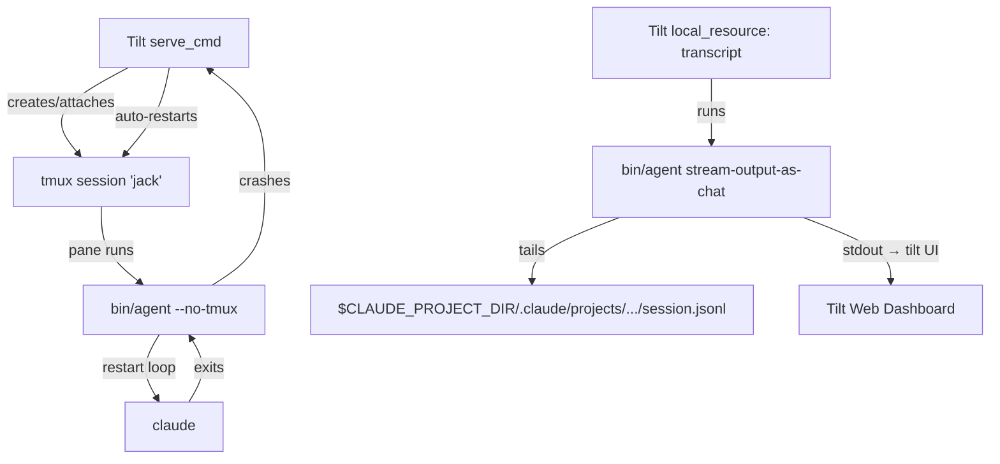
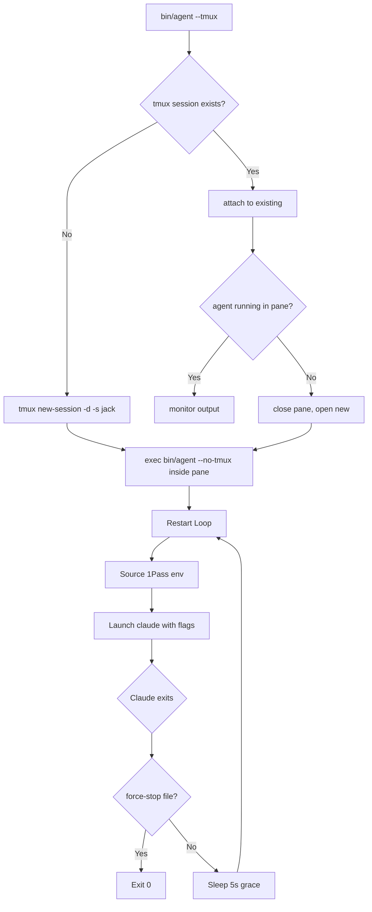

# Tilt Orchestration for Agent Development

## Problem Statement

Developing and testing multi-agent systems locally requires orchestrating multiple
processes (agents, MCP servers, mesh infrastructure) with hot-reload, log aggregation,
and health monitoring. Currently, agents are launched manually via tmux scripts or
the `agents` CLI, with no unified dev loop for iterating on agent configurations,
harness changes, or infrastructure components.

[Tilt](https://tilt.dev) provides a development orchestration layer that watches files,
rebuilds on change, and presents a unified dashboard for all running services. Using
`local_resource` and tmux-managed processes, this gives a complete local dev
environment for agent orchestration at Level 3–4 abstraction
(see `agent-abstraction-levels.md`).

> **Note:** K8s support (ctlptl + kind cluster) is deferred to a future spec.
> This spec covers the tmux/local_resource mode only.

## Scope

### In Scope

- Tiltfile configuration for launching agents in local development
- Hot-reload of agent definitions (`<agent-repo>/.claude/agents/*.md`, `agent.yaml`)
- Hot-reload of harness scripts (`bin/agent`, launcher config)
- Log aggregation from multiple agent processes into the Tilt dashboard
- Health check integration (agent harness lifecycle signals)
- MCP server lifecycle management (mesh server, stdio clients)
- Resource grouping (agents, infrastructure, MCP servers)
- Composable Tiltfile structure using `load()` / `include()`

### Out of Scope

- **surv (tilt fork/rename)**: Migration to surv is a separate milestone. This spec
  targets tilt.dev as it exists today. When surv stabilizes, a follow-up spec will
  cover the migration.
- Production deployment orchestration (that is K8s controllers + Helm)
- Cloud cluster provisioning (EKS, GKE, AKS)
- CI/CD pipeline integration (GitHub Actions workflows are separate)

## Design

### Architecture Overview

The Tilt orchestration has three distinct layers:

1. **Tiltfile `serve_cmd`** — a shell script that manages the tmux session lifecycle
   for each agent. It finds, creates, or restarts tmux sessions and launches `bin/agent`
   inside them. This script is NOT `bin/agent` itself; it wraps the tmux lifecycle around it.

2. **`bin/agent`** — runs INSIDE the tmux session, launched by `serve_cmd` with
   `--no-tmux` (since the Tiltfile's serve_cmd already manages the tmux session).
   `bin/agent` handles the Claude Code harness, restart loops, and agent lifecycle.

3. **`bin/agent stream-output-as-chat`** — a subcommand that tails the agent's JSONL
   transcript and transforms it into a human-readable chat-room format for streaming
   into the Tilt UI. Used by transcript `local_resource` entries.

### Architecture Diagrams

#### Process Tree



#### bin/agent Lifecycle



### Tiltfile Structure

Rather than a single monolithic Tiltfile, the Tiltfile is split into composable
sub-files using Tilt's `load()` function. Each sub-file manages a logical group of
resources, and the root Tiltfile assembles them:

```
Tiltfile                — root: loads all sub-files
tilt/agents.tiltfile    — agent local_resource definitions
tilt/infra.tiltfile     — infrastructure resources (MCP servers, mesh)
tilt/logs.tiltfile      — log stream resources (transcript, debug, harness)
```

**Root Tiltfile:**

```python
# Tiltfile (project root)
load('./tilt/infra.tiltfile', 'define_infra')
load('./tilt/agents.tiltfile', 'define_agents')
load('./tilt/logs.tiltfile', 'define_logs')

define_infra()
define_agents()
define_logs()
```

**tilt/infra.tiltfile:**

```python
def define_infra():
    # MCP Servers and shared infrastructure
    local_resource(
        'mesh-mcp-server',
        serve_cmd='bun run src/mesh/server.ts',
        deps=['src/mesh/'],
        labels=['infrastructure'],
    )
```

**tilt/agents.tiltfile:**

```python
def define_agents():
    # Each agent is a local_resource whose serve_cmd is a script that
    # manages the tmux session lifecycle (see "tmux Session Lifecycle" below).
    # bin/agent runs INSIDE the tmux session, NOT as the serve_cmd directly.
    local_resource(
        'agent-jack',
        serve_cmd='scripts/serve-agent.sh jack ../nsheaps/.ai-agent-jack',
        deps=[
            '../nsheaps/.ai-agent-jack/.claude/',  # <agent-repo>/.claude/
            '../nsheaps/.ai-agent-jack/bin/agent',
        ],
        resource_deps=['mesh-mcp-server'],
        labels=['agents'],
    )
    # Additional agents follow the same pattern
```

**tilt/logs.tiltfile:**

```python
def define_logs():
    # Each agent gets a log resource that calls bin/agent stream-output-as-chat
    # to tail the conversation JSONL and transform it to chat-room format.
    local_resource(
        'agent-jack-transcript',
        serve_cmd=' '.join([
            '../nsheaps/.ai-agent-jack/bin/agent',
            'stream-output-as-chat',
        ]),
        labels=['transcripts'],
    )
    # Debug and harness streams defined here too (see Three Log Streams section)
```

### Stopping Individual Agents

Tilt supports stopping individual agent resources without bringing down the whole
environment. Use Tilt's built-in resource disable:

```bash
tilt disable agent-jack          # stop Jack's resource (and its transcript)
tilt enable agent-jack           # re-enable it later
```

This is the equivalent of `tilt down <agent-name>` — the resource is disabled in the
dashboard and its process is stopped, but the rest of the environment stays up.

### tmux Session Lifecycle

Each agent runs inside a tmux session. The Tiltfile's `serve_cmd` (e.g.,
`scripts/serve-agent.sh`) manages the full tmux lifecycle — `bin/agent` does NOT
receive a `--mode=tilt` flag or manage tmux itself when run under Tilt.

The serve_cmd script handles:

1. **Check if tmux session/window exists** — look for a session named after the agent
   (e.g., `tmux has-session -t jack 2>/dev/null`)
2. **If not → create and launch** — `tmux new-session -d -s jack` then send
   `bin/agent --no-tmux` into the new session's pane
3. **If exists but agent not running** — close the dead pane, open a new one, and
   relaunch `bin/agent --no-tmux`
4. **If exists and running** — attach to the existing output (stream it to Tilt)
5. **Auto-start on `tilt up`** — agent resources use `TRIGGER_MODE_AUTO` (the default),
   not `TRIGGER_MODE_MANUAL`, so they start automatically when Tilt comes up

### Dynamic Resource Detection

Rather than hardcoding one `local_resource` per agent, the Tiltfile should discover
agents dynamically:

- **One Tilt resource per tmux window** in the agent's session, enabling multi-window
  agents to surface each window as a separate resource in the dashboard
- **Auto-refresh via file watch** — watch an agent registry YAML
  (e.g., `agents.yaml` or a config directory) so that adding/removing agents triggers
  Tiltfile re-evaluation without manual edits
- **Discovery from disk** — alternatively, glob agent repo directories on disk and
  generate resources for each discovered agent

### Development Modes

| Mode | Command | What It Does |
|:--|:--|:--|
| **Process mode** | `tilt up` | Runs agents as local processes with file watching |

> **K8s mode** (ctlptl + kind) and **Hybrid mode** are deferred to a future spec.

### File Watch Triggers

| File Pattern | Action |
|:--|:--|
| `<agent-repo>/.claude/agents/*.md` | Restart the affected agent |
| `<agent-repo>/.claude/settings.json` | Restart the affected agent |
| `<agent-repo>/.claude/rules/**` | Restart the affected agent (rules load at session start) |
| `bin/agent` | Restart the affected agent |
| `src/mesh/**` | Rebuild and restart mesh MCP server |
| `Tiltfile` | Tilt re-evaluates automatically |

### Three Log Streams per Agent

Each agent surfaces **three separate log streams** in the Tilt web UI, each as its
own `local_resource` (or Tilt log stream) so operators can view them independently:

1. **Conversation transcript** (`agent-jack-transcript`) — tails the JSONL conversation
   file and pipes through a reformatter for human-readable chat-room output. This is the
   existing transcript resource shown in the Tiltfile example above.
2. **Claude Code debug logs** (`agent-jack-debug`) — captures Claude Code's stderr
   output (the `CLAUDE_DEBUG` / verbose stream). Useful for diagnosing MCP failures,
   tool errors, and internal Claude Code behavior.
3. **Agent harness logs** (`agent-jack-harness`) — captures stdout/stderr from `bin/agent`
   itself (the launcher/harness script). Shows restart loop activity, health check results,
   tmux session management, and environment setup.

```python
# Example Tiltfile additions per agent
local_resource(
    'agent-jack-debug',
    serve_cmd='tail -F ../nsheaps/.ai-agent-jack/.claude/tmp/debug.log',  # <agent-repo>/.claude/tmp/debug.log
    labels=['logs'],
)

local_resource(
    'agent-jack-harness',
    serve_cmd='tail -F ../nsheaps/.ai-agent-jack/.claude/tmp/harness.log',  # <agent-repo>/.claude/tmp/harness.log
    labels=['logs'],
)
```

All three streams appear in the Tilt dashboard under their respective labels, allowing
operators to view conversation flow, Claude internals, and harness lifecycle independently.

### Individual Agent Control via CLI

Tilt supports targeting individual resources from the command line. From the
`nsheaps/agents` directory (where the Tiltfile lives):

```bash
tilt up jack          # start only Jack (and his log streams + dependencies)
tilt down jack        # stop only Jack
tilt up jack henry    # start Jack and Henry
tilt down henry       # stop Henry while Jack keeps running
```

This works via Tilt's resource selection arguments — `tilt up <resource>` starts only
the named resources (plus their `resource_deps`), and `tilt down <resource>` tears down
only those resources. The Tiltfile must use resource names that match the short agent
names (e.g., `jack` not `agent-jack`) for ergonomic CLI usage, or define
`tilt_args`-based aliases.

### Agent Self-Management

Agents themselves can control other agents (or themselves) by running Tilt CLI commands.
Because the Tiltfile lives in `nsheaps/agents` and Tilt manages local processes, any
agent with filesystem access can:

```bash
cd /home/nsheaps/src/nsheaps/agents
tilt up henry         # Jack can bring Henry online
tilt down henry       # Jack can take Henry offline
tilt up jack          # An agent can even restart itself (harness will re-launch)
```

**Requirements for agent self-management:**

- The `tilt` binary must be on the agent's `$PATH`
- The agent must have filesystem access to the `nsheaps/agents` directory
- Agents should use the `bin/agent` harness or a dedicated skill/tool to wrap these
  commands with appropriate guardrails (e.g., confirming with the handler before
  stopping another agent in production-like environments)
- Self-restart (`tilt down jack` followed by `tilt up jack`) relies on the harness
  restart loop — the agent process exits and Tilt restarts the resource

This enables autonomous fleet management where agents can scale the team up or down
based on workload, bring up specialists on demand, or gracefully shut down idle agents.

### Dashboard Integration

Tilt's web dashboard (default `localhost:10350`) provides:

- Real-time logs per agent (conversation, debug, and harness streams)
- Health status indicators (mapped from agent harness lifecycle)
- Restart buttons per resource
- Build/reload history

### Per-Agent Configuration

Each agent's Tilt resource reads configuration from the agent's repo-local `<agent-repo>/.claude/`
directory, consistent with the per-agent `.claude/` directory standard
(see `agents-cli.md` §Per-Agent `<agent-repo>/.claude/` Directory Standard).

**Note on `CLAUDE_SETTINGS_DIR`:** The Tiltfile passes `AGENT_NAME` to the resource's
`serve_cmd`, but does NOT set `CLAUDE_SETTINGS_DIR` directly. The harness script
(`bin/agent`) is responsible for resolving the correct settings directory based on
`AGENT_NAME` (see tracking issue [agents#116](https://github.com/nsheaps/agents/issues/116)
for per-agent settings isolation). The Tiltfile's role is only to trigger hot-reload
on config changes; directory resolution happens in the harness.

## Implementation Phases

### Phase 1: Process-Mode Orchestration

1. Create composable Tiltfile structure (`Tiltfile`, `tilt/agents.tiltfile`,
   `tilt/infra.tiltfile`, `tilt/logs.tiltfile`)
2. Configure file watches for agent config hot-reload
3. Map agent harness health signals to Tilt readiness probes
4. Document `tilt up` workflow in project README

> **K8s support deferred to a future spec.** Phase 2 (K8s-Mode Testing) and
> Phase 3 (Hybrid and Multi-Agent with K8s) are intentionally omitted here.
> When K8s support is ready, a new spec covering ctlptl, kind, `k8s_yaml`,
> and `docker_build` will be created.

## Open Questions

- Should the Tiltfile live in `nsheaps/agents` (orchestration repo) or in each agent's
  own repo? The monorepo vision (agents#111) suggests the former.
- How does tilt interact with the `agents` CLI? Should `agents run` delegate to
  `tilt up` internally, or are they independent workflows?
- What is the minimum viable Tiltfile for a single-agent dev loop?

## References

### Related Issues

- [agents#116](https://github.com/nsheaps/agents/issues/116) — Per-agent settings isolation and harness responsibility for directory resolution

### External Documentation

- [Tilt documentation](https://docs.tilt.dev/)
- [Tilt `local_resource` reference](https://docs.tilt.dev/local_resource.html)
- [Tilt `load()` / `include()` reference](https://docs.tilt.dev/api.html#api.load)
- [nsheaps/tiltenv](https://github.com/nsheaps/tiltenv) — config-driven multi-service Tilt env tool (archived); informed the enable/disable service pattern

> **ctlptl** and **kind** references removed — K8s support is deferred to a future spec.

### Internal References

- `docs/scratch.md` line 123 — original note: "use tilt/ctlptl/kind for testing"
- `docs/specs/agent-abstraction-levels.md` — Level 3–4 abstraction
- `docs/specs/agents-cli.md` — per-agent `<agent-repo>/.claude/` directory standard
- `docs/specs/agent-harness-lifecycle.md` — harness restart loop and health signals
