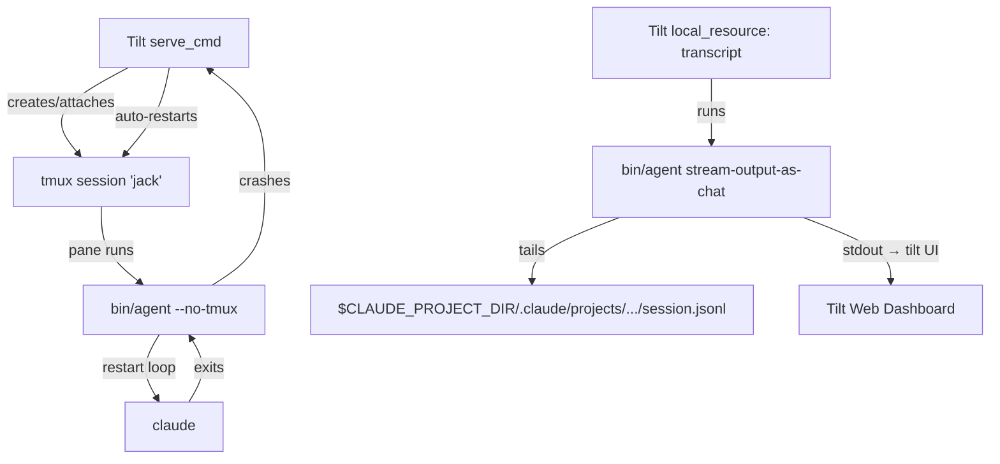
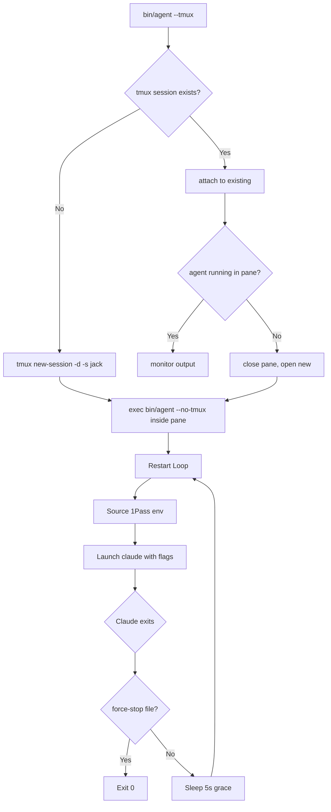

# Tilt Orchestration for Agent Development

## Problem Statement

Developing and testing multi-agent systems locally requires orchestrating multiple
processes (agents, MCP servers, mesh infrastructure) with hot-reload, log aggregation,
and health monitoring. Currently, agents are launched manually via tmux scripts or
the `agents` CLI, with no unified dev loop for iterating on agent configurations,
harness changes, or infrastructure components.

[Tilt](https://tilt.dev) provides a development orchestration layer that watches files,
rebuilds on change, and presents a unified dashboard for all running services. Using
`local_resource` and tmux-managed processes, this gives a complete local dev
environment for agent orchestration at Level 3–4 abstraction
(see `agent-abstraction-levels.md`).

> **Note:** K8s support (ctlptl + kind cluster) is deferred to a future spec.
> This spec covers the tmux/local_resource mode only.

## Scope

### In Scope

- Tiltfile configuration for launching agents in local development
- Config-driven agent registry (`agents.yaml`) for enabling/disabling agents without editing the Tiltfile
- Hot-reload of agent definitions (`<agent-repo>/.claude/agents/*.md`, `agent.yaml`)
- Hot-reload of harness scripts (`bin/agent`, launcher config)
- Log aggregation from multiple agent processes into the Tilt dashboard
- Health check integration (agent harness lifecycle signals)
- Resource grouping (agents, transcripts)
- Composable Tiltfile structure using `load()` / `include()`

### Out of Scope

- **surv (tilt fork/rename)**: Migration to surv is a separate milestone. This spec
  targets tilt.dev as it exists today. When surv stabilizes, a follow-up spec will
  cover the migration.
- Production deployment orchestration (that is K8s controllers + Helm)
- Cloud cluster provisioning (EKS, GKE, AKS)
- CI/CD pipeline integration (GitHub Actions workflows are separate)

## Design

### Architecture Overview

The Tilt orchestration has three distinct layers:

1. **Tiltfile `serve_cmd`** — a shell script that manages the tmux session lifecycle
   for each agent. It finds, creates, or restarts tmux sessions and launches `bin/agent`
   inside them. This script is NOT `bin/agent` itself; it wraps the tmux lifecycle around it.

2. **`bin/agent`** — runs INSIDE the tmux session, launched by `serve_cmd` with
   `--no-tmux` (since the Tiltfile's serve_cmd already manages the tmux session).
   `bin/agent` handles the Claude Code harness, restart loops, and agent lifecycle.

3. **`bin/agent stream-output-as-chat`** — a subcommand that tails the agent's JSONL
   transcript and transforms it into a human-readable chat-room format for streaming
   into the Tilt UI. Used by transcript `local_resource` entries.

### Architecture Diagrams

#### Process Tree



#### bin/agent Lifecycle



### Tiltfile Structure

Rather than a single monolithic Tiltfile, the Tiltfile is split into composable
sub-files using Tilt's `load()` function. Each sub-file manages a logical group of
resources, and the root Tiltfile assembles them:

```
Tiltfile                — root: loads all sub-files
tilt/agents.tiltfile    — agent local_resource definitions
tilt/logs.tiltfile      — log stream resources (transcript, debug, harness)
```

> **Note:** `tilt/infra.tiltfile` (mesh MCP server) is deferred. Infrastructure
> resources will be added when the mesh server is ready for local orchestration.

**Root Tiltfile:**

```python
# Tiltfile (project root)
load('./tilt/agents.tiltfile', 'register_agents')
load('./tilt/logs.tiltfile', 'register_logs')

register_agents()
register_logs()
```

**tilt/agents.tiltfile:**

```python
def register_agents():
    # Read the agent registry. Tilt re-evaluates whenever agents.yaml changes,
    # so enabling/disabling an agent in that file immediately creates or tears
    # down the corresponding resource — no Tiltfile edits required.
    config = read_yaml('agents.yaml')

    for agent in config.get('agents', []):
        if not agent.get('enabled', False):
            continue  # skip disabled agents — they get no resource

        name = agent['name']
        repo = agent['repo']

        # Each agent is a local_resource whose serve_cmd manages the tmux
        # session lifecycle (see "tmux Session Lifecycle" below).
        # bin/agent runs INSIDE the tmux session, NOT as the serve_cmd directly.
        local_resource(
            name,
            serve_cmd='scripts/serve-agent.sh %s %s' % (name, repo),
            deps=[
                repo + '/.claude/',
                repo + '/bin/agent',
            ],
            labels=['agents'],
        )
```

**tilt/logs.tiltfile:**

```python
def register_logs():
    # Mirror the agents.yaml registry so transcript resources are created only
    # for agents that are currently enabled.
    config = read_yaml('agents.yaml')

    for agent in config.get('agents', []):
        if not agent.get('enabled', False):
            continue

        name = agent['name']
        repo = agent['repo']

        # Each enabled agent gets a transcript resource that tails the JSONL
        # conversation file and transforms it to chat-room format.
        local_resource(
            name + '-transcript',
            serve_cmd=repo + '/bin/agent stream-output-as-chat',
            labels=['transcripts'],
            resource_deps=[name],
        )
    # Phase 2: debug and harness log streams (tail .claude/tmp/debug.log, harness.log)
```

### Enabling and Disabling Individual Agents

Agent lifecycle is controlled entirely through `agents.yaml`. To start or stop an
individual agent without touching the rest of the environment:

```bash
# Edit agents.yaml — set enabled: true or false for the target agent
# Tilt detects the file change, re-parses the Tiltfile, and:
#   - creates the resource if newly enabled
#   - tears down the resource if newly disabled
```

Tilt's `TRIGGER_MODE_AUTO` ensures that newly created resources start immediately;
disabled agents have no resource at all (they are never registered with Tilt, so
there is nothing to disable or stop manually).

Do NOT use `tilt disable`/`tilt enable` CLI commands as the primary lifecycle
mechanism — those only affect the in-process Tilt state and do not persist across
`tilt up` restarts. The `agents.yaml` file is the source of truth.

### tmux Session Lifecycle

Each agent runs inside a tmux session. The Tiltfile's `serve_cmd` (e.g.,
`scripts/serve-agent.sh`) manages the full tmux lifecycle — `bin/agent` does NOT
receive a `--mode=tilt` flag or manage tmux itself when run under Tilt.

The serve_cmd script handles:

1. **Check if tmux session/window exists** — look for a session named after the agent
   (e.g., `tmux has-session -t jack 2>/dev/null`)
2. **If not → create and launch** — `tmux new-session -d -s jack` then send
   `bin/agent --no-tmux` into the new session's pane
3. **If exists but agent not running** — close the dead pane, open a new one, and
   relaunch `bin/agent --no-tmux`
4. **If exists and running** — attach to the existing output (stream it to Tilt).
   This means agents already running in tmux before `tilt up` are adopted, not
   restarted.
5. **Auto-start when enabled** — enabled agent resources use `TRIGGER_MODE_AUTO`
   (the default), so Tilt starts them immediately when the resource is created
   (i.e., when the agent is enabled in `agents.yaml` and Tilt re-parses). Disabled
   agents are never registered, so `TRIGGER_MODE_AUTO` has no effect on them.

### Agent Registry (`agents.yaml`)

The Tiltfile reads a declarative registry file (`agents.yaml` in the repo root)
to determine which agents exist and which are currently enabled. This is the
config-driven pattern inspired by [nsheaps/tiltenv](https://github.com/nsheaps/tiltenv).

**Format:**

```yaml
# agents.yaml
agents:
  - name: jack
    repo: ~/src/nsheaps/.ai-agent-jack
    enabled: true

  - name: henry
    repo: ~/src/nsheaps/.ai-agent-henry
    enabled: false # disabled — no Tilt resource is created

  - name: pamela
    repo: ~/src/nsheaps/.ai-agent-pamela
    enabled: true
```

**Lifecycle rules:**

- `tilt up` starts the Tilt daemon and dashboard. It does NOT auto-launch agents.
  Only agents with `enabled: true` get a Tilt resource; Tilt then starts those
  resources via `TRIGGER_MODE_AUTO`.
- Changing `enabled: false → true` in `agents.yaml`: Tilt detects the file change,
  re-parses the Tiltfile, and immediately creates and starts the new resource.
- Changing `enabled: true → false`: Tilt re-parses, removes the resource, and
  tears down the running process. The tmux session may still exist; `serve_cmd`
  handles cleanup.
- Agents already running in tmux when they become enabled are adopted (attached
  to), not restarted.

**Tilt watch integration:**

`agents.yaml` is listed as a `watch_file` dependency so that Tilt re-evaluates
the Tiltfile whenever the registry changes. No manual Tiltfile edits are needed
to add, remove, enable, or disable agents.

### Dynamic Resource Detection

Rather than hardcoding one `local_resource` per agent in the Tiltfile, resources
are generated dynamically by iterating over the enabled entries in `agents.yaml`.
This keeps the Tiltfile stable as the team grows — new agents are added only to
`agents.yaml`.

- **One Tilt resource per enabled agent** — disabled agents produce no resource
- **Auto-refresh via file watch** — `agents.yaml` is watched; any change triggers
  Tiltfile re-evaluation and resource reconciliation
- **Multi-window agents (future)** — one resource per tmux window is a possible
  future extension, deferred until needed

### Development Modes

| Mode                   | Command                               | What It Does                                                                                                                              |
| :--------------------- | :------------------------------------ | :---------------------------------------------------------------------------------------------------------------------------------------- |
| **Start orchestrator** | `tilt up`                             | Starts the Tilt daemon and web dashboard. Does NOT auto-launch agents. Reads `agents.yaml` and creates resources only for enabled agents. |
| **Enable an agent**    | Edit `agents.yaml` → `enabled: true`  | Tilt detects the change, creates the resource, and starts the agent process automatically.                                                |
| **Disable an agent**   | Edit `agents.yaml` → `enabled: false` | Tilt detects the change, removes the resource, and stops the agent process.                                                               |
| **Stop orchestrator**  | `tilt down`                           | Tears down all Tilt resources and stops the daemon. Does not destroy tmux sessions.                                                       |

> **K8s mode** (ctlptl + kind) and **Hybrid mode** are deferred to a future spec.

### File Watch Triggers

| File Pattern                         | Action                                                                          |
| :----------------------------------- | :------------------------------------------------------------------------------ |
| `agents.yaml`                        | Tiltfile re-evaluates; enabled agents gain resources, disabled agents lose them |
| `<agent-repo>/.claude/agents/*.md`   | Restart the affected agent                                                      |
| `<agent-repo>/.claude/settings.json` | Restart the affected agent                                                      |
| `<agent-repo>/.claude/rules/**`      | Restart the affected agent (rules load at session start)                        |
| `bin/agent`                          | Restart the affected agent                                                      |
| `src/mesh/**`                        | Rebuild and restart mesh MCP server (Phase 2 — infra.tiltfile)                  |
| `Tiltfile`                           | Tilt re-evaluates automatically                                                 |

### Three Log Streams per Agent

Each agent surfaces **three separate log streams** in the Tilt web UI, each as its
own `local_resource` (or Tilt log stream) so operators can view them independently:

1. **Conversation transcript** (`<agent>-transcript`) — tails the JSONL conversation
   file and pipes through a reformatter for human-readable chat-room output. Generated
   dynamically from `agents.yaml` (see `tilt/logs.tiltfile` above).
2. **Claude Code debug logs** (`<agent>-debug`) — captures Claude Code's stderr
   output (the `CLAUDE_DEBUG` / verbose stream). Useful for diagnosing MCP failures,
   tool errors, and internal Claude Code behavior.
3. **Agent harness logs** (`<agent>-harness`) — captures stdout/stderr from `bin/agent`
   itself (the launcher/harness script). Shows restart loop activity, health check results,
   tmux session management, and environment setup.

```python
# Example Tiltfile additions per agent
local_resource(
    'agent-jack-debug',
    serve_cmd='tail -F ../nsheaps/.ai-agent-jack/.claude/tmp/debug.log',  # <agent-repo>/.claude/tmp/debug.log
    labels=['logs'],
)

local_resource(
    'agent-jack-harness',
    serve_cmd='tail -F ../nsheaps/.ai-agent-jack/.claude/tmp/harness.log',  # <agent-repo>/.claude/tmp/harness.log
    labels=['logs'],
)
```

All three streams appear in the Tilt dashboard under their respective labels, allowing
operators to view conversation flow, Claude internals, and harness lifecycle independently.

### Individual Agent Control

Agent lifecycle is controlled through `agents.yaml`, not through `tilt up <resource>`
arguments. The reason: `tilt up` with resource arguments affects only the current
invocation and does not persist. `agents.yaml` is the durable source of truth.

**To start an agent:**

```yaml
# agents.yaml
agents:
  - name: henry
    repo: ~/src/nsheaps/.ai-agent-henry
    enabled: true # was false — Tilt will create and start the resource
```

**To stop an agent:**

```yaml
agents:
  - name: henry
    enabled: false # Tilt will remove the resource and stop the process
```

Tilt detects the `agents.yaml` change, re-evaluates the Tiltfile, and reconciles
resources accordingly — all without restarting the Tilt daemon or touching other agents.

### Agent Self-Management

Agents themselves can control other agents (or themselves) by editing `agents.yaml`.
Because `agents.yaml` lives in `nsheaps/agents` and Tilt watches it, any agent with
filesystem access can modify the registry to bring agents online or offline:

```bash
# Jack enables Henry by editing agents.yaml (e.g., via yq or sed)
yq e '.agents[] |= if .name == "henry" then .enabled = true else . end' \
    -i /home/nsheaps/src/nsheaps/agents/agents.yaml
# Tilt detects the change and starts Henry automatically.
```

**Requirements for agent self-management:**

- The agent must have filesystem write access to `agents.yaml` in `nsheaps/agents`
- Agents should confirm with the handler before enabling/disabling agents in
  production-like environments
- Self-restart: set `enabled: false`, wait for the resource to stop, then set
  `enabled: true`. The harness restart loop will re-launch inside the tmux session.

This enables autonomous fleet management where agents can scale the team up or down
based on workload, bring up specialists on demand, or gracefully shut down idle agents.

### Dashboard Integration

Tilt's web dashboard (default `localhost:10350`) provides:

- Real-time logs per agent (conversation, debug, and harness streams)
- Health status indicators (mapped from agent harness lifecycle)
- Restart buttons per resource
- Build/reload history

### Per-Agent Configuration

Each agent's Tilt resource reads configuration from the agent's repo-local `<agent-repo>/.claude/`
directory, consistent with the per-agent `.claude/` directory standard
(see `agents-cli.md` §Per-Agent `<agent-repo>/.claude/` Directory Standard).

**Note on `CLAUDE_SETTINGS_DIR`:** The Tiltfile passes `AGENT_NAME` to the resource's
`serve_cmd`, but does NOT set `CLAUDE_SETTINGS_DIR` directly. The harness script
(`bin/agent`) is responsible for resolving the correct settings directory based on
`AGENT_NAME` (see tracking issue [agents#116](https://github.com/nsheaps/agents/issues/116)
for per-agent settings isolation). The Tiltfile's role is only to trigger hot-reload
on config changes; directory resolution happens in the harness.

## Implementation Phases

### Phase 1: Process-Mode Orchestration

1. Create `agents.yaml` registry with all known agents (`enabled: false` by default
   for agents not yet under Tilt management)
2. Create composable Tiltfile structure (`Tiltfile`, `tilt/agents.tiltfile`,
   `tilt/logs.tiltfile`; `tilt/infra.tiltfile` deferred to Phase 2)
3. Tiltfile reads `agents.yaml` via `read_yaml()` and registers resources only for
   enabled agents; watch `agents.yaml` for live enable/disable
4. Configure file watches for agent config hot-reload
5. Map agent harness health signals to Tilt readiness probes
6. Document `tilt up` workflow and `agents.yaml` editing in project README

> **K8s support deferred to a future spec.** Phase 2 (K8s-Mode Testing) and
> Phase 3 (Hybrid and Multi-Agent with K8s) are intentionally omitted here.
> When K8s support is ready, a new spec covering ctlptl, kind, `k8s_yaml`,
> and `docker_build` will be created.

## Open Questions

- Should the Tiltfile live in `nsheaps/agents` (orchestration repo) or in each agent's
  own repo? The monorepo vision (agents#111) suggests the former.
- How does tilt interact with the `agents` CLI? Should `agents run` delegate to
  editing `agents.yaml` internally, or are they independent workflows?
- Should `agents.yaml` be committed to the repo (shared default registry) or
  gitignored (per-developer local overrides)? A possible pattern: commit
  `agents.yaml.example` with all agents disabled, gitignore `agents.yaml`.
- Should agents be able to edit `agents.yaml` autonomously, or should self-management
  require handler approval?

## References

### Related Issues

- [agents#116](https://github.com/nsheaps/agents/issues/116) — Per-agent settings isolation and harness responsibility for directory resolution

### External Documentation

- [Tilt documentation](https://docs.tilt.dev/)
- [Tilt `local_resource` reference](https://docs.tilt.dev/local_resource.html)
- [Tilt `load()` / `include()` reference](https://docs.tilt.dev/api.html#api.load)
- [nsheaps/tiltenv](https://github.com/nsheaps/tiltenv) — config-driven multi-service Tilt env tool (archived); informed the enable/disable service pattern

> **ctlptl** and **kind** references removed — K8s support is deferred to a future spec.

### Internal References

- `docs/scratch.md` line 123 — original note: "use tilt/ctlptl/kind for testing"
- `docs/specs/agent-abstraction-levels.md` — Level 3–4 abstraction
- `docs/specs/agents-cli.md` — per-agent `<agent-repo>/.claude/` directory standard
- `docs/specs/agent-harness-lifecycle.md` — harness restart loop and health signals
