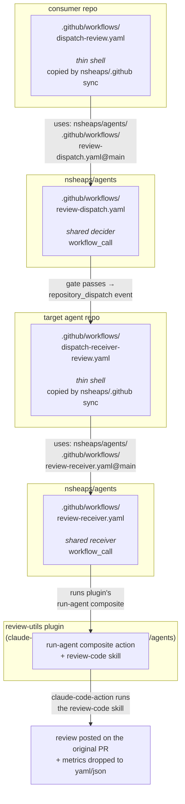
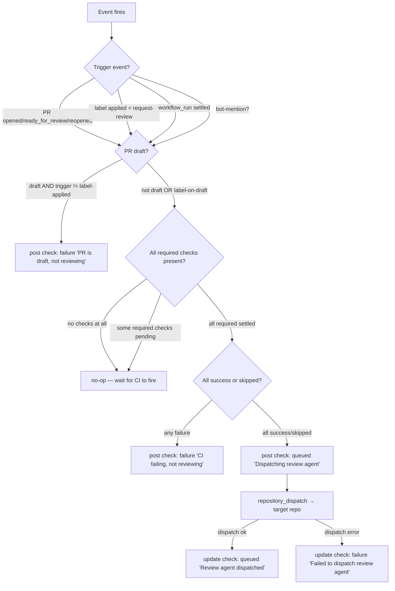
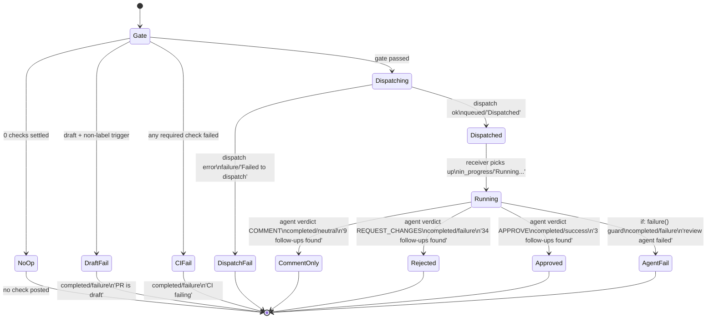
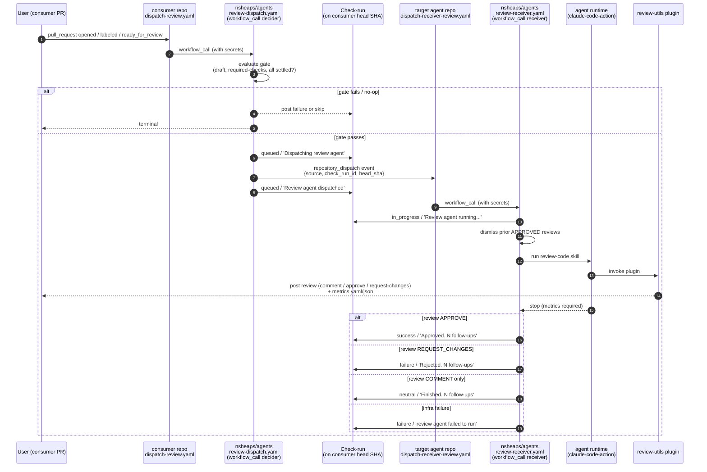
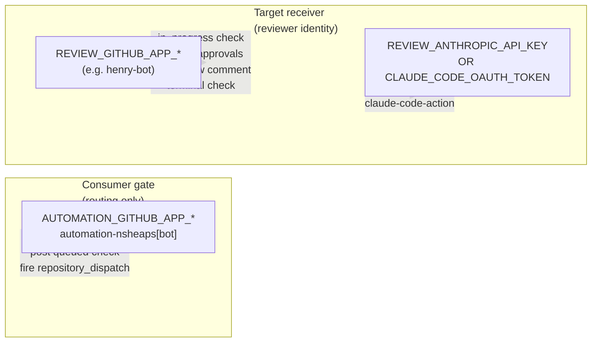

# review-dispatch

> **Spec for the AI-code-review dispatch pipeline.** A consumer repo's PR event fires a tiny `dispatch-review.yaml` workflow, which calls a shared decider in `nsheaps/agents`. The decider gates on PR/CI state, posts a queued check-run on the consumer PR, and (if the gate passes) fires a `repository_dispatch` to the **target agent repo** (henry by default). The target's `dispatch-receiver-review.yaml` — also a tiny shell — calls the same `nsheaps/agents` shared workflow which runs the `review-utils` plugin under the target agent's GitHub App identity. Both consumer-side files (`dispatch-review.yaml` + `dispatch-receiver-review.yaml`) are copied into repos by `nsheaps/.github` CI automation.

## Status

DRAFT — landing alongside implementation in PR #165 per the spec-with-impl directive[^impldirective]. Cross-links to the implementation files appear inline below; consult the `Implementation:` lines under each section.

**Supersedes:** the post-[PR #164][^pr164] in-process executor (where the review ran on `nsheaps/agents` runners under a generic bot identity). The framing message[^framing] established that the reviewer-as-henry framing is authoritative: the review is henry's work product, executed in henry's repo, under henry's identity.

**2026-05-23 redesign (Nate 18:08Z[^redesign-18-08z]):** dispatch is simplified to "post pending check + fire repo dispatch" — the CI-settled gate evaluation moves out of the decider. Triggering is reframed as "assigned and reviewable" — the dispatch fires on the union of PR-event types listed in [§Trigger events](#trigger-events-consumer-side) provided the PR is open and labelled (label name configurable via `inputs.request-label`). Two important invariants this redesign adds: (1) **the decider DOES NOT remove the trigger label** — the label stays so subsequent PR events keep re-firing the dispatch; the receiver dismisses prior approvals but never touches the label. (2) **`converted_to_draft` is a first-class event** — the receiver short-circuits with a `neutral` check rather than running a review the PR is no longer ready for. The pre-redesign "Dispatch gate" section is preserved below as struck-through historical context until the matching workflow rewrite (PR #165 step 2) lands.

### Implementation map

| Section                                         | File(s)                                                                                                                  |
| ----------------------------------------------- | ------------------------------------------------------------------------------------------------------------------------ |
| Topology — decider                              | [`.github/workflows/review-dispatch.yaml`](../../../../.github/workflows/review-dispatch.yaml)                           |
| Topology — receiver                             | [`.github/workflows/review-receiver.yaml`](../../../../.github/workflows/review-receiver.yaml)                           |
| Topology — consumer template                    | [`templates/dispatch-review.yaml`](../../../../templates/dispatch-review.yaml)                                           |
| Topology — receiver template                    | [`templates/dispatch-receiver-review.yaml`](../../../../templates/dispatch-receiver-review.yaml)                         |
| Topology — plugin composite                     | [`../actions/run-agent/action.yaml`](../actions/run-agent/action.yaml)                                                   |
| Topology — review-code skill                    | [`../skills/review-code/SKILL.md`](../skills/review-code/SKILL.md)                                                       |
| Trigger events                                  | `templates/dispatch-review.yaml` `on:` block                                                                             |
| Dispatch gate                                   | `review-dispatch.yaml` step "Evaluate dispatch gate"                                                                     |
| Check-run lifecycle (queued/dispatched/failure) | `review-dispatch.yaml` steps "Post queued check" → "Update check (dispatched\|dispatch failed)"                          |
| Check-run lifecycle (in_progress/terminal)      | `review-receiver.yaml` steps "Update check (in_progress\|terminal\|agent failed)"                                        |
| Approval dismissal                              | `review-receiver.yaml` step "Dismiss prior approval reviews"                                                             |
| Metrics emission (agent side)                   | `../skills/review-code/SKILL.md` step 11                                                                                 |
| Metrics path export                             | `../actions/run-agent/action.yaml` step "Export trigger fields for prompt interpolation"                                 |
| Metrics gate (receiver side)                    | `review-receiver.yaml` steps "Read agent metrics" + "Compute check conclusion"                                           |
| `if: failure()` safety net                      | `review-receiver.yaml` step "Update check (agent failed)" + `review-dispatch.yaml` step "Update check (dispatch failed)" |

## Problem

The pre-[PR #164][^pr164] flow (`peter-evans/repository-dispatch` forwarder) had henry's repo running its own local composite actions + prompt, with full review logic copy-pasted across `nsheaps/.ai-agent-henry/.github/actions/`. [PR #164][^pr164] pulled the review logic into a marketplace plugin (`review-utils@nsheaps-agents`), but mistakenly ran the plugin in-process on the `nsheaps/agents` runners — losing the per-agent-identity property.

The pipeline needs:

1. **Plugin-owned logic.** Review behavior lives in `review-utils`; both ends of the dispatch only orchestrate.
2. **Per-agent identity.** The review check-run, the review comment, and the API operations all run under the target agent's GitHub App. Today henry is the only reviewer; future expansion (other agent-reviewers) plugs in without code changes.
3. **Cheap to add a consumer repo.** Adding `dispatch-review.yaml` to a new repo is a `nsheaps/.github` CI sync, not a hand-wired PR.
4. **Cheap to add a reviewer repo.** Same — the receiver workflow is also a thin shell copied by CI.
5. **Always-visible check-runs.** Every PR that could trigger a review gets a check, even in the "we decided not to review" cases — so contributors aren't left wondering whether the bot saw the PR.

## Goal

Three thin shell workflows + one shared `workflow_call` library (per side) + one plugin. PR events flow through the decider, dispatch fires the receiver, the receiver runs the plugin, the plugin posts the review. Every state transition lights up a check-run on the originating PR with a deep link to the most recent relevant workflow run.

## Non-goals

- Implementing the `review-utils` plugin itself — that already exists (PR [#164](https://github.com/nsheaps/agents/pull/164)). This spec describes how the dispatch pipeline calls it.
- Replacing the `nsheaps/.github` CI sync mechanism. This spec assumes it exists and works; consumer-side workflow files arrive via that path.
- Designing the metrics yaml/json schema. The spec only states that the agent emits it and the receiver-side CI gates on its presence; the schema is a follow-up.
- Generalising beyond GitHub Actions / GitHub Apps. This spec is GH-specific.

## Topology



`review-utils` MUST be declared in the target agent's `.claude/settings.json` plugin list — that's the source-of-truth for "this agent is a reviewer," even though the GitHub Actions side checks out the plugin's composite actions directly from `nsheaps/agents`. The settings.json declaration also makes the plugin available to the agent at restart-time for any review-related skills (e.g. local-running `/review` commands).

### Two `workflow_call`s, not one

The decider and the receiver are SEPARATE shared workflows in `nsheaps/agents`. Combining them would conflate "should we review this PR?" (consumer-side gating, runs on consumer runners) with "now run the review" (target-side execution, runs on target runners under target's identity). Keeping them separate also lets us evolve receiver semantics (e.g. metrics schema, approval dismissal) without redeploying every consumer's `dispatch-review.yaml`.

## Trigger events (consumer side)

The consumer's `dispatch-review.yaml` listens for **any** of:

- `pull_request` with action ∈ {`opened`, `ready_for_review`, `reopened`}.
- `pull_request` with action `labeled` AND `event.label.name == inputs.request-label` (default `request-review`).
- `workflow_run` of the consumer's own CI workflows with `conclusion ∈ {success, skipped}` and `event.pull_requests` non-empty — this is how "CI just settled" re-evaluates the gate.
- (?) `issue_comment` containing a bot-mention pattern — see [Open questions §2](#open-questions).

Each event fires the workflow; the workflow then runs the dispatch gate (next section) to decide whether to actually dispatch.

## Dispatch gate (decider workflow)

The shared `review-dispatch.yaml` evaluates these conditions in order. A gate decision determines BOTH whether to fire the `repository_dispatch` AND which check-run to post on the head SHA.



### Detailed conditions

- **Draft handling.** Reviews run on non-draft PRs, with one exception: if the trigger event is `pull_request.labeled` AND the applied label matches `inputs.request-label`, the dispatch runs even if the PR is still in draft. (This is the "I want pre-merge feedback before un-drafting" path.)
- **"CI settled" semantics.** The decider fetches all check-runs for the head SHA via the GitHub API. If the consumer repo configures _required_ status checks (branch protection), the decider considers ONLY those required checks. Otherwise it considers all checks. A check is "settled" iff it has a terminal `conclusion ∈ {success, failure, skipped, neutral, cancelled, timed_out, action_required}`. The dispatch fires iff the relevant set is non-empty AND every entry is in `{success, skipped, neutral}` (the "OK to proceed" group).
- **Zero-checks case.** If the relevant set is empty, the gate emits **no check-run** and exits silently. CI hasn't run yet; when it does, the consumer's `workflow_run` trigger re-fires the dispatch workflow, which re-evaluates. (Without this no-op rule we'd post a permanent "no CI" failure check on every fresh PR.)
- **Required-checks-only.** Branch protection's required-checks list is fetched via `GET /repos/{owner}/{repo}/branches/{branch}/protection/required_status_checks`. If absent (no branch protection or no required-checks rule), fall back to "all checks present."

## Check-run lifecycle

Every check-run posted by the pipeline targets the head SHA of the consumer PR. The `name` is fixed (`AI Code Review`) so reruns update the same check-run rather than stacking new ones. The `details_url` ALWAYS points at the most-recent / most-relevant workflow run — gathered via `qoomon/actions--context@v5` so we link to the right run even when re-triggers happen.



### Stage-by-stage

1. **Decider posts initial check.** The first action inside the dispatch job that decided to fire is `checks.create({name: "AI Code Review", head_sha, status: "queued", output: {title: "Dispatching review agent", summary: "..."}})`. The check_id is exported as a job output so the receiver can update it.
2. **`repository_dispatch` payload.** The dispatch event carries: `event_type` (e.g. `pr-review`), `client_payload.source` (consumer repo, PR number, head SHA, head ref, base ref), `client_payload.check_run_id` (the consumer-side check-run to update), `client_payload.consumer_workflow_run_url` (so the receiver can preserve the deep link if it doesn't override).
3. **Receiver updates to in_progress.** First action on the receiver side is `checks.update({check_run_id, status: "in_progress", output: {title: "Review agent running..."}})`. The receiver runs under the target agent's GitHub App, but updates the check-run on the consumer repo — so the App must be installed on the consumer.
4. **Agent runs.** `claude-code-action` invokes the `review-code` skill from the `review-utils` plugin. The skill posts the actual review (comment / REQUEST_CHANGES / APPROVE) via the GitHub MCP server. It ALSO emits a structured metrics file (yaml or json — schema TBD) into the workflow workspace.
5. **Approval dismissal.** Before the agent runs, the receiver dismisses any prior `APPROVED` review from this bot on this PR. The intent: a previously-approved PR with new commits MUST get a fresh look before merge. Comment-only and request-changes reviews are NOT dismissed — they remain part of the audit trail. See [Open question §1](#open-questions) on whether this should happen earlier.
6. **Metrics gate.** A final receiver step reads the metrics file. If absent, the workflow fails (`if: !steps.metrics.outputs.exists`). This forces the agent to emit metrics or the run is marked failed — preventing silent regressions where the agent posts but doesn't report.
7. **Final check update.** Based on the agent's verdict + the metrics' follow-up count:
   - COMMENT only → `completed/neutral` "The agent finished. {N} follow-ups found."
   - REQUEST_CHANGES → `completed/failure` "The agent rejected this PR. {N} follow-ups found."
   - APPROVE → `completed/success` "The agent approved this PR. {N} follow-ups found."
8. **`if: failure()` guard.** A final receiver step that runs only when an earlier step failed posts `completed/failure` "The review agent failed to run." This catches infrastructure failures (auth gone, MCP server crash, etc.) that would otherwise leave the check stuck `in_progress`.

### Why posting a "draft, not reviewing" check?

Contributors who open a draft PR and DON'T attach `request-review` see a failure check, not a missing check. The signal is: "the bot saw your PR and decided not to review yet." Without this, draft PRs would silently lack any review-check, and contributors would wonder if the workflow is wired correctly. The check title alone communicates the decision (no comment payload is needed).

### Why `details_url` always points at the most recent run?

A dispatch can be re-triggered (new commits → workflow_run re-evaluates → fresh dispatch). The check-run with the OLD `details_url` becomes stale. `qoomon/actions--context@v5` exports the current job's workflow-run URL; we set `details_url` to this on every check update. The user clicking the check on the PR always lands on the run that produced the current state.

## End-to-end sequence



## Why `nsheaps/.github` CI sync owns both consumer-side files

Both `dispatch-review.yaml` (consumer) AND `dispatch-receiver-review.yaml` (target agent) are tiny shell-workflow files that change rarely. Putting their templates in `nsheaps/.github` and letting the sync workflow distribute them means:

- One file edit propagates to every repo that has the consumer wired up.
- New consumer repos onboard by being added to the sync target list — no copy-paste PR.
- Drift across consumers is impossible by construction (the sync overwrites).
- The shared `workflow_call` in `nsheaps/agents` is where ALL logic lives. Consumer files have NO logic — they just declare the trigger events + secret passthrough.

The receiver template is similarly thin: it forwards the `repository_dispatch.client_payload` straight into `nsheaps/agents/.github/workflows/review-receiver.yaml`. Adding a new reviewer-agent is the same shape: drop the receiver template into the agent repo's `.github/workflows/` (via sync), install `review-utils@nsheaps-agents` in its `.claude/settings.json`, ensure the target repo's GitHub App has access to the consumer repos that might dispatch to it.

## Secrets

The pipeline splits credentials along the routing-vs-reviewing axis. The gate never speaks AS the reviewer (it just routes the dispatch), so it gets automation-nsheaps[bot] creds. The receiver IS the reviewer — its posts, dismissals, and check updates all carry agent identity, so it gets per-agent REVIEW\_\* creds.



### Consumer-side gate (passes through to `review-dispatch.yaml`)

- `AUTOMATION_GITHUB_APP_ID` + `AUTOMATION_GITHUB_APP_PRIVATE_KEY` — automation-nsheaps[bot]. Used by the decider to:
  - remove the `request-review` label after dispatch fires
  - post the initial queued check-run on the consumer PR head SHA
  - fire `repository_dispatch` to the target agent repo

  This App MUST be installed on both the consumer repo (for label + check perms) AND on the target agent repo (for `Contents: write` to fire `repository_dispatch`). Already provisioned to all `nsheaps/*` repos via `nsheaps/.github` secret-sync (also powers lint-autofix), so adding a new consumer is zero-secret work.

### Receiver-side (passes through to `review-receiver.yaml` and on to the plugin)

- `REVIEW_GITHUB_APP_ID` + `REVIEW_GITHUB_APP_PRIVATE_KEY` — the target agent's GitHub App (e.g. henry-bot). Used by the receiver to:
  - update the check-run state on the consumer PR (in_progress → terminal)
  - dismiss prior `APPROVED` reviews on this PR from this bot
  - post the actual review comment / APPROVE / REQUEST_CHANGES
  - all `mcp__github__*` and `gh` calls the review-code skill makes

  Per-agent — each reviewer-agent uses its own App. Add a reviewer-agent by provisioning their `REVIEW_GITHUB_APP_*` to that agent's repo via `nsheaps/.github` sync (initially just henry).

- ONE of: `REVIEW_ANTHROPIC_API_KEY` OR `CLAUDE_CODE_OAUTH_TOKEN` — LLM auth for `claude-code-action`. Owned by the target agent's repo so each agent can use its own model billing.

### Why split gate-creds from reviewer-creds?

1. **Semantic clarity.** The check-run author + label-edit actor for the gate is `automation-nsheaps[bot]` — clearly an infrastructure action. The review comment + approve/reject is by `henry-bot` (or whichever agent) — clearly the reviewer. Anyone reading the PR sees who did what.
2. **Provisioning leverage.** `AUTOMATION_GITHUB_APP_*` is already synced everywhere via `nsheaps/.github` (lint-autofix uses it on every repo). Adopting the gate side requires no new secret distribution. `REVIEW_GITHUB_APP_*` is per-agent — sync only goes to reviewer-agent repos.
3. **Blast-radius minimisation.** The gate runs on every consumer PR; if those creds leaked, the impact is "the attacker can post checks + remove labels." The receiver runs only on dispatched review jobs; if those creds leaked, the impact includes "the attacker can post bot-authored reviews / approvals." Smaller attack surface for the higher-privilege creds.
4. **Multi-reviewer scaling.** When we add a second reviewer-agent, its `REVIEW_GITHUB_APP_*` is independent of the gate. No consumer-template change needed; the new agent just provisions its own receiver-side secret.

## Open questions

1. **Approval-dismissal timing.** Should we dismiss the prior `APPROVED` review at decider-time (right when the dispatch fires) instead of at receiver-time (when the agent starts running)? Decider-time dismissal closes the "PR is APPROVED, ready to merge" UI affordance ~30s earlier, but if the dispatch then fails downstream we've dismissed an approval we couldn't replace. Receiver-time dismissal is safer but leaves a brief window where the PR shows green-approved while the agent is queued.
   **Current implementation:** receiver-time (`review-receiver.yaml` step "Dismiss prior approval reviews"). Resolved if no objection; the safety argument outweighs the ~30s UI lag.
2. **Bot mention as trigger.** Is `issue_comment` containing `@<bot-handle>` a valid trigger event? Use cases: contributor wants the bot to re-review after manually pushing fixes that don't change CI. Open issues: spam-resistance (only allow trigger from PR author + maintainers?), comment-only-on-PRs (issues without an associated PR should be a no-op).
   **Current implementation:** not wired. Templates only declare `pull_request` + `workflow_run`. Adding `issue_comment` is a small consumer-template edit + a decider gate-step extension; deferred until we have a clear use-case.
3. **Distinguishing "no CI configured" from "CI hasn't started yet."** With zero checks present, current spec says "no-op + wait for `workflow_run`." But a repo with NO CI at all will never fire `workflow_run` — and so the review never runs. Options: (a) add a fallback timer that fires the gate after N minutes regardless; (b) require the consumer to set an input `requires-ci: false` to opt out of the CI gate; (c) call GH API to enumerate workflows, and if the repo has zero workflow files, fall through. (c) is cleanest but adds an API call.
   **Current implementation:** option (none) — gate returns `decision=wait` and the workflow exits silently. A consumer with NO CI relies on the `pull_request: opened` trigger to fire the dispatch when the gate's "0 checks" case is hit... but the current gate treats 0 checks as "wait" and exits. This is a known gap; suggested follow-up: implement (b) as an `inputs.dispatch-without-ci` boolean defaulting to false.
4. **Mention triggers on issues.** If we accept bot-mention as a trigger event (Q2), does it apply to plain issues (no PR) or only PR-bound issue comments? Plain-issue mentions are probably a "future skills" feature, not in scope here.
   **Current implementation:** out of scope until Q2 is resolved.
5. **Metrics schema versioning.** When the metrics file schema changes, how do consumer/receiver workflows know which version they're reading? Embed a `$schema` field? Or version-bump the plugin and lockstep the receiver?
   **RESOLVED:** schema v1 embedded as the first key (`version: 1`) in the metrics file. Receiver currently ignores the version field but a future receiver MUST `version: 1`-check before parsing. Schema:
   ```yaml
   version: 1
   verdict: APPROVE # APPROVE | REQUEST_CHANGES | COMMENT
   follow_ups: 3 # integer
   review_url: <github-url> # link to the posted review
   ```
   See `plugins/claude-code/review-utils/skills/review-code/SKILL.md` step 11.
6. **Multi-reviewer dispatch.** The decider sends to ONE target agent (`inputs.target-repo`). If we eventually want N reviewers (henry + a security-focused reviewer agent + …), do we (a) fan out N `repository_dispatch` events from one decider run, or (b) chain N separate consumer-side workflows each dispatching to one target? (a) keeps the dispatch atomic; (b) keeps consumers in control of which reviewers they invite.
   **Current implementation:** single-target. Multi-reviewer is deferred until a second reviewer-agent exists in practice.
7. **Approving over other reviewers' open feedback.**[^q7] If a human reviewer or another bot has left a request-changes review or open blocking comment that hasn't been resolved, should the agent still be allowed to `APPROVE`? Sub-questions: (a) does the agent have to **agree** with the other reviewer's feedback before approving, (b) what if the agent is confident the other reviewer is wrong — can it approve and explain why, (c) does the agent dismiss/respond to the other thread before approving, or just leave it open?
   **Current implementation:** the skill (`review-code/SKILL.md` step 4 "Manage previous comments and threads") only addresses the agent's OWN prior comments. There's no rule for other reviewers' open threads. Suggested resolution direction: agent MUST scan other reviewers' threads; if any unresolved REQUEST_CHANGES exists from a human, downgrade verdict to COMMENT (cannot approve over a human's open block); for another-bot disagreement, agent may approve only with an inline comment explaining the disagreement on the conflicting thread.

## Phases

Bundled into PR #165 (this PR) unless noted otherwise.

1. **Spec doc** — this file. ✅ (commits `ac301bf` + `15562d2`)
2. **Revert in-process executor.** Restore `review-dispatch.yaml` to forwarder mode (drop the embedded `run-agent` step, restore `repository_dispatch`). Add the gate logic. ✅ (commit `260eef5`)
3. **Add `review-receiver.yaml`** to `nsheaps/agents`. Mirrors today's run-agent flow but driven by `repository_dispatch` payload + does the check-update + dismissal + metrics gate. ✅ (commit `4c1696b`)
4. **Add `check-run-id` input to `run-agent` action.** Skip internal check creation when caller owns lifecycle. ✅ (commit `70296b4`)
5. **Update consumer templates.** `templates/dispatch-review.yaml` drops anthropic/oauth + adds workflow_run trigger; NEW `templates/dispatch-receiver-review.yaml`. ✅ (commit `0a2ede7`)
6. **Wire metrics emission** into the `review-code` skill + `run-agent` action. ✅ (commit `15562d2`)
7. **Install `review-utils@nsheaps-agents`** in henry's `.claude/settings.json` + drop `templates/dispatch-receiver-review.yaml` into henry's `.github/workflows/`. ⏳ companion PR on `nsheaps/.ai-agent-henry`.
8. **Retire henry's local composites** (`./.github/actions/agent-setup`, `./.github/actions/run-agent`, `.claude/prompts/pr-review.md`). ⏳ same henry-companion PR.
9. **End-to-end smoke test** on an open PR in a consumer repo. ⏳ after henry-companion PR merges.
10. **Migrate already-installed consumer gates** from `REVIEW_GITHUB_APP_*` → `AUTOMATION_GITHUB_APP_*` secrets (alex, jack, ai-mktpl). The gate/receiver creds split landed in this PR but pre-existing consumer-side files still pass `REVIEW_*`. ⏳ follow-up PR per consumer (or one bulk sweep via `nsheaps/.github` template re-sync).

<!-- Footnote references — keep alphabetical/numeric, do not delete unused (a section may add a ref later). -->

[^framing]: Discord [msg 1507407855471563026](https://discord.com/channels/1490863845252665415/1497431286661517353/1507407855471563026) (Nate, 2026-05-22 15:40Z) — _"if henry is running the review, why doesn't that go into henry's repo? nsheaps/agents contains the plugin and all the logic and shared github workflow, but the plugin should be installed in henry's config, and the triggered review workflow should trigger henry."_ — this is the framing that established per-agent-identity as the central invariant.

[^dictation1]: Discord [msg 1507422997261062214](https://discord.com/channels/1490863845252665415/1497431286661517353/1507422997261062214) (Nate, 2026-05-22 16:40Z) — topology dictation: _"consumer repos have a tiny dispatch-review.yaml workflow / dispatch-review.yaml workflow is copied to repos using nsheaps/.github ci automation / the dispatch-review workflow fires often, but may not actually dispatch a review depending on the conditions..."_ — describes the consumer + decider half of the pipeline.

[^dictation2]: Discord [msg 1507423082040787106](https://discord.com/channels/1490863845252665415/1497431286661517353/1507423082040787106) (Nate, 2026-05-22 16:41Z) — trigger-events + receiver dictation: _"Reviews are dispatched when: any of these events happen: The PR moves to an open state; The appropriate review label was just applied; The review bot was mentioned on a PR (or issue?) / the following are all true after the event: The PR is in open state... All CI has settled..."_ — defines the gate conditions + introduces the receiver-side `dispatch-receiver-review.yaml` shape.

[^dictation3]: Discord [msg 1507423084699713829](https://discord.com/channels/1490863845252665415/1497431286661517353/1507423084699713829) (Nate, 2026-05-22 16:41Z) — final-check-update dictation: _"CI posts check to original PR (with updated link to review workflow): if comment only: set check to completed/neutral; if PR rejected: set to failed; if PR accepted: set to success; step at the end, if: failure() forces a check posted to the PR: failed"_ — defines the terminal-check mapping + the `if: failure()` safety net.

[^plugindir]: Discord [msg 1507427367700926506](https://discord.com/channels/1490863845252665415/1497431286661517353/1507427367700926506) (Nate, 2026-05-22 16:58Z) — placement correction: _"alex put it in nsheaps/agents/plugins/review-utils/specs/.... not in the repo root docs folder. Plugin specs stay in plugins"_ — established the per-plugin spec-dir convention this file lives by.

[^asciimermaid]: Discord [msg 1507427456334954659](https://discord.com/channels/1490863845252665415/1497431286661517353/1507427456334954659) (Nate, 2026-05-22 16:58Z) — _"alex I also see some ascii flow diagrams, use mermaid diagrams for that"_ — drove the ASCII-→-mermaid topology rewrite.

[^impldirective]: Discord [msg 1507428091616694393](https://discord.com/channels/1490863845252665415/1497431286661517353/1507428091616694393) (Nate, 2026-05-22 17:01Z) — _"Alex once you move it, please keep going, write the spec (and keep it up to date with references to where things are implemented and sources used for research (and links to research docs), in the right place, then add the functionality defined in the spec in the same PR."_ — scoped this PR to include implementation alongside the spec.

[^redesign-18-08z]: Discord [msg 1507807485438726204](https://discord.com/channels/1490863845252665415/1497431286661517353/1507807485438726204) (Nate, 2026-05-23 18:08Z) — direct ping to alex with the redesign brief: drop the gate, simplify dispatch to "post pending check + fire repo dispatch", reframe trigger as "assigned and reviewable" (no longer "request-review label only"), receiver MUST NOT remove the label, `converted_to_draft` short-circuits with neutral check + early exit, scripts >3 lines extracted to proper files, open Q on run-agent harness necessity.

[^q7]: Discord [PR #165 inline comment](https://github.com/nsheaps/agents/pull/165#discussion_r0) (Nate, 2026-05-22 17:09Z) — _"Q: should we avoid approving if other reviewers/commenters left valid feedback that MUST be addressed before merging? Should the review agent have to agree with that other feedback before approving/if it's confident that the other statement is incorrect to approve it anyway?"_ — added as Open Question 7.

[^pr164]: [PR nsheaps/agents#164](https://github.com/nsheaps/agents/pull/164) — first review-utils plugin landing (2026-05-22). Pulled the review logic into a marketplace plugin but ran the plugin in-process on `nsheaps/agents` runners, losing per-agent-identity. This spec's PR (#165) supersedes that in-process executor with a forwarder + per-target-receiver shape.

[^pr160]: [PR nsheaps/agents#160](https://github.com/nsheaps/agents/pull/160) — original reusable `review-dispatch.yaml`. This PR rewrites that workflow into the forwarder/gate shape and adds the companion `review-receiver.yaml`.

[^deprecatedagent]: [`docs/specs/deprecated-agent.md`](../../../../docs/specs/deprecated-agent.md) — adjacent spec for `bin/agent` consolidation (canonical script + thin per-repo shims). Shares the "thin consumer files + shared core + nsheaps/.github sync" shape used here for the workflow templates.

<!-- Removed bullet about henry's pre-PR-164 `repo-dispatch.yaml` (no stable artifact link, captured in commit history of nsheaps/.ai-agent-henry/.github/). -->

See also: [^deprecatedagent] for the adjacent consolidation pattern.
