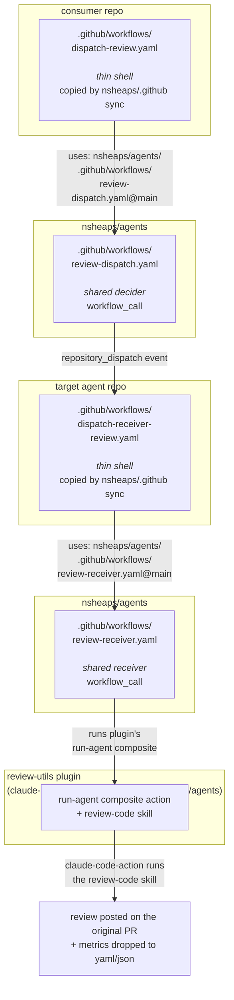
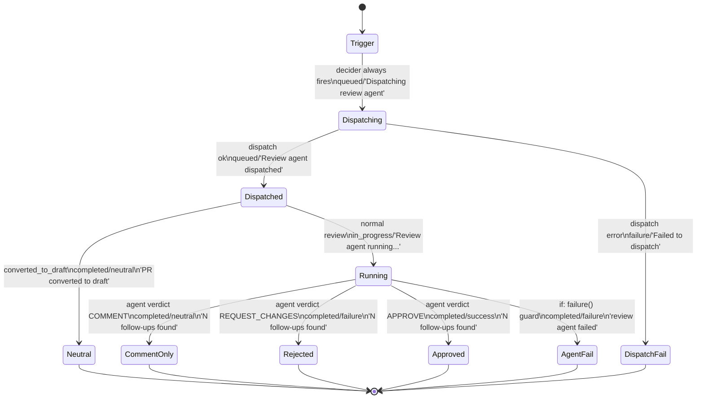
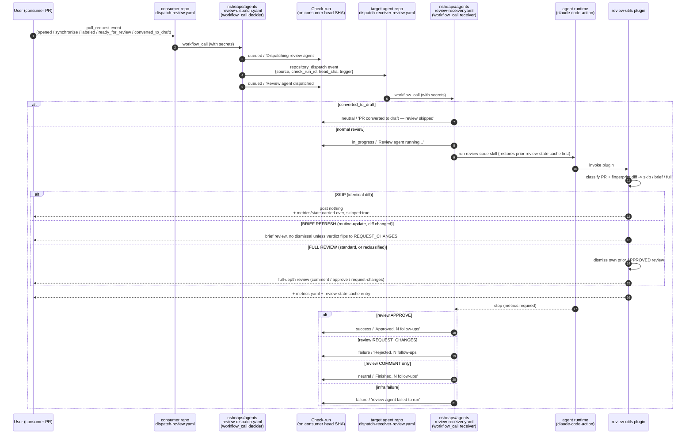
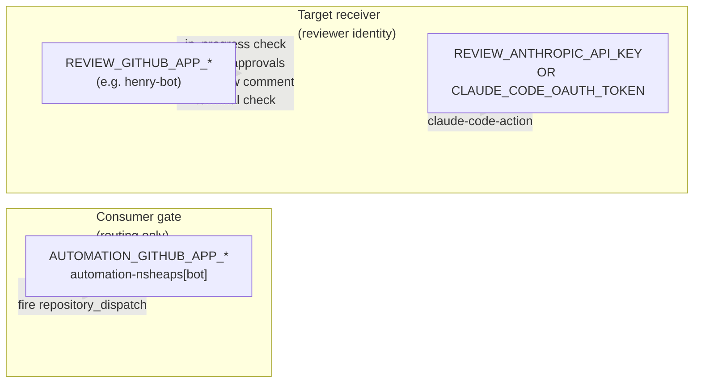

# review-dispatch

> **Spec for the AI-code-review dispatch pipeline.** A consumer repo's PR event fires a tiny `dispatch-review.yaml` workflow, which calls a shared decider in `nsheaps/agents`. The decider posts a pending check-run on the consumer PR and fires a `repository_dispatch` to the **target agent repo** (henry by default). The target's `dispatch-receiver-review.yaml` — also a tiny shell — calls the same `nsheaps/agents` shared workflow which runs the `review-utils` plugin under the target agent's GitHub App identity. Both consumer-side files (`dispatch-review.yaml` + `dispatch-receiver-review.yaml`) are copied into repos by `nsheaps/.github` CI automation.

## Status

DRAFT — landing alongside implementation in PR #165 per the spec-with-impl directive[^impldirective]. Cross-links to the implementation files appear inline below; consult the `Implementation:` lines under each section.

**Supersedes:** the post-[PR #164][^pr164] in-process executor (where the review ran on `nsheaps/agents` runners under a generic bot identity). The framing message[^framing] established that the reviewer-as-henry framing is authoritative: the review is henry's work product, executed in henry's repo, under henry's identity.

**2026-05-23 redesign (Nate 18:08Z[^redesign-18-08z]):** dispatch is simplified to "post pending check + fire repo dispatch" — the CI-settled gate evaluation moves out of the decider. Triggering is reframed as "assigned and reviewable" — the dispatch fires on the union of PR-event types listed in [§Trigger events](#trigger-events-consumer-side) provided the PR is open and labelled (label name configurable via `inputs.request-label`). Two important invariants this redesign adds: (1) **the decider DOES NOT remove the trigger label** — the label stays so subsequent PR events keep re-firing the dispatch; the receiver dismisses prior approvals but never touches the label. (2) **`converted_to_draft` is a first-class event** — the receiver short-circuits with a `neutral` check rather than running a review the PR is no longer ready for. The matching workflow rewrites landed in PRs #367 (decider) and #368 (receiver).

**2026-08-12 redesign — incremental review (skip / brief / full):** Renovate/Dependabot force-push rebases fire the same dispatch pipeline as any other push, but frequently produce a byte-identical reviewable diff (only the head SHA changes). Combined with the receiver's then-unconditional pre-agent approval dismissal, this churned "routine" PRs through repeated dismiss → full-depth re-review → dismiss cycles that gave the author nothing new to act on. This redesign:

1. **Adds a cross-run cache** (`actions/cache` in `run-agent/action.yaml`, keyed per PR) carrying the skill's prior conclusions — diff fingerprint, PR classification, verdict, follow-up count, and unresolved thread IDs. Schema and full decision tree: `plugins/claude-code/review-utils/skills/review-code/partials/incremental-review.md`.
2. **Classifies each PR** as `routine-update` (bot-authored, dependency-manifest-only diff) or `standard` (everything else).
3. **Compares diff content, not head SHA**, against the cached fingerprint (`gh pr diff | sha256sum`) to decide: SKIP (identical diff — post nothing), BRIEF REFRESH (routine-update, diff changed — proportionate response, brief format, no mandatory dismissal), or FULL REVIEW (standard, or a routine-update PR that just became standard — full depth, prior approval dismissed).
4. **Moves approval dismissal from the receiver into the skill itself.** The `review-receiver.yaml` unconditional "Dismiss prior approval reviews" step is removed; dismissal now happens only inside the FULL REVIEW branch (or a REQUEST_CHANGES-verdict BRIEF REFRESH), gated on the skill's own diff-content analysis rather than firing before that analysis has even happened. See [Open question §1](#open-questions) — this resolves it.
5. **Adds a brief formatting mode** (`partials/review-formatting.md` "Brief format") for `routine-update` reviews — no mandatory badges, no `<details>` wrapper.

This is a plugin minor-version bump (`review-utils` 0.2.0 → 0.3.0) — new capability, backwards compatible (a PR with no prior cache entry always takes the FULL REVIEW branch, matching pre-redesign behavior).

### Implementation map

| Section                                         | File(s)                                                                                                                                                                                                                                |
| ----------------------------------------------- | -------------------------------------------------------------------------------------------------------------------------------------------------------------------------------------------------------------------------------------- |
| Topology — decider                              | [`.github/workflows/review-dispatch.yaml`](../../../../.github/workflows/review-dispatch.yaml)                                                                                                                                         |
| Topology — receiver                             | [`.github/workflows/review-receiver.yaml`](../../../../.github/workflows/review-receiver.yaml)                                                                                                                                         |
| Topology — consumer template                    | [`nsheaps/.github` — `ansible/templates/.github/workflows/dispatch-review.yaml`](https://github.com/nsheaps/.github/blob/main/ansible/templates/.github/workflows/dispatch-review.yaml) (sole source of truth; no mirror in this repo) |
| Topology — receiver template                    | [`templates/dispatch-receiver-review.yaml`](../../../../templates/dispatch-receiver-review.yaml)                                                                                                                                       |
| Topology — plugin composite                     | [`../actions/run-agent/action.yaml`](../actions/run-agent/action.yaml)                                                                                                                                                                 |
| Topology — review-code skill                    | [`../skills/review-code/SKILL.md`](../skills/review-code/SKILL.md)                                                                                                                                                                     |
| Trigger events                                  | `nsheaps/.github`'s `dispatch-review.yaml` template `on:` block                                                                                                                                                                        |
| Check-run lifecycle (queued/dispatched/failure) | `review-dispatch.yaml` steps "Post queued check" → "Update check (dispatched\|dispatch failed)"                                                                                                                                        |
| Check-run lifecycle (in_progress/terminal)      | `review-receiver.yaml` steps "Update check (in_progress\|terminal\|agent failed)"                                                                                                                                                      |
| Approval dismissal                              | `../skills/review-code/partials/review-thread-management.md` "Dismissing a stale prior approval" (invoked by the skill itself, FULL REVIEW branch only — see incremental review row below)                                             |
| Incremental review (skip / brief / full)        | `../skills/review-code/partials/incremental-review.md`; cache restore/save in `../actions/run-agent/action.yaml` steps "Restore prior review state" / "Save review state"                                                              |
| Metrics emission (agent side)                   | `../skills/review-code/SKILL.md` step 13                                                                                                                                                                                               |
| Metrics path export                             | `../actions/run-agent/action.yaml` step "Export trigger fields for prompt interpolation"                                                                                                                                               |
| Metrics gate (receiver side)                    | `review-receiver.yaml` steps "Read metrics + compute conclusion"                                                                                                                                                                       |
| `if: failure()` safety net                      | `review-receiver.yaml` step "Update check (agent failed)" + `review-dispatch.yaml` step "Update check (dispatch failed)"                                                                                                               |

## Problem

The pre-[PR #164][^pr164] flow (`peter-evans/repository-dispatch` forwarder) had henry's repo running its own local composite actions + prompt, with full review logic copy-pasted across `nsheaps/.ai-agent-henry/.github/actions/`. [PR #164][^pr164] pulled the review logic into a marketplace plugin (`review-utils@nsheaps-agents`), but mistakenly ran the plugin in-process on the `nsheaps/agents` runners — losing the per-agent-identity property.

The pipeline needs:

1. **Plugin-owned logic.** Review behavior lives in `review-utils`; both ends of the dispatch only orchestrate.
2. **Per-agent identity.** The review check-run, the review comment, and the API operations all run under the target agent's GitHub App. Today henry is the only reviewer; future expansion (other agent-reviewers) plugs in without code changes.
3. **Cheap to add a consumer repo.** Adding `dispatch-review.yaml` to a new repo is a `nsheaps/.github` CI sync, not a hand-wired PR.
4. **Cheap to add a reviewer repo.** Same — the receiver workflow is also a thin shell copied by CI.
5. **Always-visible check-runs.** Every PR that could trigger a review gets a check, even in the "we decided not to review" cases — so contributors aren't left wondering whether the bot saw the PR.

## Goal

Three thin shell workflows + one shared `workflow_call` library (per side) + one plugin. PR events flow through the decider, dispatch fires the receiver, the receiver runs the plugin, the plugin posts the review. Every state transition lights up a check-run on the originating PR with a deep link to the most recent relevant workflow run.

## Non-goals

- Implementing the `review-utils` plugin itself — that already exists (PR [#164](https://github.com/nsheaps/agents/pull/164)). This spec describes how the dispatch pipeline calls it.
- Replacing the `nsheaps/.github` CI sync mechanism. This spec assumes it exists and works; consumer-side workflow files arrive via that path.
- Designing the metrics yaml/json schema. The spec only states that the agent emits it and the receiver-side CI gates on its presence; the schema is a follow-up.
- Generalising beyond GitHub Actions / GitHub Apps. This spec is GH-specific.

## Topology


```mermaid
flowchart TB
    subgraph consumer["consumer repo<br/>(alex, ai-mktpl, agents, ...)"]
        CR[".github/workflows/<br/>dispatch-review.yaml<br/><br/><em>thin shell</em><br/>copied by nsheaps/.github sync"]
    end

    subgraph agentsDecider["nsheaps/agents"]
        SD[".github/workflows/<br/>review-dispatch.yaml<br/><br/><em>shared decider</em><br/>workflow_call"]
    end

    subgraph target["target agent repo<br/>(nsheaps/.ai-agent-henry, ...)"]
        TR[".github/workflows/<br/>dispatch-receiver-review.yaml<br/><br/><em>thin shell</em><br/>copied by nsheaps/.github sync"]
    end

    subgraph agentsReceiver["nsheaps/agents"]
        SR[".github/workflows/<br/>review-receiver.yaml<br/><br/><em>shared receiver</em><br/>workflow_call"]
    end

    subgraph plugin["review-utils plugin<br/>(claude-code marketplace plugin in nsheaps/agents)"]
        RV["run-agent composite action<br/>+ review-code skill"]
    end

    OUT["review posted on the original PR<br/>+ metrics dropped to yaml/json"]

    CR -->|"uses: nsheaps/agents/<br/>.github/workflows/<br/>review-dispatch.yaml@main"| SD
    SD -->|"repository_dispatch event"| TR
    TR -->|"uses: nsheaps/agents/<br/>.github/workflows/<br/>review-receiver.yaml@main"| SR
    SR -->|"runs plugin's<br/>run-agent composite"| RV
    RV -->|"claude-code-action runs<br/>the review-code skill"| OUT
```

`review-utils` MUST be declared in the target agent's `.claude/settings.json` plugin list — that's the source-of-truth for "this agent is a reviewer," even though the GitHub Actions side checks out the plugin's composite actions directly from `nsheaps/agents`. The settings.json declaration also makes the plugin available to the agent at restart-time for any review-related skills (e.g. local-running `/review` commands).

### Two `workflow_call`s, not one

The decider and the receiver are SEPARATE shared workflows in `nsheaps/agents`. Combining them would conflate "route the dispatch" (consumer-side, runs on consumer runners) with "now run the review" (target-side execution, runs on target runners under target's identity). Keeping them separate also lets us evolve receiver semantics (e.g. metrics schema, approval dismissal) without redeploying every consumer's `dispatch-review.yaml`.

## Trigger events (consumer side)

The consumer's `dispatch-review.yaml` listens for **any** `pull_request` action in:

- `opened` — new PR created (non-draft).
- `reopened` — previously closed PR re-opened.
- `synchronize` — new commits pushed to an open PR.
- `ready_for_review` — PR converted from draft to ready.
- `labeled` — a label applied to the PR (the decider fires for any label; whether the PR carries the trigger label is enforced by the consumer template's job-level `if:` condition).

When the `pull_request.action` is `converted_to_draft`, the dispatch still fires and the receiver's `skip` job handles it — posting a `neutral` check and exiting early without running a review.

Each event fires the consumer's `dispatch-review.yaml`, which unconditionally calls the shared decider workflow (see [§Dispatch workflow (decider)](#dispatch-workflow-decider)).

## Dispatch workflow (decider)

The shared `review-dispatch.yaml` always dispatches when invoked — there is no gate evaluation inside the decider. Consumer-template job-level `if:` conditions determine whether the decider is called at all (e.g. PR must be open and carry the trigger label). When called, the decider performs three steps:

1. **Check PR state (consumer-template level).** The consumer's `dispatch-review.yaml` job `if:` guard ensures the decider is invoked only when the PR is open and carries the trigger label, OR the PR was just converted to draft while the label is still present. This guard runs before the `workflow_call` — the decider itself receives no conditional logic.
2. **Post pending check.** The decider's first action is `checks.create({name: "AI Code Review", head_sha, status: "queued", output: {title: "Dispatching review agent"}})`. The resulting `check_run_id` is captured and forwarded to the receiver so it can update the same check through the lifecycle.
3. **Fire `repository_dispatch`.** The decider sends a `repository_dispatch` event to the target agent repo (`inputs.target-repo`, default `nsheaps/.ai-agent-henry`) carrying the source PR metadata (`repo`, `pr_number`, `head_sha`, `head_ref`, `base_ref`), `check_run_id`, `consumer_workflow_run_url`, and the triggering event action (so the receiver can short-circuit on `converted_to_draft`).

The decider does NOT remove the trigger label. The label persists so subsequent PR events (new commits, `ready_for_review`) keep re-firing the dispatch.

Implementation: `.github/workflows/review-dispatch.yaml`

## Check-run lifecycle

Every check-run posted by the pipeline targets the head SHA of the consumer PR. The `name` is fixed (`AI Code Review`) so reruns update the same check-run rather than stacking new ones. The `details_url` ALWAYS points at the most-recent / most-relevant workflow run — gathered via `qoomon/actions--context@v5` so we link to the right run even when re-triggers happen.


```mermaid
stateDiagram-v2
    [*] --> Trigger

    Trigger --> Dispatching: decider always fires\nqueued/'Dispatching review agent'

    Dispatching --> Dispatched: dispatch ok\nqueued/'Review agent dispatched'
    Dispatching --> DispatchFail: dispatch error\nfailure/'Failed to dispatch'

    Dispatched --> Neutral: converted_to_draft\ncompleted/neutral\n'PR converted to draft'
    Dispatched --> Running: normal review\nin_progress/'Review agent running...'

    Running --> CommentOnly: agent verdict COMMENT\ncompleted/neutral\n'N follow-ups found'
    Running --> Rejected: agent verdict REQUEST_CHANGES\ncompleted/failure\n'N follow-ups found'
    Running --> Approved: agent verdict APPROVE\ncompleted/success\n'N follow-ups found'
    Running --> AgentFail: if: failure() guard\ncompleted/failure\n'review agent failed'

    Neutral --> [*]
    DispatchFail --> [*]
    CommentOnly --> [*]
    Rejected --> [*]
    Approved --> [*]
    AgentFail --> [*]
```

### Stage-by-stage

1. **Decider posts initial check.** The decider always posts a queued check as its first substantive action: `checks.create({name: "AI Code Review", head_sha, status: "queued", output: {title: "Dispatching review agent", summary: "..."}})`. The check_id is exported as a job output so the receiver can update it.
2. **`repository_dispatch` payload.** The dispatch event carries: `event_type` (e.g. `pr-review`), `client_payload.source` (consumer repo, PR number, head SHA, head ref, base ref), `client_payload.check_run_id` (the consumer-side check-run to update), `client_payload.consumer_workflow_run_url` (so the receiver can preserve the deep link if it doesn't override), and `client_payload.trigger` (`event` + `action` fields from the originating PR event — the receiver uses `action` to detect `converted_to_draft` and short-circuit).
3. **Receiver updates to in_progress.** First action on the receiver side is `checks.update({check_run_id, status: "in_progress", output: {title: "Review agent running..."}})`. The receiver runs under the target agent's GitHub App, but updates the check-run on the consumer repo — so the App must be installed on the consumer.
4. **Agent runs.** `run-agent` first restores the prior review-state cache entry for this PR (if any — see `partials/incremental-review.md`). `claude-code-action` then invokes the `review-code` skill from the `review-utils` plugin, which loads that state, classifies the PR, computes a diff fingerprint, and decides SKIP / BRIEF REFRESH / FULL REVIEW before doing anything else. On SKIP it posts nothing. Otherwise it posts the review (comment / REQUEST_CHANGES / APPROVE) via the GitHub MCP server, using brief formatting for a `routine-update` BRIEF REFRESH or full formatting otherwise. It ALSO emits a structured metrics file (yaml — schema v1, see below) and a review-state cache entry into the workflow workspace; `run-agent` saves the state entry back to the cache after the run.
5. **Approval dismissal (skill-driven, conditional).** The skill — not the receiver — dismisses any prior `APPROVED` review from this bot on this PR, and only in the FULL REVIEW branch (or a REQUEST_CHANGES-verdict BRIEF REFRESH). A SKIP or a no-issues BRIEF REFRESH dismisses nothing — an unchanged or routine-update diff on top of an already-approved PR doesn't need a fresh "ready to merge" gate. Comment-only and request-changes reviews are NOT dismissed — they remain part of the audit trail. See `partials/review-thread-management.md` "Dismissing a stale prior approval". This resolves the former [Open question §1](#open-questions) — dismissal timing is now agent-decision-time, not receiver-pre-run-time.
6. **Metrics gate.** A final receiver step reads the metrics file. If absent, the workflow fails (`if: !steps.metrics.outputs.exists`). This forces the agent to emit metrics or the run is marked failed — preventing silent regressions where the agent posts but doesn't report.
7. **Final check update.** Based on the agent's verdict + the metrics' follow-up count:
   - COMMENT only → `completed/neutral` "The agent finished. {N} follow-ups found."
   - REQUEST_CHANGES → `completed/failure` "The agent rejected this PR. {N} follow-ups found."
   - APPROVE → `completed/success` "The agent approved this PR. {N} follow-ups found."
8. **`if: failure()` guard.** A final receiver step that runs only when an earlier step failed posts `completed/failure` "The review agent failed to run." This catches infrastructure failures (auth gone, MCP server crash, etc.) that would otherwise leave the check stuck `in_progress`.

### Why `details_url` always points at the most recent run?

A dispatch can be re-triggered (new commits push a `synchronize` event → fresh dispatch). The check-run with the OLD `details_url` becomes stale. `qoomon/actions--context@v5` exports the current job's workflow-run URL; we set `details_url` to this on every check update. The user clicking the check on the PR always lands on the run that produced the current state.

## End-to-end sequence


```mermaid
sequenceDiagram
    autonumber
    participant U as User (consumer PR)
    participant CR as consumer repo<br/>dispatch-review.yaml
    participant SD as nsheaps/agents<br/>review-dispatch.yaml<br/>(workflow_call decider)
    participant CK as Check-run<br/>(on consumer head SHA)
    participant TR as target agent repo<br/>dispatch-receiver-review.yaml
    participant SR as nsheaps/agents<br/>review-receiver.yaml<br/>(workflow_call receiver)
    participant AG as agent runtime<br/>(claude-code-action)
    participant RV as review-utils plugin

    U->>CR: pull_request event<br/>(opened / synchronize / labeled / ready_for_review / converted_to_draft)
    CR->>SD: workflow_call (with secrets)
    SD->>CK: queued / 'Dispatching review agent'
    SD->>TR: repository_dispatch event<br/>{source, check_run_id, head_sha, trigger}
    SD->>CK: queued / 'Review agent dispatched'
    TR->>SR: workflow_call (with secrets)

    alt converted_to_draft
        SR->>CK: neutral / 'PR converted to draft — review skipped'
    else normal review
        SR->>CK: in_progress / 'Review agent running...'
        SR->>AG: run review-code skill (restores prior review-state cache first)
        AG->>RV: invoke plugin
        RV->>RV: classify PR + fingerprint diff -> skip / brief / full
        alt SKIP (identical diff)
            RV-->>U: post nothing<br/>+ metrics/state carried over, skipped:true
        else BRIEF REFRESH (routine-update, diff changed)
            RV-->>U: brief review, no dismissal unless verdict flips to REQUEST_CHANGES
        else FULL REVIEW (standard, or reclassified)
            RV->>RV: dismiss own prior APPROVED review
            RV-->>U: full-depth review (comment / approve / request-changes)
        end
        RV-->>U: + metrics yaml + review-state cache entry
        AG-->>SR: stop (metrics required)

        alt review APPROVE
            SR->>CK: success / 'Approved. N follow-ups'
        else review REQUEST_CHANGES
            SR->>CK: failure / 'Rejected. N follow-ups'
        else review COMMENT only
            SR->>CK: neutral / 'Finished. N follow-ups'
        else infra failure
            SR->>CK: failure / 'review agent failed to run'
        end
    end
```

## Why `nsheaps/.github` CI sync owns both consumer-side files

Both `dispatch-review.yaml` (consumer) AND `dispatch-receiver-review.yaml` (target agent) are tiny shell-workflow files that change rarely. Putting their templates in `nsheaps/.github` and letting the sync workflow distribute them means:

- One file edit propagates to every repo that has the consumer wired up.
- New consumer repos onboard by being added to the sync target list — no copy-paste PR.
- Drift across consumers is impossible by construction (the sync overwrites).
- The shared `workflow_call` in `nsheaps/agents` is where ALL logic lives. Consumer files have NO logic — they just declare the trigger events + secret passthrough.

The receiver template is similarly thin: it forwards the `repository_dispatch.client_payload` straight into `nsheaps/agents/.github/workflows/review-receiver.yaml`. Adding a new reviewer-agent is the same shape: drop the receiver template into the agent repo's `.github/workflows/` (via sync), install `review-utils@nsheaps-agents` in its `.claude/settings.json`, ensure the target repo's GitHub App has access to the consumer repos that might dispatch to it.

## Secrets

The pipeline splits credentials along the routing-vs-reviewing axis. The gate never speaks AS the reviewer (it just routes the dispatch), so it gets automation-nsheaps[bot] creds. The receiver IS the reviewer — its posts, dismissals, and check updates all carry agent identity, so it gets per-agent REVIEW\_\* creds.


```mermaid
flowchart LR
    subgraph gate["Consumer gate<br/>(routing only)"]
        A["AUTOMATION_GITHUB_APP_*<br/>automation-nsheaps[bot]"]
    end
    subgraph receiver["Target receiver<br/>(reviewer identity)"]
        B["REVIEW_GITHUB_APP_*<br/>(e.g. henry-bot)"]
        C["REVIEW_ANTHROPIC_API_KEY<br/>OR CLAUDE_CODE_OAUTH_TOKEN"]
    end

    A -.->|"post queued check<br/>fire repository_dispatch"| gate
    B -.->|"in_progress check<br/>dismiss approvals<br/>post review comment<br/>terminal check"| receiver
    C -.->|"LLM auth for<br/>claude-code-action"| receiver
```

### Consumer-side gate (passes through to `review-dispatch.yaml`)

- `AUTOMATION_GITHUB_APP_ID` + `AUTOMATION_GITHUB_APP_PRIVATE_KEY` — automation-nsheaps[bot]. Used by the decider to:
  - post the initial queued check-run on the consumer PR head SHA
  - fire `repository_dispatch` to the target agent repo

  This App MUST be installed on both the consumer repo (for label + check perms) AND on the target agent repo (for `Contents: write` to fire `repository_dispatch`). Already provisioned to all `nsheaps/*` repos via `nsheaps/.github` secret-sync (also powers lint-autofix), so adding a new consumer is zero-secret work.

### Receiver-side (passes through to `review-receiver.yaml` and on to the plugin)

- `REVIEW_GITHUB_APP_ID` + `REVIEW_GITHUB_APP_PRIVATE_KEY` — the target agent's GitHub App (e.g. henry-bot). Used by the receiver to:
  - update the check-run state on the consumer PR (in_progress → terminal)
  - dismiss prior `APPROVED` reviews on this PR from this bot
  - post the actual review comment / APPROVE / REQUEST_CHANGES
  - all `mcp__github__*` and `gh` calls the review-code skill makes

  Per-agent — each reviewer-agent uses its own App. Add a reviewer-agent by provisioning their `REVIEW_GITHUB_APP_*` to that agent's repo via `nsheaps/.github` sync (initially just henry).

- ONE of: `REVIEW_ANTHROPIC_API_KEY` OR `CLAUDE_CODE_OAUTH_TOKEN` — LLM auth for `claude-code-action`. Owned by the target agent's repo so each agent can use its own model billing.

### Why split gate-creds from reviewer-creds?

1. **Semantic clarity.** The check-run author + label-edit actor for the gate is `automation-nsheaps[bot]` — clearly an infrastructure action. The review comment + approve/reject is by `henry-bot` (or whichever agent) — clearly the reviewer. Anyone reading the PR sees who did what.
2. **Provisioning leverage.** `AUTOMATION_GITHUB_APP_*` is already synced everywhere via `nsheaps/.github` (lint-autofix uses it on every repo). Adopting the gate side requires no new secret distribution. `REVIEW_GITHUB_APP_*` is per-agent — sync only goes to reviewer-agent repos.
3. **Blast-radius minimisation.** The gate runs on every consumer PR; if those creds leaked, the impact is "the attacker can post checks + remove labels." The receiver runs only on dispatched review jobs; if those creds leaked, the impact includes "the attacker can post bot-authored reviews / approvals." Smaller attack surface for the higher-privilege creds.
4. **Multi-reviewer scaling.** When we add a second reviewer-agent, its `REVIEW_GITHUB_APP_*` is independent of the gate. No consumer-template change needed; the new agent just provisions its own receiver-side secret.

### Scripts longer than ~3 lines live in `.github/scripts/`

Shell logic exceeding ~3 lines is extracted from inline YAML `run:` blocks into standalone scripts under `.github/scripts/review-receiver/` in the `nsheaps/agents` repo. The receiver workflow checks out `nsheaps/agents` at the start of each run so these scripts are available on the runner.

Current scripts (introduced in commit `ae5a886`):

- `.github/scripts/review-receiver/dismiss-prior-approvals.sh` — **superseded 2026-08-12**, no longer invoked by `review-receiver.yaml`. Kept as a reference implementation; the equivalent `gh api` commands are now inlined directly in `partials/review-thread-management.md` for the skill to run itself (its sandbox doesn't have access to this file's path).
- `.github/scripts/review-receiver/read-metrics-and-compute-conclusion.sh` — reads the metrics yaml emitted by the agent and outputs the `conclusion` + `title` for the terminal check update. Updated 2026-08-12 to special-case `skipped: true`.

This convention keeps workflow YAML readable and makes shell logic independently testable.

## Open questions

1. **Approval-dismissal timing.** ~~Should we dismiss the prior `APPROVED` review at decider-time... or at receiver-time...~~
   **RESOLVED (2026-08-12):** neither — dismissal moved to **agent-decision-time**, inside the skill itself, gated on the skill's own diff-fingerprint + classification analysis (see `partials/incremental-review.md`). The original framing assumed dismissal should always happen somewhere before/at review start; in practice, unconditional pre-run dismissal (the receiver-time answer this question had settled on) churned routine dependency-bump PRs through repeated dismiss → full-depth re-review cycles even when the diff hadn't meaningfully changed. Dismissal now only fires in the FULL REVIEW branch (or a REQUEST_CHANGES-verdict BRIEF REFRESH) — i.e. only when the skill has actually concluded a fresh look is warranted. A SKIP or a no-issues BRIEF REFRESH leaves a still-valid prior approval untouched. See `partials/review-thread-management.md` "Dismissing a stale prior approval".
2. **Bot mention as trigger.** Is `issue_comment` containing `@<bot-handle>` a valid trigger event? Use cases: contributor wants the bot to re-review after manually pushing fixes that don't change CI. Open issues: spam-resistance (only allow trigger from PR author + maintainers?), comment-only-on-PRs (issues without an associated PR should be a no-op).
   **Current implementation:** not wired. Templates only declare `pull_request` + `workflow_run`. Adding `issue_comment` is a small consumer-template edit + a decider gate-step extension; deferred until we have a clear use-case.
3. **Repos with no CI.** With the gate removed, the decider always dispatches on every listed PR event. A repo with no CI configured will dispatch on every push (`synchronize`). This is fine for now but opens the question of whether the consumer template should gate on CI presence (e.g. a job-level `if:` that checks for CI results). Deferred — the current design dispatches unconditionally when triggered.
4. **Mention triggers on issues.** If we accept bot-mention as a trigger event (Q2), does it apply to plain issues (no PR) or only PR-bound issue comments? Plain-issue mentions are probably a "future skills" feature, not in scope here.
   **Current implementation:** out of scope until Q2 is resolved.
5. **Metrics schema versioning.** When the metrics file schema changes, how do consumer/receiver workflows know which version they're reading? Embed a `$schema` field? Or version-bump the plugin and lockstep the receiver?
   **RESOLVED:** schema v1 embedded as the first key (`version: 1`) in the metrics file. Receiver currently ignores the version field but a future receiver MUST `version: 1`-check before parsing. Schema:
   ```yaml
   version: 1
   verdict: APPROVE # APPROVE | REQUEST_CHANGES | COMMENT
   follow_ups: 3 # integer
   review_url: <github-url> # link to the posted review
   skipped: false # true when the incremental-review decision posted nothing new
   ```
   See `plugins/claude-code/review-utils/skills/review-code/SKILL.md` step 13. `skipped` added 2026-08-12 alongside the incremental-review redesign — see `partials/incremental-review.md`. There's a companion cache schema (also v1) for the review-state file read/written in skill steps 2 and 12 — same versioning convention, documented in that partial rather than duplicated here.
6. **Multi-reviewer dispatch.** The decider sends to ONE target agent (`inputs.target-repo`). If we eventually want N reviewers (henry + a security-focused reviewer agent + …), do we (a) fan out N `repository_dispatch` events from one decider run, or (b) chain N separate consumer-side workflows each dispatching to one target? (a) keeps the dispatch atomic; (b) keeps consumers in control of which reviewers they invite.
   **Current implementation:** single-target. Multi-reviewer is deferred until a second reviewer-agent exists in practice.
7. **Approving over other reviewers' open feedback.**[^q7] If a human reviewer or another bot has left a request-changes review or open blocking comment that hasn't been resolved, should the agent still be allowed to `APPROVE`? Sub-questions: (a) does the agent have to **agree** with the other reviewer's feedback before approving, (b) what if the agent is confident the other reviewer is wrong — can it approve and explain why, (c) does the agent dismiss/respond to the other thread before approving, or just leave it open?
   **Current implementation:** the skill (`review-code/SKILL.md` step 4 "Manage previous comments and threads") only addresses the agent's OWN prior comments. There's no rule for other reviewers' open threads. Suggested resolution direction: agent MUST scan other reviewers' threads; if any unresolved REQUEST_CHANGES exists from a human, downgrade verdict to COMMENT (cannot approve over a human's open block); for another-bot disagreement, agent may approve only with an inline comment explaining the disagreement on the conflicting thread.

## Phases

Bundled into PR #165 (this PR) unless noted otherwise.

1. **Spec doc** — this file. ✅ (commits `ac301bf` + `15562d2`)
2. **Revert in-process executor.** Restore `review-dispatch.yaml` to forwarder mode (drop the embedded `run-agent` step, restore `repository_dispatch`). Add the gate logic. ✅ (commit `260eef5`)
   2.5. **2026-05-23 redesign.** Drop the CI-settled gate; decider always dispatches; receiver handles `converted_to_draft` short-circuit; trigger label never removed. ✅ ([PR #367](https://github.com/nsheaps/agents/pull/367) decider rewrite + [PR #368](https://github.com/nsheaps/agents/pull/368) receiver rewrite)
3. **Add `review-receiver.yaml`** to `nsheaps/agents`. Mirrors today's run-agent flow but driven by `repository_dispatch` payload + does the check-update + dismissal + metrics gate. ✅ (commit `4c1696b`)
4. **Add `check-run-id` input to `run-agent` action.** Skip internal check creation when caller owns lifecycle. ✅ (commit `70296b4`)
5. **Update consumer templates.** `templates/dispatch-review.yaml` drops anthropic/oauth + adds workflow_run trigger; NEW `templates/dispatch-receiver-review.yaml`. ✅ (commit `0a2ede7`)
6. **Wire metrics emission** into the `review-code` skill + `run-agent` action. ✅ (commit `15562d2`)
7. **Install `review-utils@nsheaps-agents`** in henry's `.claude/settings.json` + drop `templates/dispatch-receiver-review.yaml` into henry's `.github/workflows/`. ⏳ companion PR on `nsheaps/.ai-agent-henry`.
8. **Retire henry's local composites** (`./.github/actions/agent-setup`, `./.github/actions/run-agent`, `.claude/prompts/pr-review.md`). ⏳ same henry-companion PR.
9. **End-to-end smoke test** on an open PR in a consumer repo. ⏳ after henry-companion PR merges.
10. **Migrate already-installed consumer gates** from `REVIEW_GITHUB_APP_*` → `AUTOMATION_GITHUB_APP_*` secrets (alex, jack, ai-mktpl). The gate/receiver creds split landed in this PR but pre-existing consumer-side files still pass `REVIEW_*`. ⏳ follow-up PR per consumer (or one bulk sweep via `nsheaps/.github` template re-sync).
11. **Scripts extraction.** Shell logic >~3 lines extracted from inline `run:` blocks into `.github/scripts/review-receiver/` scripts. ✅ (commits `ae5a886` + `7ced518`)
12. **Incremental review (skip / brief / full).** Cross-run review-state cache (`actions/cache` in `run-agent`), PR classification, diff-fingerprint-based skip/brief/full decision in the skill, brief formatting mode, and moving approval dismissal from the receiver's unconditional pre-step into the skill's own FULL REVIEW branch. Plugin version bump 0.2.0 → 0.3.0. ✅ (this change)

<!-- Footnote references — keep alphabetical/numeric, do not delete unused (a section may add a ref later). -->

[^framing]: Discord [msg 1507407855471563026](https://discord.com/channels/1490863845252665415/1497431286661517353/1507407855471563026) (Nate, 2026-05-22 15:40Z) — _"if henry is running the review, why doesn't that go into henry's repo? nsheaps/agents contains the plugin and all the logic and shared github workflow, but the plugin should be installed in henry's config, and the triggered review workflow should trigger henry."_ — this is the framing that established per-agent-identity as the central invariant.

[^dictation1]: Discord [msg 1507422997261062214](https://discord.com/channels/1490863845252665415/1497431286661517353/1507422997261062214) (Nate, 2026-05-22 16:40Z) — topology dictation: _"consumer repos have a tiny dispatch-review.yaml workflow / dispatch-review.yaml workflow is copied to repos using nsheaps/.github ci automation / the dispatch-review workflow fires often, but may not actually dispatch a review depending on the conditions..."_ — describes the consumer + decider half of the pipeline.

[^dictation2]: Discord [msg 1507423082040787106](https://discord.com/channels/1490863845252665415/1497431286661517353/1507423082040787106) (Nate, 2026-05-22 16:41Z) — trigger-events + receiver dictation: _"Reviews are dispatched when: any of these events happen: The PR moves to an open state; The appropriate review label was just applied; The review bot was mentioned on a PR (or issue?) / the following are all true after the event: The PR is in open state... All CI has settled..."_ — defines the gate conditions + introduces the receiver-side `dispatch-receiver-review.yaml` shape.

[^dictation3]: Discord [msg 1507423084699713829](https://discord.com/channels/1490863845252665415/1497431286661517353/1507423084699713829) (Nate, 2026-05-22 16:41Z) — final-check-update dictation: _"CI posts check to original PR (with updated link to review workflow): if comment only: set check to completed/neutral; if PR rejected: set to failed; if PR accepted: set to success; step at the end, if: failure() forces a check posted to the PR: failed"_ — defines the terminal-check mapping + the `if: failure()` safety net.

[^plugindir]: Discord [msg 1507427367700926506](https://discord.com/channels/1490863845252665415/1497431286661517353/1507427367700926506) (Nate, 2026-05-22 16:58Z) — placement correction: _"alex put it in nsheaps/agents/plugins/review-utils/specs/.... not in the repo root docs folder. Plugin specs stay in plugins"_ — established the per-plugin spec-dir convention this file lives by.

[^asciimermaid]: Discord [msg 1507427456334954659](https://discord.com/channels/1490863845252665415/1497431286661517353/1507427456334954659) (Nate, 2026-05-22 16:58Z) — _"alex I also see some ascii flow diagrams, use mermaid diagrams for that"_ — drove the ASCII-→-mermaid topology rewrite.

[^impldirective]: Discord [msg 1507428091616694393](https://discord.com/channels/1490863845252665415/1497431286661517353/1507428091616694393) (Nate, 2026-05-22 17:01Z) — _"Alex once you move it, please keep going, write the spec (and keep it up to date with references to where things are implemented and sources used for research (and links to research docs), in the right place, then add the functionality defined in the spec in the same PR."_ — scoped this PR to include implementation alongside the spec.

[^redesign-18-08z]: Discord [msg 1507807485438726204](https://discord.com/channels/1490863845252665415/1497431286661517353/1507807485438726204) (Nate, 2026-05-23 18:08Z) — direct ping to alex with the redesign brief: drop the gate, simplify dispatch to "post pending check + fire repo dispatch", reframe trigger as "assigned and reviewable" (no longer "request-review label only"), receiver MUST NOT remove the label, `converted_to_draft` short-circuits with neutral check + early exit, scripts >3 lines extracted to proper files, open Q on run-agent harness necessity.

[^q7]: Discord [PR #165 inline comment](https://github.com/nsheaps/agents/pull/165#discussion_r0) (Nate, 2026-05-22 17:09Z) — _"Q: should we avoid approving if other reviewers/commenters left valid feedback that MUST be addressed before merging? Should the review agent have to agree with that other feedback before approving/if it's confident that the other statement is incorrect to approve it anyway?"_ — added as Open Question 7.

[^pr164]: [PR nsheaps/agents#164](https://github.com/nsheaps/agents/pull/164) — first review-utils plugin landing (2026-05-22). Pulled the review logic into a marketplace plugin but ran the plugin in-process on `nsheaps/agents` runners, losing per-agent-identity. This spec's PR (#165) supersedes that in-process executor with a forwarder + per-target-receiver shape.

[^pr160]: [PR nsheaps/agents#160](https://github.com/nsheaps/agents/pull/160) — original reusable `review-dispatch.yaml`. This PR rewrites that workflow into the forwarder/gate shape and adds the companion `review-receiver.yaml`.

[^deprecatedagent]: [`docs/specs/deprecated-agent.md`](../../../../docs/specs/deprecated-agent.md) — adjacent spec for `bin/agent` consolidation (canonical script + thin per-repo shims). Shares the "thin consumer files + shared core + nsheaps/.github sync" shape used here for the workflow templates.

<!-- Removed bullet about henry's pre-PR-164 `repo-dispatch.yaml` (no stable artifact link, captured in commit history of nsheaps/.ai-agent-henry/.github/). -->

See also: [^deprecatedagent] for the adjacent consolidation pattern.
